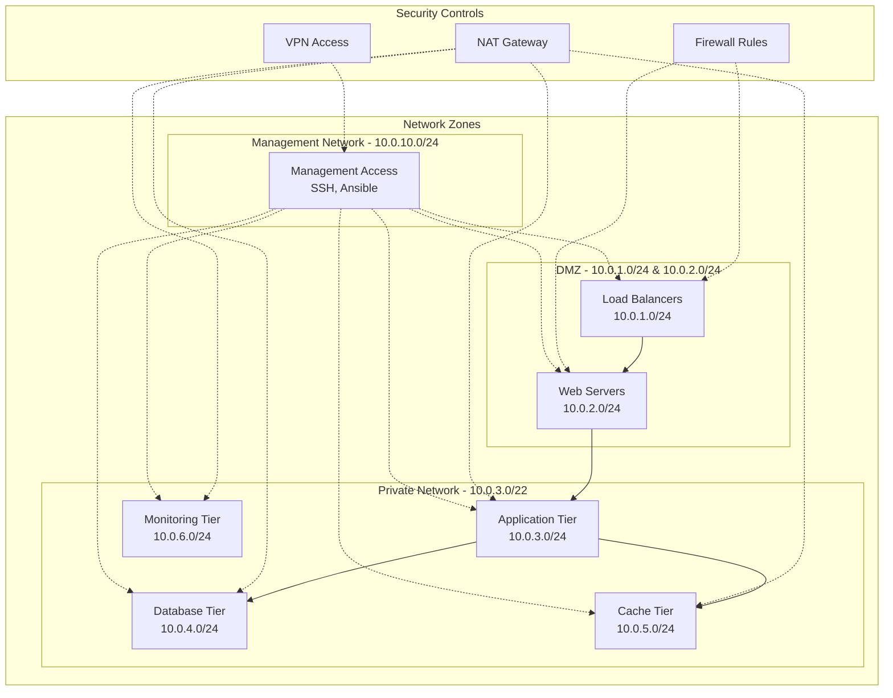
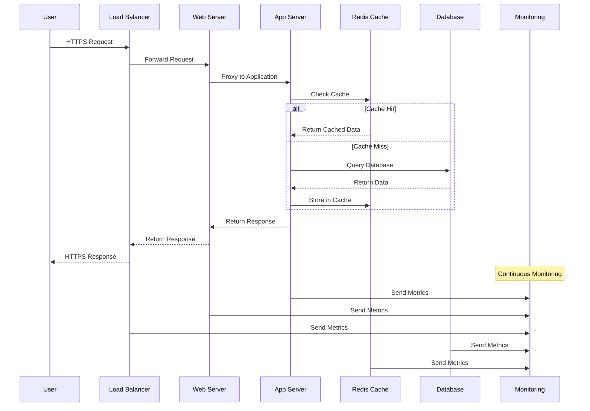
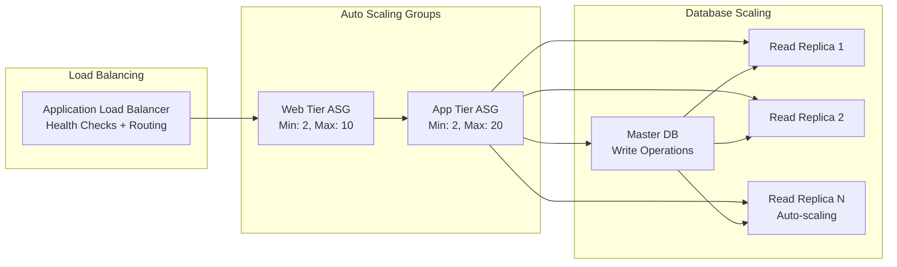
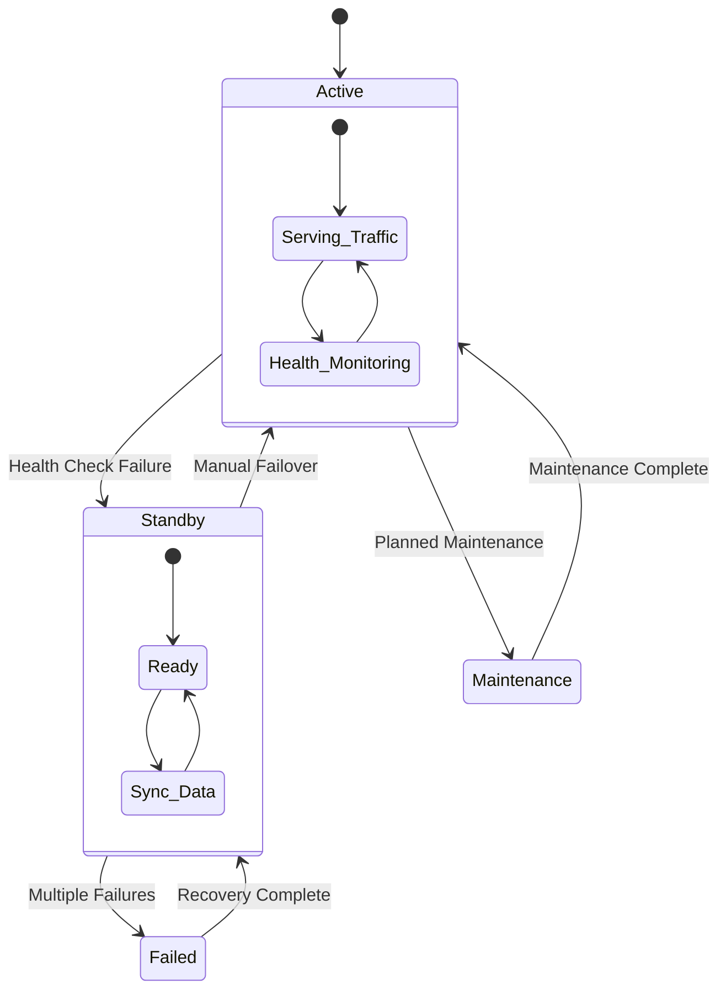

# HX Infrastructure Architecture

## 🏗️ System Architecture Overview

This document provides a comprehensive overview of the HX Infrastructure architecture, designed for enterprise-scale deployments with high availability, scalability, and security.

## 🎯 Architecture Principles

- **High Availability**: Multi-tier redundancy with failover capabilities
- **Scalability**: Horizontal scaling across all tiers
- **Security**: Defense-in-depth security model
- **Maintainability**: Modular design with clear separation of concerns
- **Observability**: Comprehensive monitoring and logging

## 🏢 Infrastructure Topology

### 15-Server Architecture

```mermaid
graph TB
    subgraph "Internet"
        INTERNET[Internet Traffic]
    end
    
    subgraph "DMZ - Load Balancer Tier"
        LB1[Load Balancer 1<br/>📍 10.0.1.10<br/>🔧 nginx + keepalived<br/>🔒 SSL Termination]
        LB2[Load Balancer 2<br/>📍 10.0.1.11<br/>🔧 nginx + keepalived<br/>🔒 SSL Termination]
        VIP[Virtual IP<br/>📍 10.0.1.100<br/>🔄 Floating IP]
    end
    
    subgraph "Web Tier - DMZ"
        WEB1[Web Server 1<br/>📍 10.0.2.10<br/>🔧 nginx + static content<br/>🚀 CDN Integration]
        WEB2[Web Server 2<br/>📍 10.0.2.11<br/>🔧 nginx + static content<br/>🚀 CDN Integration]
        WEB3[Web Server 3<br/>📍 10.0.2.12<br/>🔧 nginx + static content<br/>🚀 CDN Integration]
    end
    
    subgraph "Application Tier - Private"
        APP1[App Server 1<br/>📍 10.0.3.10<br/>🔧 Application Runtime<br/>⚡ Auto-scaling]
        APP2[App Server 2<br/>📍 10.0.3.11<br/>🔧 Application Runtime<br/>⚡ Auto-scaling]
        APP3[App Server 3<br/>📍 10.0.3.12<br/>🔧 Application Runtime<br/>⚡ Auto-scaling]
    end
    
    subgraph "Database Tier - Private"
        DB1[Database Master<br/>📍 10.0.4.10<br/>🔧 PostgreSQL 15<br/>💾 Primary Read/Write]
        DB2[Database Replica 1<br/>📍 10.0.4.11<br/>🔧 PostgreSQL 15<br/>📖 Read Replica]
        DB3[Database Replica 2<br/>📍 10.0.4.12<br/>🔧 PostgreSQL 15<br/>📖 Read Replica]
    end
    
    subgraph "Cache Tier - Private"
        CACHE1[Redis Master<br/>📍 10.0.5.10<br/>🔧 Redis 7.x<br/>⚡ Session Store]
        CACHE2[Redis Replica<br/>📍 10.0.5.11<br/>🔧 Redis 7.x<br/>📖 Read Replica]
    end
    
    subgraph "Monitoring & Management - Private"
        MON1[Monitoring Server<br/>📍 10.0.6.10<br/>🔧 Prometheus + Grafana<br/>📊 Metrics & Dashboards]
        LOG1[Log Server<br/>📍 10.0.6.11<br/>🔧 ELK Stack<br/>📝 Centralized Logging]
    end
    
    %% Traffic Flow
    INTERNET --> VIP
    VIP --> LB1
    VIP --> LB2
    
    LB1 --> WEB1
    LB1 --> WEB2
    LB1 --> WEB3
    LB2 --> WEB1
    LB2 --> WEB2
    LB2 --> WEB3
    
    WEB1 --> APP1
    WEB2 --> APP2
    WEB3 --> APP3
    
    APP1 --> DB1
    APP2 --> DB1
    APP3 --> DB1
    
    DB1 --> DB2
    DB1 --> DB3
    
    APP1 --> CACHE1
    APP2 --> CACHE1
    APP3 --> CACHE1
    
    CACHE1 --> CACHE2
    
    %% Monitoring Connections
    MON1 -.-> LB1
    MON1 -.-> LB2
    MON1 -.-> WEB1
    MON1 -.-> WEB2
    MON1 -.-> WEB3
    MON1 -.-> APP1
    MON1 -.-> APP2
    MON1 -.-> APP3
    MON1 -.-> DB1
    MON1 -.-> DB2
    MON1 -.-> DB3
    MON1 -.-> CACHE1
    MON1 -.-> CACHE2
    
    %% Logging Connections
    LOG1 -.-> LB1
    LOG1 -.-> LB2
    LOG1 -.-> WEB1
    LOG1 -.-> WEB2
    LOG1 -.-> WEB3
    LOG1 -.-> APP1
    LOG1 -.-> APP2
    LOG1 -.-> APP3
```

## 🔧 Component Details

### Load Balancer Tier
- **Purpose**: SSL termination, traffic distribution, health checking
- **Technology**: nginx with keepalived for HA
- **Features**: 
  - Layer 7 load balancing
  - SSL/TLS termination
  - Health checks and failover
  - Rate limiting and DDoS protection

### Web Tier
- **Purpose**: Static content serving, reverse proxy
- **Technology**: nginx with caching
- **Features**:
  - Static asset serving
  - Gzip compression
  - Browser caching headers
  - CDN integration

### Application Tier
- **Purpose**: Business logic processing
- **Technology**: Configurable runtime (Node.js, Python, Java, etc.)
- **Features**:
  - Horizontal auto-scaling
  - Session management
  - API endpoints
  - Background job processing

### Database Tier
- **Purpose**: Data persistence and management
- **Technology**: PostgreSQL with streaming replication
- **Features**:
  - Master-replica setup
  - Automated backups
  - Point-in-time recovery
  - Connection pooling

### Cache Tier
- **Purpose**: High-performance data caching
- **Technology**: Redis with replication
- **Features**:
  - Session storage
  - Application caching
  - Pub/Sub messaging
  - Data structure operations

### Monitoring Tier
- **Purpose**: System observability and alerting
- **Technology**: Prometheus, Grafana, ELK Stack
- **Features**:
  - Metrics collection and storage
  - Custom dashboards
  - Alerting and notifications
  - Log aggregation and analysis

## 🌐 Network Architecture

## 🔒 Security Architecture

### Defense in Depth

```mermaid
graph TB
    subgraph "Security Layers"
        L1[Layer 1: Perimeter Security<br/>🔥 Firewall, DDoS Protection]
        L2[Layer 2: Network Security<br/>🌐 VLANs, Network Segmentation]
        L3[Layer 3: Host Security<br/>🖥️ OS Hardening, Antivirus]
        L4[Layer 4: Application Security<br/>🔐 WAF, Input Validation]
        L5[Layer 5: Data Security<br/>💾 Encryption, Access Control]
    end
    
    subgraph "Security Controls"
        IAM[Identity & Access Management]
        VAULT[Secrets Management]
        AUDIT[Audit Logging]
        COMPLIANCE[Compliance Monitoring]
    end
    
    L1 --> L2
    L2 --> L3
    L3 --> L4
    L4 --> L5
    
    IAM -.-> L1
    IAM -.-> L2
    IAM -.-> L3
    IAM -.-> L4
    IAM -.-> L5
    
    VAULT -.-> L3
    VAULT -.-> L4
    VAULT -.-> L5
    
    AUDIT -.-> L1
    AUDIT -.-> L2
    AUDIT -.-> L3
    AUDIT -.-> L4
    AUDIT -.-> L5
    
    COMPLIANCE -.-> AUDIT
```

## 📊 Data Flow Architecture

## 🚀 Scalability Patterns

### Horizontal Scaling

## 🔄 High Availability Design

### Failover Mechanisms

## 📈 Performance Optimization

### Caching Strategy

```mermaid
graph TB
    subgraph "Caching Layers"
        CDN[CDN Cache<br/>🌍 Global Edge Locations]
        NGINX[Nginx Cache<br/>🔧 Reverse Proxy Cache]
        APP_CACHE[Application Cache<br/>⚡ In-Memory Cache]
        REDIS[Redis Cache<br/>💾 Distributed Cache]
        DB_CACHE[Database Cache<br/>🗄️ Query Result Cache]
    end
    
    subgraph "Cache Hierarchy"
        USER[User Request]
        ORIGIN[Origin Server]
    end
    
    USER --> CDN
    CDN --> NGINX
    NGINX --> APP_CACHE
    APP_CACHE --> REDIS
    REDIS --> DB_CACHE
    DB_CACHE --> ORIGIN
    
    CDN -.-> USER
    NGINX -.-> CDN
    APP_CACHE -.-> NGINX
    REDIS -.-> APP_CACHE
    DB_CACHE -.-> REDIS
    ORIGIN -.-> DB_CACHE
```

## 🔍 Monitoring Architecture

### Observability Stack

```mermaid
graph TB
    subgraph "Data Collection"
        METRICS[Metrics Collection<br/>📊 Prometheus Exporters]
        LOGS[Log Collection<br/>📝 Filebeat, Fluentd]
        TRACES[Distributed Tracing<br/>🔍 Jaeger, Zipkin]
    end
    
    subgraph "Data Storage"
        PROM[Prometheus<br/>📊 Time Series DB]
        ELASTIC[Elasticsearch<br/>📝 Log Storage]
        JAEGER_STORE[Jaeger Storage<br/>🔍 Trace Storage]
    end
    
    subgraph "Visualization"
        GRAFANA[Grafana<br/>📈 Dashboards]
        KIBANA[Kibana<br/>📊 Log Analysis]
        JAEGER_UI[Jaeger UI<br/>🔍 Trace Analysis]
    end
    
    subgraph "Alerting"
        ALERT_MGR[Alertmanager<br/>🚨 Alert Routing]
        NOTIFICATIONS[Notifications<br/>📧 Email, Slack, PagerDuty]
    end
    
    METRICS --> PROM
    LOGS --> ELASTIC
    TRACES --> JAEGER_STORE
    
    PROM --> GRAFANA
    ELASTIC --> KIBANA
    JAEGER_STORE --> JAEGER_UI
    
    PROM --> ALERT_MGR
    ALERT_MGR --> NOTIFICATIONS
```

## 🏗️ Deployment Architecture

### Infrastructure as Code

```mermaid
graph TB
    subgraph "Source Control"
        GIT[Git Repository<br/>📁 Infrastructure Code]
    end
    
    subgraph "CI/CD Pipeline"
        CI[Continuous Integration<br/>🔄 GitHub Actions]
        TEST[Testing Phase<br/>🧪 Molecule, Testinfra]
        DEPLOY[Deployment Phase<br/>🚀 Ansible Playbooks]
    end
    
    subgraph "Environment Management"
        DEV[Development<br/>🔧 Dev Environment]
        STAGING[Staging<br/>🎭 Pre-production]
        PROD[Production<br/>🏭 Live Environment]
    end
    
    subgraph "Configuration Management"
        ANSIBLE[Ansible<br/>⚙️ Configuration Management]
        VAULT[Ansible Vault<br/>🔐 Secrets Management]
        INVENTORY[Dynamic Inventory<br/>📋 Host Management]
    end
    
    GIT --> CI
    CI --> TEST
    TEST --> DEPLOY
    
    DEPLOY --> DEV
    DEV --> STAGING
    STAGING --> PROD
    
    ANSIBLE --> DEV
    ANSIBLE --> STAGING
    ANSIBLE --> PROD
    
    VAULT -.-> ANSIBLE
    INVENTORY -.-> ANSIBLE
```

## 📋 Technology Stack

### Core Technologies

| Component | Technology | Version | Purpose |
|-----------|------------|---------|---------|
| **Load Balancer** | nginx + keepalived | 1.24+ | Traffic distribution, SSL termination |
| **Web Server** | nginx | 1.24+ | Static content, reverse proxy |
| **Application** | Configurable | Latest | Business logic processing |
| **Database** | PostgreSQL | 15+ | Data persistence |
| **Cache** | Redis | 7.x | High-performance caching |
| **Monitoring** | Prometheus + Grafana | Latest | Metrics and visualization |
| **Logging** | ELK Stack | 8.x | Log aggregation and analysis |
| **Orchestration** | Ansible | 2.15+ | Configuration management |

### Supporting Technologies

| Component | Technology | Purpose |
|-----------|------------|---------|
| **Container Runtime** | Docker | Application containerization |
| **Service Discovery** | Consul | Service registration and discovery |
| **Secret Management** | Ansible Vault + HashiCorp Vault | Secure secret storage |
| **Backup** | pgBackRest, Redis Backup | Data backup and recovery |
| **Security** | fail2ban, OSSEC | Intrusion detection and prevention |

## 🎯 Design Goals

### Performance Targets
- **Response Time**: < 200ms for 95th percentile
- **Throughput**: > 10,000 requests/second
- **Availability**: 99.9% uptime SLA
- **Scalability**: Support 10x traffic growth

### Security Requirements
- **Encryption**: TLS 1.3 for all communications
- **Authentication**: Multi-factor authentication
- **Authorization**: Role-based access control
- **Compliance**: SOC 2, ISO 27001 ready

### Operational Excellence
- **Automation**: 100% infrastructure as code
- **Monitoring**: Full observability stack
- **Recovery**: RTO < 15 minutes, RPO < 5 minutes
- **Documentation**: Comprehensive operational runbooks

---

This architecture provides a solid foundation for enterprise-scale applications with built-in scalability, security, and operational excellence.
