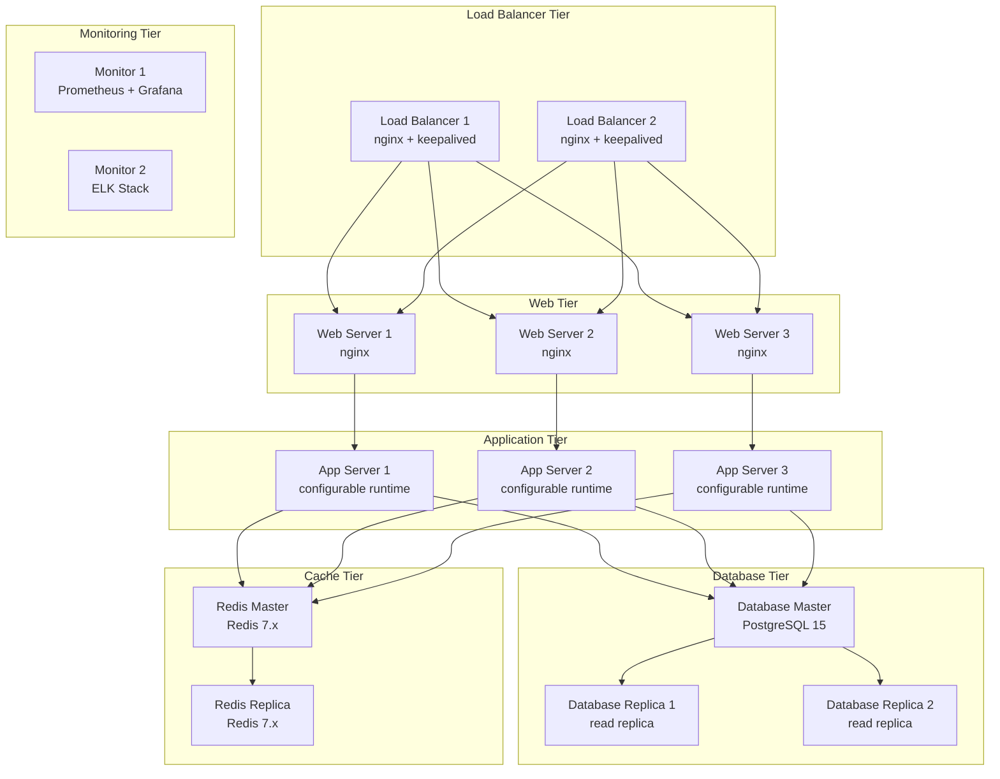

# HX Infrastructure Ansible

## 🚀 Enterprise Infrastructure Automation Platform

A comprehensive Ansible-based infrastructure automation platform designed for scalable, secure, and maintainable enterprise deployments following [Official Ansible Best Practices](https://docs.ansible.com/ansible/latest/user_guide/playbooks_best_practices.html).

### 📋 Project Overview

This repository contains a complete infrastructure automation solution built with Ansible, featuring:

- **15-Server Architecture**: Comprehensive multi-tier infrastructure setup
- **Multi-Environment Support**: Production, staging, and development environments
- **Ansible Standards Compliance**: Follows official Ansible documentation standards
- **Variable Consolidation**: Centralized variable management with proper precedence
- **Shared Variable Libraries**: Reusable components for FQDNs, IPs, and service endpoints
- **Visual Documentation**: Extensive Mermaid diagrams for all components
- **Security-First Design**: Integrated secrets management and security controls

### 🏗️ Infrastructure Architecture



## 📁 Repository Structure

Following [Ansible Directory Layout Best Practices](https://docs.ansible.com/ansible/latest/user_guide/playbooks_best_practices.html#alternative-directory-layout):

```
HX-Infrastructure-Ansible/
├── README.md                           # Project overview and documentation
├── ansible.cfg                         # Ansible configuration following official standards
├── requirements.yml                    # Role and collection dependencies
├── inventory/                          # Inventory definitions
│   ├── environments/                   # Multi-environment support
│   │   ├── production/                 # Production environment
│   │   │   ├── hosts.yml              # Production inventory
│   │   │   └── group_vars/
│   │   │       └── all.yml            # Production-specific variables
│   │   ├── staging/                    # Staging environment
│   │   │   ├── hosts.yml              # Staging inventory
│   │   │   └── group_vars/
│   │   │       └── all.yml            # Staging-specific variables
│   │   └── development/                # Development environment
│   │       ├── hosts.yml              # Development inventory
│   │       └── group_vars/
│   │           └── all.yml            # Development-specific variables
│   └── group_vars/                     # Global and shared variables
│       ├── all.yml                    # Global variables (all environments)
│       └── shared/                    # Shared variable libraries
│           ├── fqdns.yml              # FQDN definitions
│           ├── ip_addresses.yml       # IP address mappings
│           └── service_endpoints.yml  # Service endpoint configurations
└── docs/                              # Comprehensive documentation
    ├── VISUAL_DOCUMENTATION.md        # Architecture diagrams and visual guides
    ├── VISUAL_DOCUMENTATION.pdf       # PDF version of visual documentation
    └── ANSIBLE_STANDARDS_COMPLIANCE.md # Ansible standards compliance guide
```

## 🚀 Quick Start

### Prerequisites

- Ansible 2.15+ ([Installation Guide](https://docs.ansible.com/ansible/latest/installation_guide/intro_installation.html))
- Python 3.9+
- SSH access to target hosts
- Ansible Vault password file (for encrypted variables)

### Environment Setup

1. **Clone the repository**:
   ```bash
   git clone https://github.com/hanax-ai/HX-Infrastructure-Ansible.git
   cd HX-Infrastructure-Ansible
   ```

2. **Install dependencies**:
   ```bash
   ansible-galaxy install -r requirements.yml
   ```

3. **Configure Ansible Vault**:
   ```bash
   echo "your-vault-password" > ~/.ansible_vault_pass
   chmod 600 ~/.ansible_vault_pass
   ```

### Multi-Environment Usage

#### Production Deployment
```bash
ansible-playbook -i inventory/environments/production site.yml
```

#### Staging Deployment
```bash
ansible-playbook -i inventory/environments/staging site.yml
```

#### Development Deployment
```bash
ansible-playbook -i inventory/environments/development site.yml
```

### Validation and Testing

#### Syntax Validation
```bash
# Validate playbook syntax
ansible-playbook --syntax-check site.yml

# Validate inventory
ansible-inventory --list -i inventory/environments/production

# Check variable precedence
ansible-inventory --host <hostname> --yaml -i inventory/environments/production
```

#### Linting
```bash
# Install ansible-lint
pip install ansible-lint

# Run linting
ansible-lint .
```

## 🏗️ Architecture Components

### Network Architecture
- **Multi-tier Design**: DMZ, Private, and Management zones
- **VLAN Segmentation**: Isolated network segments for security
- **Load Balancer VIPs**: High availability with keepalived
- **Firewall Rules**: Tier-based access controls

### Service Tiers

#### Load Balancer Tier
- **Technology**: nginx + keepalived
- **Purpose**: Traffic distribution and SSL termination
- **High Availability**: Active-passive configuration
- **Health Checks**: Automated failover

#### Web Tier
- **Technology**: nginx
- **Purpose**: Static content serving and reverse proxy
- **Scaling**: Horizontal scaling with load balancing
- **Caching**: Multiple caching layers

#### Application Tier
- **Technology**: Configurable runtime (Java 17, Python 3.9, Node.js 18)
- **Purpose**: Business logic processing
- **Scaling**: Auto-scaling based on metrics
- **Health Monitoring**: Comprehensive health checks

#### Database Tier
- **Technology**: PostgreSQL 15
- **Purpose**: Data persistence with master-replica setup
- **High Availability**: Streaming replication
- **Backup**: Automated backup and recovery

#### Cache Tier
- **Technology**: Redis 7.x
- **Purpose**: High-performance caching
- **Replication**: Master-replica configuration
- **Persistence**: Configurable persistence options

#### Monitoring Tier
- **Technology**: Prometheus + Grafana + ELK Stack
- **Purpose**: System observability and logging
- **Metrics**: Infrastructure and application metrics
- **Alerting**: Multi-channel alerting system

## 📊 Variable Management

### Variable Precedence
Following [Ansible Variable Precedence](https://docs.ansible.com/ansible/latest/user_guide/playbooks_variables.html#variable-precedence-where-should-i-put-a-variable):

1. **Global Variables**: `inventory/group_vars/all.yml`
2. **Shared Libraries**: `inventory/group_vars/shared/`
3. **Environment Variables**: `inventory/environments/{env}/group_vars/all.yml`
4. **Host Variables**: `inventory/environments/{env}/host_vars/`

### Shared Variable Libraries

#### FQDNs (`inventory/group_vars/shared/fqdns.yml`)
- External and internal domain names
- SSL certificate domains
- DNS record templates

#### IP Addresses (`inventory/group_vars/shared/ip_addresses.yml`)
- Network subnet definitions
- Server IP mappings
- VIP configurations
- Firewall rule templates

#### Service Endpoints (`inventory/group_vars/shared/service_endpoints.yml`)
- API endpoint definitions
- Health check URLs
- External service integrations
- Service discovery configuration

## 🔒 Security Features

### Security Hardening
- **OS Hardening**: CIS Benchmarks compliance
- **Network Security**: Firewall rules and network segmentation
- **Application Security**: Security headers and configurations
- **Database Security**: Encrypted connections and access controls

### Secrets Management
- **Ansible Vault**: Encrypted variable storage
- **SSH Key Management**: Secure key distribution
- **SSL/TLS Certificates**: Automated certificate management
- **Access Controls**: Role-based access control (RBAC)

### Compliance Standards
- **CIS Benchmarks**: Center for Internet Security guidelines
- **NIST Cybersecurity Framework**: Risk management framework
- **SOC 2**: Security and availability controls
- **ISO 27001**: Information security management

## 📈 Performance Optimization

### Ansible Performance
- **SSH Pipelining**: Reduced SSH overhead
- **Fact Caching**: 24-hour fact caching with JSON backend
- **Parallel Execution**: 20 concurrent forks
- **Smart Gathering**: Conditional fact collection

### Infrastructure Performance
- **Load Balancing**: Multiple algorithms (round-robin, least-connections)
- **Caching Strategy**: Multi-level caching (CDN, Reverse Proxy, Application, Database)
- **Database Optimization**: Connection pooling and query optimization
- **Auto-scaling**: Metric-based horizontal scaling

## 🔍 Monitoring and Observability

### Metrics Collection
- **Infrastructure Metrics**: CPU, memory, disk, network
- **Application Metrics**: Response time, throughput, error rates
- **Business Metrics**: Custom application metrics
- **Retention**: 90-day metric retention

### Logging
- **Centralized Logging**: ELK Stack integration
- **Structured Logging**: JSON format for better parsing
- **Log Retention**: 30-day log retention
- **Log Aggregation**: Multi-source log collection

### Alerting
- **Multi-channel Alerts**: Email, Slack, PagerDuty
- **Severity Levels**: Critical, warning, info
- **Escalation Policies**: Automated escalation workflows
- **Alert Correlation**: Intelligent alert grouping

## 🧪 Testing and Validation

### Testing Framework
- **Molecule**: Role testing with Docker/Vagrant
- **Test Kitchen**: Infrastructure testing
- **Ansible Test**: Built-in testing tools
- **Syntax Validation**: Automated syntax checking

### Continuous Integration
- **Pre-commit Hooks**: Local validation
- **CI/CD Pipeline**: Automated testing and deployment
- **Quality Gates**: Code quality enforcement
- **Security Scanning**: Automated security checks

## 📚 Documentation

### Available Documentation
- **[Visual Documentation](docs/VISUAL_DOCUMENTATION.md)**: Architecture diagrams and visual guides
- **[Ansible Standards Compliance](docs/ANSIBLE_STANDARDS_COMPLIANCE.md)**: Detailed compliance guide
- **README.md**: This comprehensive overview

### External References
- **[Official Ansible Documentation](https://docs.ansible.com/)**
- **[Ansible Best Practices](https://docs.ansible.com/ansible/latest/user_guide/playbooks_best_practices.html)**
- **[Variable Precedence Guide](https://docs.ansible.com/ansible/latest/user_guide/playbooks_variables.html#variable-precedence-where-should-i-put-a-variable)**
- **[Inventory Best Practices](https://docs.ansible.com/ansible/latest/user_guide/intro_inventory.html)**

## 🤝 Contributing

### Development Workflow
1. **Fork the repository**
2. **Create a feature branch**
3. **Follow Ansible best practices**
4. **Add tests for new functionality**
5. **Update documentation**
6. **Submit a pull request**

### Code Standards
- **Ansible Lint**: All code must pass ansible-lint
- **YAML Lint**: Proper YAML formatting
- **Documentation**: Update docs for changes
- **Testing**: Include appropriate tests

## 📄 License

This project is licensed under the MIT License - see the LICENSE file for details.

## 🆘 Support

### Getting Help
- **Issues**: GitHub Issues for bug reports and feature requests
- **Discussions**: GitHub Discussions for questions and community support
- **Documentation**: Comprehensive documentation in the `docs/` directory

### Contact Information
- **Email**: support@hanax-ai.com
- **Maintainer**: HX Infrastructure Team
- **Organization**: hanax-ai

---

**Note**: This infrastructure automation platform follows official Ansible documentation standards and best practices. For the most up-to-date information, always refer to the [Official Ansible Documentation](https://docs.ansible.com/).
