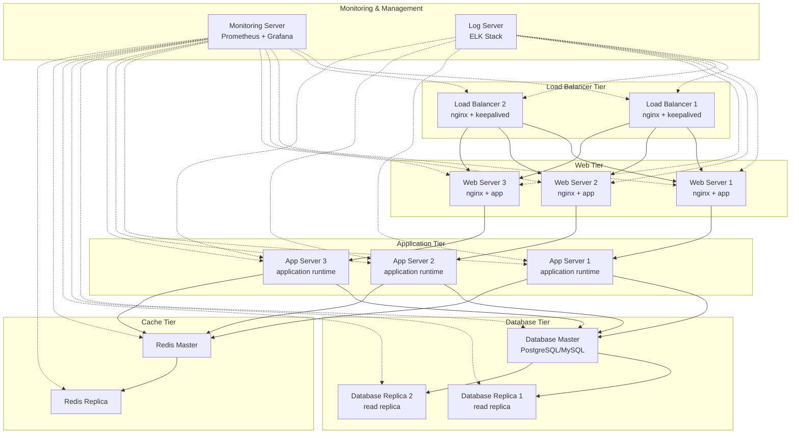
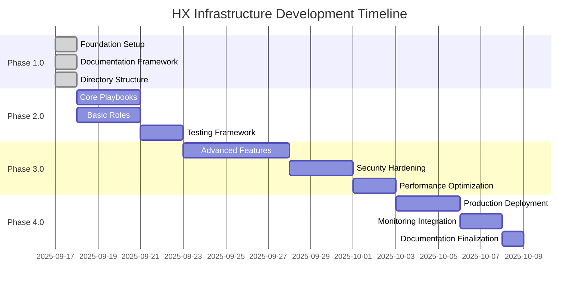

# HX Infrastructure Ansible

## 🚀 Enterprise Infrastructure Automation Platform

A comprehensive Ansible-based infrastructure automation platform designed for scalable, secure, and maintainable enterprise deployments.

### 📋 Project Overview

This repository contains a complete infrastructure automation solution built with Ansible, featuring:

- **15-Server Architecture**: Comprehensive multi-tier infrastructure setup
- **Phase-Based Development**: Structured 4-phase implementation approach
- **Visual Documentation**: Extensive Mermaid diagrams for all components
- **Security-First Design**: Integrated secrets management and security controls
- **CI/CD Integration**: Automated testing and deployment pipelines

### 🏗️ Infrastructure Architecture



### 🎯 Development Phases



### 📁 Directory Structure

```
HX-Infrastructure-Ansible/
├── 📁 playbooks/                    # Main Ansible playbooks
│   ├── 📁 site/                     # Site-wide playbooks
│   ├── 📁 services/                 # Service-specific playbooks
│   ├── 📁 maintenance/              # Maintenance and operations
│   └── 📁 deployment/               # Deployment workflows
├── 📁 roles/                        # Ansible roles
│   ├── 📁 common/                   # Common system configurations
│   ├── 📁 web/                      # Web server roles
│   ├── 📁 database/                 # Database roles
│   ├── 📁 monitoring/               # Monitoring and logging
│   └── 📁 security/                 # Security hardening
├── 📁 inventory/                    # Inventory management
│   ├── 📁 environments/             # Environment-specific configs
│   ├── 📁 group_vars/               # Group variables
│   └── 📁 host_vars/                # Host-specific variables
├── 📁 vars/                         # Variable definitions
├── 📁 templates/                    # Jinja2 templates
├── 📁 files/                        # Static files
├── 📁 scripts/                      # Utility scripts
├── 📁 tests/                        # Testing framework
├── 📁 docs/                         # Documentation
└── 📁 .github/                      # GitHub workflows
```

### 🔧 Quick Start

1. **Clone Repository**
   ```bash
   git clone https://github.com/hanax-ai/HX-Infrastructure-Ansible.git
   cd HX-Infrastructure-Ansible
   ```

2. **Install Dependencies**
   ```bash
   pip install -r requirements.txt
   ansible-galaxy install -r requirements.yml
   ```

3. **Configure Inventory**
   ```bash
   cp inventory/environments/example inventory/environments/production
   # Edit inventory/environments/production/hosts.yml
   ```

4. **Run Site Playbook**
   ```bash
   ansible-playbook -i inventory/environments/production playbooks/site/main.yml
   ```

### 📚 Documentation

- [Architecture Guide](docs/ARCHITECTURE.md) - Detailed system architecture
- [Development Guide](docs/DEVELOPMENT_GUIDE.md) - Development workflows
- [User Guide](docs/USER_GUIDE.md) - Usage instructions
- [API Reference](docs/API_REFERENCE.md) - Ansible role APIs

### 🔒 Security

- Ansible Vault for secrets management
- Role-based access control (RBAC)
- Security hardening playbooks
- Compliance automation (CIS, NIST)

### 🧪 Testing

- Molecule for role testing
- CI/CD pipeline integration
- Infrastructure validation
- Performance benchmarking

### 📊 Monitoring

- Prometheus metrics collection
- Grafana dashboards
- ELK stack for logging
- Alerting and notifications

### 🤝 Contributing

1. Fork the repository
2. Create a feature branch
3. Make your changes
4. Add tests
5. Submit a pull request

### 📄 License

This project is licensed under the MIT License - see the [LICENSE](LICENSE) file for details.

### 🆘 Support

For support and questions:
- Create an issue in this repository
- Check the [documentation](docs/)
- Review existing [discussions](https://github.com/hanax-ai/HX-Infrastructure-Ansible/discussions)

---

**Note**: For GitHub App permissions to access private repositories, please visit: [GitHub App Installation](https://github.com/apps/abacusai/installations/select_target)
