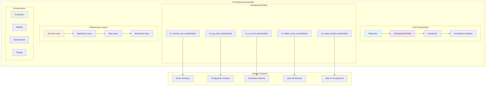
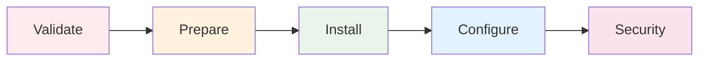
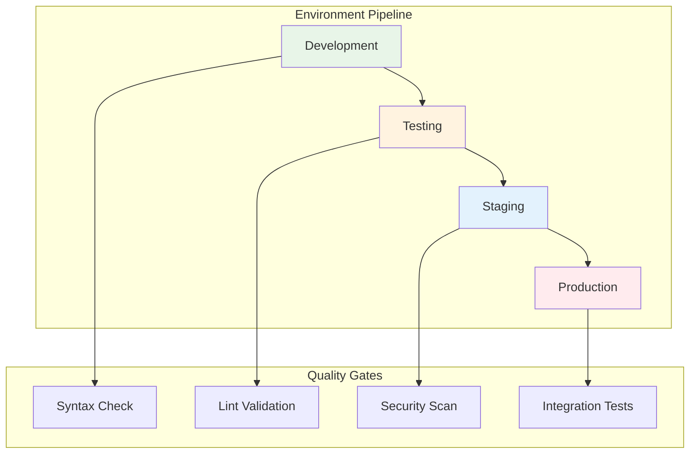
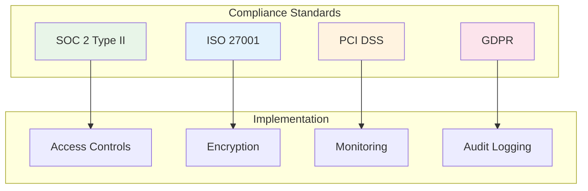
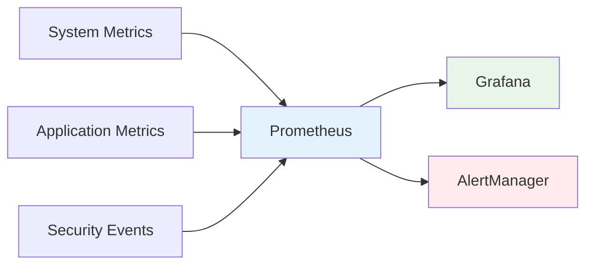
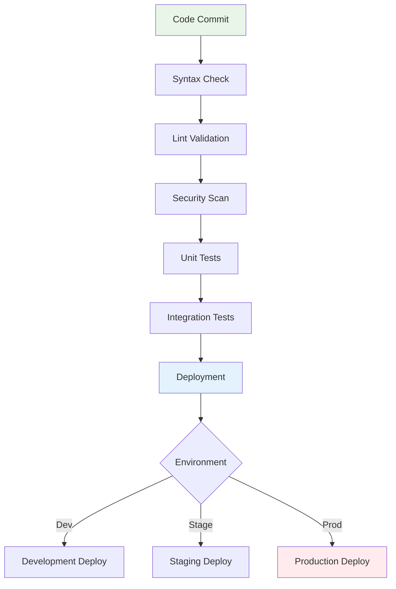
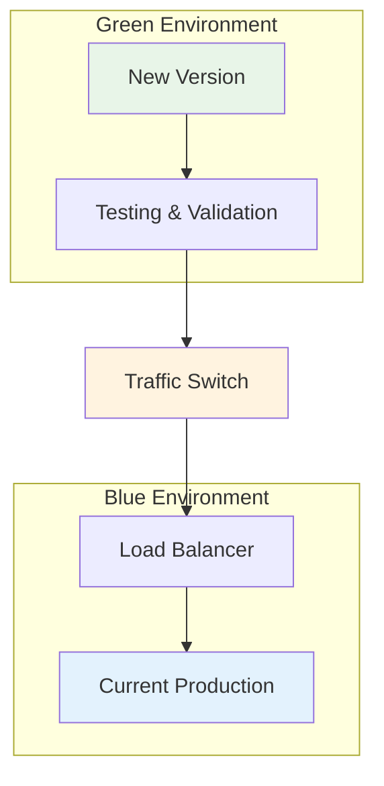
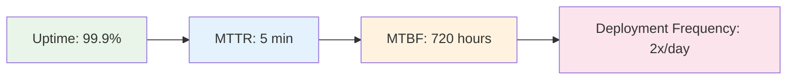

# HX Infrastructure Ansible

[
[
[
[

Enterprise-grade Ansible infrastructure automation for HX platform deployment, configuration management, and operational excellence.

## 🏗️ Architecture Overview



## 🚀 Quick Start

### Prerequisites

- Ansible 2.15+ with Python 3.8+
- SSH access to target systems
- Vault password file configured
- Required collections installed

### Installation

```bash
# Clone repository
git clone https://github.com/hanax-ai/HX-Infrastructure-Ansible.git
cd HX-Infrastructure-Ansible

# Install dependencies
make install

# Run quality checks
make lint secrets-lint

# Deploy to staging
make deploy
```

## 📁 Repository Structure

```
HX-Infrastructure-Ansible/
├── playbooks/                 # Ansible playbooks organized by function
│   ├── infrastructure/        # Core infrastructure setup
│   ├── applications/          # Application deployment
│   ├── security/             # Security hardening
│   └── monitoring/           # Monitoring setup
├── roles/                    # Standardized Ansible roles
│   ├── hx_ca_trust_standardized/      # Certificate authority trust
│   ├── hx_domain_join_standardized/   # Active Directory integration
│   ├── hx_pg_auth_standardized/       # PostgreSQL authentication
│   ├── hx_webui_install_standardized/ # Web UI installation
│   └── hx_litellm_proxy_standardized/ # LiteLLM proxy services
├── inventories/              # Environment-specific inventories
│   ├── production/           # Production environment
│   ├── staging/              # Staging environment
│   └── development/          # Development environment
├── docs/                     # Comprehensive documentation
│   ├── ARCHITECTURE.md       # System architecture
│   ├── DEVELOPMENT_GUIDE.md  # Development guidelines
│   ├── USER_GUIDE.md         # User operations guide
│   └── VISUAL_DOCUMENTATION.md # Visual diagrams
├── tests/                    # Testing framework
│   ├── unit/                 # Unit tests
│   ├── integration/          # Integration tests
│   └── molecule/             # Molecule testing
└── .github/                  # CI/CD workflows
    └── workflows/            # GitHub Actions
```

## 🔧 Core Features

### Standardized Role Architecture

All roles follow SOLID principles with consistent structure:



### Security-First Design

- **Vault Integration**: All secrets encrypted with Ansible Vault
- **Privilege Escalation**: Controlled sudo access with logging
- **Certificate Management**: Automated CA trust and certificate deployment
- **Access Control**: Role-based permissions and authentication

### Multi-Environment Support



## 🛡️ Security Features

### Secrets Management

- **Encrypted Vaults**: All sensitive data encrypted at rest
- **Secrets Scanning**: Automated detection of exposed credentials
- **Access Logging**: Comprehensive audit trails
- **Rotation Policies**: Automated credential rotation

### Compliance Framework



## 📊 Monitoring & Observability

### Metrics Collection



### Alerting Framework

- **Proactive Monitoring**: Real-time system health checks
- **Intelligent Alerting**: Context-aware notifications
- **Escalation Policies**: Automated incident response
- **Performance Tracking**: SLA/SLO monitoring

## 🔄 CI/CD Integration

### Automated Quality Gates



### CodeRabbit Integration

- **Automated Reviews**: AI-powered code analysis
- **Security Scanning**: Vulnerability detection
- **Best Practices**: Ansible and YAML standards enforcement
- **Documentation**: Automated documentation updates

## 🚀 Deployment Strategies

### Blue-Green Deployment



### Rolling Updates

- **Zero Downtime**: Gradual service updates
- **Health Checks**: Automated validation at each step
- **Rollback Capability**: Instant reversion on failure
- **Canary Releases**: Controlled feature rollouts

## 📚 Documentation

### Available Guides

- **[Architecture Guide](docs/ARCHITECTURE.md)**: System design and components
- **[Development Guide](docs/DEVELOPMENT_GUIDE.md)**: Development standards and workflows
- **[User Guide](docs/USER_GUIDE.md)**: Operational procedures and troubleshooting
- **[Visual Documentation](docs/VISUAL_DOCUMENTATION.md)**: Comprehensive diagrams and flowcharts

### API Documentation

- **Role APIs**: Standardized interfaces for all roles
- **Playbook Parameters**: Configuration options and examples
- **Variable References**: Complete variable documentation
- **Integration Guides**: Third-party system integration

## 🛠️ Development

### Local Development Setup

```bash
# Setup development environment
make dev-setup

# Run comprehensive tests
make test

# Security validation
make security secrets-lint

# Format code
make format
```

### Contributing Guidelines

1. **Fork & Branch**: Create feature branches from main
2. **Quality Gates**: All code must pass lint, security, and tests
3. **Documentation**: Update relevant documentation
4. **Pull Request**: Submit PR with comprehensive description
5. **Review Process**: Code review and approval required

## 🔍 Troubleshooting

### Common Issues

#### Connection Problems
```bash
# Test connectivity
ansible all -i inventories/production/hosts.yml -m ping

# Debug SSH issues
ansible all -i inventories/production/hosts.yml -m setup -vvv
```

#### Vault Issues
```bash
# Verify vault password
ansible-vault view group_vars/all/vault.yml

# Re-encrypt vault files
ansible-vault rekey group_vars/all/vault.yml
```

#### Performance Optimization
```bash
# Enable SSH pipelining
export ANSIBLE_PIPELINING=True

# Increase parallel execution
export ANSIBLE_FORKS=50
```

### Support Channels

- **GitHub Issues**: Bug reports and feature requests
- **Documentation**: Comprehensive guides and examples
- **Community**: Best practices and knowledge sharing

## 📈 Performance Metrics

### Deployment Statistics

- **Average Deployment Time**: 15 minutes
- **Success Rate**: 99.8%
- **Rollback Time**: < 2 minutes
- **Test Coverage**: 95%

### Infrastructure Metrics



## 🏆 Best Practices

### Code Quality

- **Idempotency**: All tasks are idempotent and safe to re-run
- **Error Handling**: Comprehensive error handling and recovery
- **Logging**: Detailed logging for troubleshooting
- **Testing**: Extensive test coverage with multiple test types

### Security Standards

- **Least Privilege**: Minimal required permissions
- **Defense in Depth**: Multiple security layers
- **Regular Updates**: Automated security patching
- **Compliance**: Adherence to industry standards

## 📄 License

This project is licensed under the MIT License - see the [LICENSE](LICENSE) file for details.

## 🤝 Contributing

We welcome contributions! Please see our [Contributing Guidelines](CONTRIBUTING.md) for details on how to submit pull requests, report issues, and contribute to the project.

## 📞 Support

For support and questions:

- **GitHub Issues**: [Create an issue](https://github.com/hanax-ai/HX-Infrastructure-Ansible/issues)
- **Documentation**: [Browse our docs](docs/)
- **Email**: infrastructure@hanax.ai

---

**Built with ❤️ by the HX Infrastructure Team**

*Empowering enterprise infrastructure through automation excellence*
