# HX Infrastructure User Guide

## 🎯 Getting Started

This comprehensive user guide will help you deploy, configure, and manage the HX Infrastructure using Ansible automation.

## 📋 Table of Contents

- [Prerequisites](#prerequisites)
- [Installation](#installation)
- [Configuration](#configuration)
- [Deployment](#deployment)
- [Management](#management)
- [Monitoring](#monitoring)
- [Troubleshooting](#troubleshooting)
- [Advanced Usage](#advanced-usage)

## ✅ Prerequisites

### System Requirements

```mermaid
graph TB
    subgraph "Control Node Requirements"
        CONTROL[Control Node<br/>🖥️ Ansible Controller]
        PYTHON[Python 3.9+<br/>🐍 Runtime Environment]
        ANSIBLE[Ansible 2.15+<br/>⚙️ Automation Engine]
        GIT[Git 2.30+<br/>📁 Version Control]
    end
    
    subgraph "Target Infrastructure"
        SERVERS[15 Servers<br/>🖥️ Target Hosts]
        OS[Ubuntu 20.04+ / RHEL 8+<br/>🐧 Operating System]
        SSH[SSH Access<br/>🔑 Key-based Authentication]
        SUDO[Sudo Access<br/>🔒 Privilege Escalation]
    end
    
    subgraph "Network Requirements"
        CONNECTIVITY[Network Connectivity<br/>🌐 SSH Port 22]
        DNS[DNS Resolution<br/>🔍 Hostname Resolution]
        FIREWALL[Firewall Rules<br/>🔥 Port Access]
    end
    
    CONTROL --> SERVERS
    PYTHON --> ANSIBLE
    ANSIBLE --> SSH
    SSH --> SUDO
    
    SERVERS --> OS
    OS --> CONNECTIVITY
    CONNECTIVITY --> DNS
    DNS --> FIREWALL
```



### Infrastructure Overview

| Tier | Servers | Purpose | Specifications |
|------|---------|---------|----------------|
| **Load Balancer** | 2 | Traffic distribution, SSL termination | 2 CPU, 4GB RAM, 50GB SSD |
| **Web** | 3 | Static content, reverse proxy | 2 CPU, 4GB RAM, 100GB SSD |
| **Application** | 3 | Business logic processing | 4 CPU, 8GB RAM, 100GB SSD |
| **Database** | 3 | Data persistence (1 master, 2 replicas) | 4 CPU, 16GB RAM, 500GB SSD |
| **Cache** | 2 | High-performance caching | 2 CPU, 8GB RAM, 100GB SSD |
| **Monitoring** | 2 | System observability | 2 CPU, 8GB RAM, 200GB SSD |

## 🚀 Installation

### Step 1: Clone Repository

```bash
# Clone the HX Infrastructure repository
git clone https://github.com/hanax-ai/HX-Infrastructure-Ansible.git
cd HX-Infrastructure-Ansible

# Verify repository structure
ls -la
```

### Step 2: Setup Environment

```bash
# Create Python virtual environment
python3 -m venv venv
source venv/bin/activate

# Install Python dependencies
pip install -r requirements.txt

# Install Ansible Galaxy collections and roles
ansible-galaxy install -r requirements.yml
```

### Step 3: Verify Installation

```bash
# Check Ansible version
ansible --version

# Verify Ansible configuration
ansible-config dump --only-changed

# Test Ansible installation
ansible localhost -m ping
```

## ⚙️ Configuration

### Inventory Setup

```mermaid
graph TB
    subgraph "Inventory Structure"
        ENV[Environment Selection<br/>🎯 dev/staging/production]
        HOSTS[Host Definition<br/>📋 Server inventory]
        GROUPS[Group Variables<br/>🔧 Tier-specific config]
        HOST_VARS[Host Variables<br/>🖥️ Server-specific config]
    end
    
    subgraph "Configuration Files"
        INVENTORY[inventory/environments/<env>/hosts.yml]
        GROUP_VARS[inventory/group_vars/]
        HOST_VARS_DIR[inventory/host_vars/]
        SECRETS[vars/secrets.yml (encrypted)]
    end
    
    ENV --> HOSTS
    HOSTS --> GROUPS
    GROUPS --> HOST_VARS
    
    ENV --> INVENTORY
    GROUPS --> GROUP_VARS
    HOST_VARS --> HOST_VARS_DIR
    HOST_VARS --> SECRETS
```

### 1. Configure Inventory

```bash
# Copy example inventory
cp -r inventory/environments/example inventory/environments/production

# Edit hosts file
vim inventory/environments/production/hosts.yml
```

```yaml
# inventory/environments/production/hosts.yml
---
all:
  children:
    load_balancers:
      hosts:
        lb-01:
          ansible_host: 10.0.1.10
          ansible_user: ubuntu
        lb-02:
          ansible_host: 10.0.1.11
          ansible_user: ubuntu
    
    web_servers:
      hosts:
        web-01:
          ansible_host: 10.0.2.10
          ansible_user: ubuntu
        web-02:
          ansible_host: 10.0.2.11
          ansible_user: ubuntu
        web-03:
          ansible_host: 10.0.2.12
          ansible_user: ubuntu
    
    app_servers:
      hosts:
        app-01:
          ansible_host: 10.0.3.10
          ansible_user: ubuntu
        app-02:
          ansible_host: 10.0.3.11
          ansible_user: ubuntu
        app-03:
          ansible_host: 10.0.3.12
          ansible_user: ubuntu
    
    database_servers:
      hosts:
        db-01:
          ansible_host: 10.0.4.10
          ansible_user: ubuntu
          postgresql_role: master
        db-02:
          ansible_host: 10.0.4.11
          ansible_user: ubuntu
          postgresql_role: replica
        db-03:
          ansible_host: 10.0.4.12
          ansible_user: ubuntu
          postgresql_role: replica
    
    cache_servers:
      hosts:
        cache-01:
          ansible_host: 10.0.5.10
          ansible_user: ubuntu
          redis_role: master
        cache-02:
          ansible_host: 10.0.5.11
          ansible_user: ubuntu
          redis_role: replica
    
    monitoring_servers:
      hosts:
        monitor-01:
          ansible_host: 10.0.6.10
          ansible_user: ubuntu
        log-01:
          ansible_host: 10.0.6.11
          ansible_user: ubuntu
```

### 2. Configure Variables

```bash
# Edit global variables
vim inventory/group_vars/all.yml
```

```yaml
# inventory/group_vars/all.yml
---
# Global Configuration
environment: production
domain_name: example.com
timezone: UTC

# Security Configuration
ssh_port: 22
firewall_enabled: true
fail2ban_enabled: true

# SSL Configuration
ssl_enabled: true
ssl_certificate_path: /etc/ssl/certs
ssl_private_key_path: /etc/ssl/private

# Backup Configuration
backup_enabled: true
backup_retention_days: 30
backup_schedule: "0 2 * * *"

# Monitoring Configuration
monitoring_enabled: true
log_aggregation_enabled: true
metrics_retention_days: 90
```

### 3. Configure Secrets

```bash
# Create encrypted secrets file
ansible-vault create vars/secrets.yml
```

```yaml
# vars/secrets.yml (encrypted with Ansible Vault)
---
# Database Passwords
postgresql_admin_password: "super_secure_password_123"
postgresql_replication_password: "replication_password_456"

# Redis Password
redis_password: "redis_secure_password_789"

# SSL Certificates (base64 encoded)
ssl_certificate: |
  LS0tLS1CRUdJTi...
ssl_private_key: |
  LS0tLS1CRUdJTi...

# API Keys
monitoring_api_key: "monitoring_api_key_abc123"
backup_encryption_key: "backup_encryption_key_def456"

# Application Secrets
app_secret_key: "application_secret_key_ghi789"
jwt_secret: "jwt_signing_secret_jkl012"
```

## 🚀 Deployment

### Deployment Workflow


### Pre-Deployment Checks

```bash
# Test connectivity to all hosts
ansible all -i inventory/environments/production -m ping

# Verify SSH access and sudo privileges
ansible all -i inventory/environments/production -m setup --limit 1

# Check disk space on all hosts
ansible all -i inventory/environments/production -m shell -a "df -h"

# Validate playbook syntax
ansible-playbook --syntax-check playbooks/site/main.yml

# Run deployment in check mode (dry run)
ansible-playbook -i inventory/environments/production playbooks/site/main.yml --check --diff
```

### Full Infrastructure Deployment

```bash
# Deploy complete infrastructure
ansible-playbook -i inventory/environments/production playbooks/site/main.yml --ask-vault-pass

# Deploy with specific tags
ansible-playbook -i inventory/environments/production playbooks/site/main.yml --tags "database,cache" --ask-vault-pass

# Deploy to specific host groups
ansible-playbook -i inventory/environments/production playbooks/site/main.yml --limit "web_servers" --ask-vault-pass
```

### Tier-Specific Deployments

```bash
# Deploy database tier only
ansible-playbook -i inventory/environments/production playbooks/site/db-tier.yml --ask-vault-pass

# Deploy web tier only
ansible-playbook -i inventory/environments/production playbooks/site/web-tier.yml --ask-vault-pass

# Deploy application tier only
ansible-playbook -i inventory/environments/production playbooks/site/app-tier.yml --ask-vault-pass
```

## 🔧 Management

### Service Management

```mermaid
graph TB
    subgraph "Service Operations"
        START[Start Services<br/>🚀 Service startup]
        STOP[Stop Services<br/>⏹️ Service shutdown]
        RESTART[Restart Services<br/>🔄 Service restart]
        RELOAD[Reload Config<br/>⚡ Config reload]
        STATUS[Check Status<br/>📊 Health check]
    end
    
    subgraph "Management Playbooks"
        SERVICE_MGMT[Service Management<br/>📋 playbooks/maintenance/]
        CONFIG_UPDATE[Configuration Update<br/>⚙️ Config management]
        HEALTH_CHECK[Health Monitoring<br/>🏥 System validation]
    end
    
    START --> SERVICE_MGMT
    STOP --> SERVICE_MGMT
    RESTART --> SERVICE_MGMT
    RELOAD --> CONFIG_UPDATE
    STATUS --> HEALTH_CHECK
```



### Common Management Tasks

```bash
# Restart all web services
ansible-playbook -i inventory/environments/production playbooks/maintenance/restart-services.yml --limit "web_servers" --tags "nginx"

# Update system packages
ansible-playbook -i inventory/environments/production playbooks/maintenance/update.yml

# Apply security patches
ansible-playbook -i inventory/environments/production playbooks/maintenance/security.yml

# Backup databases
ansible-playbook -i inventory/environments/production playbooks/maintenance/backup.yml --tags "database"

# Check system health
ansible-playbook -i inventory/environments/production playbooks/maintenance/health-check.yml
```

### Configuration Updates

```bash
# Update nginx configuration
ansible-playbook -i inventory/environments/production playbooks/services/nginx.yml --tags "configuration"

# Update database configuration
ansible-playbook -i inventory/environments/production playbooks/services/postgresql.yml --tags "configuration"

# Update monitoring configuration
ansible-playbook -i inventory/environments/production playbooks/services/monitoring.yml --tags "configuration"
```

## 📊 Monitoring

### Monitoring Stack


### Accessing Monitoring

```bash
# Access Grafana dashboard
# URL: https://monitor-01.example.com:3000
# Default credentials: admin/admin (change on first login)

# Access Prometheus
# URL: https://monitor-01.example.com:9090

# Access Kibana
# URL: https://log-01.example.com:5601

# Check monitoring services status
ansible monitoring_servers -i inventory/environments/production -m service -a "name=prometheus state=started"
ansible monitoring_servers -i inventory/environments/production -m service -a "name=grafana-server state=started"
```

### Key Metrics to Monitor

| Metric Category | Key Metrics | Thresholds |
|----------------|-------------|------------|
| **System** | CPU usage, Memory usage, Disk usage | CPU > 80%, Memory > 85%, Disk > 90% |
| **Network** | Bandwidth, Connections, Latency | Bandwidth > 80%, Latency > 100ms |
| **Application** | Response time, Error rate, Throughput | Response > 500ms, Errors > 1% |
| **Database** | Connections, Query time, Replication lag | Connections > 80%, Query > 1s |
| **Cache** | Hit rate, Memory usage, Connections | Hit rate < 90%, Memory > 80% |

## 🔍 Troubleshooting

### Common Issues and Solutions


### Diagnostic Commands

```bash
# Test connectivity
ansible all -i inventory/environments/production -m ping

# Check service status
ansible all -i inventory/environments/production -m service -a "name=nginx"

# Check system resources
ansible all -i inventory/environments/production -m shell -a "free -h && df -h"

# Check logs
ansible web_servers -i inventory/environments/production -m shell -a "tail -n 50 /var/log/nginx/error.log"

# Validate configurations
ansible web_servers -i inventory/environments/production -m shell -a "nginx -t"
ansible database_servers -i inventory/environments/production -m shell -a "sudo -u postgres psql -c 'SELECT version();'"
```

### Recovery Procedures

```bash
# Restart failed services
ansible-playbook -i inventory/environments/production playbooks/maintenance/restart-services.yml --limit "failed_host"

# Restore from backup
ansible-playbook -i inventory/environments/production playbooks/maintenance/restore.yml --extra-vars "backup_date=2025-09-17"

# Emergency maintenance mode
ansible-playbook -i inventory/environments/production playbooks/maintenance/maintenance-mode.yml --extra-vars "maintenance_enabled=true"

# Health check after recovery
ansible-playbook -i inventory/environments/production playbooks/maintenance/health-check.yml
```

## 🚀 Advanced Usage

### Rolling Updates


```bash
# Perform rolling update
ansible-playbook -i inventory/environments/production playbooks/deployment/rolling-update.yml

# Blue-green deployment
ansible-playbook -i inventory/environments/production playbooks/deployment/blue-green.yml

# Canary deployment
ansible-playbook -i inventory/environments/production playbooks/deployment/canary.yml --extra-vars "canary_percentage=10"
```

### Scaling Operations

```bash
# Scale web tier horizontally
ansible-playbook -i inventory/environments/production playbooks/scaling/scale-web.yml --extra-vars "web_server_count=5"

# Scale application tier
ansible-playbook -i inventory/environments/production playbooks/scaling/scale-app.yml --extra-vars "app_server_count=6"

# Add database replica
ansible-playbook -i inventory/environments/production playbooks/scaling/add-db-replica.yml --extra-vars "new_replica_host=db-04"
```

### Backup and Recovery

```bash
# Full system backup
ansible-playbook -i inventory/environments/production playbooks/maintenance/backup.yml --extra-vars "backup_type=full"

# Database backup only
ansible-playbook -i inventory/environments/production playbooks/maintenance/backup.yml --tags "database"

# Restore from specific backup
ansible-playbook -i inventory/environments/production playbooks/maintenance/restore.yml --extra-vars "backup_date=2025-09-17 backup_type=database"

# Test backup integrity
ansible-playbook -i inventory/environments/production playbooks/maintenance/test-backup.yml
```

### Security Operations

```bash
# Apply security hardening
ansible-playbook -i inventory/environments/production playbooks/security/hardening.yml

# Update SSL certificates
ansible-playbook -i inventory/environments/production playbooks/security/ssl-update.yml

# Security audit
ansible-playbook -i inventory/environments/production playbooks/security/audit.yml

# Rotate secrets
ansible-playbook -i inventory/environments/production playbooks/security/rotate-secrets.yml --ask-vault-pass
```

## 📚 Additional Resources

### Quick Reference

| Task | Command |
|------|---------|
| **Deploy all** | `ansible-playbook -i inventory/environments/production playbooks/site/main.yml --ask-vault-pass` |
| **Check connectivity** | `ansible all -i inventory/environments/production -m ping` |
| **Restart services** | `ansible-playbook -i inventory/environments/production playbooks/maintenance/restart-services.yml` |
| **Update packages** | `ansible-playbook -i inventory/environments/production playbooks/maintenance/update.yml` |
| **Backup database** | `ansible-playbook -i inventory/environments/production playbooks/maintenance/backup.yml --tags database` |
| **Health check** | `ansible-playbook -i inventory/environments/production playbooks/maintenance/health-check.yml` |

### Support and Documentation

- **Project Repository**: [https://github.com/hanax-ai/HX-Infrastructure-Ansible](https://github.com/hanax-ai/HX-Infrastructure-Ansible)
- **Issue Tracker**: [GitHub Issues](https://github.com/hanax-ai/HX-Infrastructure-Ansible/issues)
- **Documentation**: [docs/](docs/) directory
- **Community Discussions**: [GitHub Discussions](https://github.com/hanax-ai/HX-Infrastructure-Ansible/discussions)

### GitHub App Access

For accessing private repositories and enhanced GitHub integration, please ensure you have granted access to our GitHub App:

🔗 **[GitHub App Installation](https://github.com/apps/abacusai/installations/select_target)**

---

This user guide provides comprehensive instructions for deploying and managing the HX Infrastructure. For additional support, please refer to the documentation or create an issue in the project repository.
