# HX Infrastructure Architecture

## System Overview

The HX Infrastructure Ansible project implements a comprehensive enterprise-grade automation framework designed for scalability, security, and operational excellence.

## Core Architecture Principles

### 1. Separation of Concerns

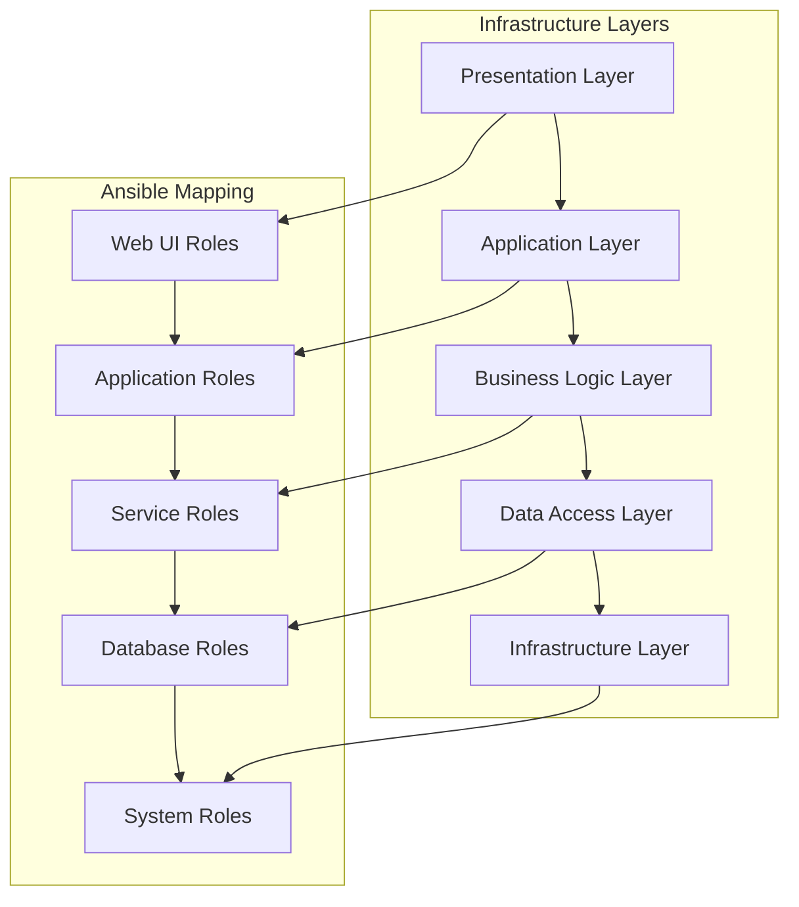

### 2. SOLID Principles Implementation

- **Single Responsibility**: Each role has one clear purpose
- **Open/Closed**: Roles are extensible without modification
- **Liskov Substitution**: Role interfaces are consistent
- **Interface Segregation**: Minimal, focused role APIs
- **Dependency Inversion**: High-level modules don't depend on low-level details

## Component Architecture

### Role Standardization Framework

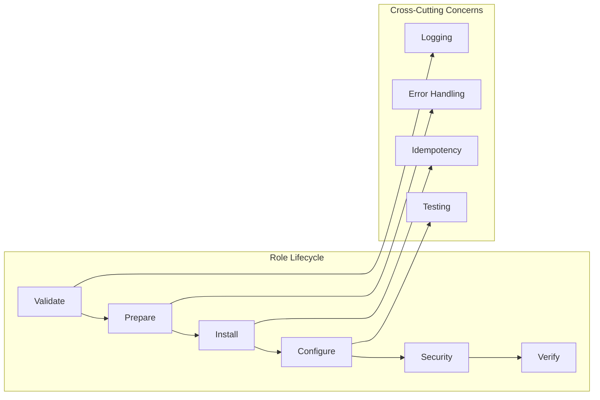

### Security Architecture

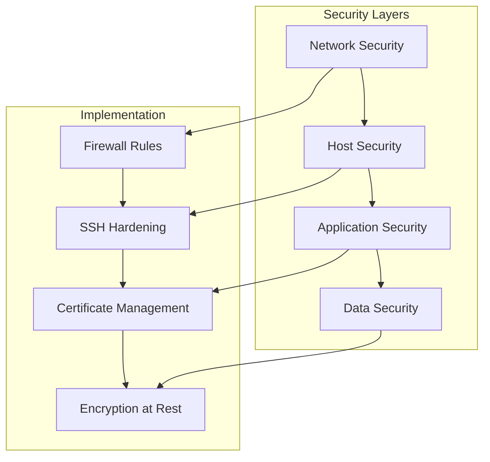

## Data Flow Architecture

### Configuration Management Flow

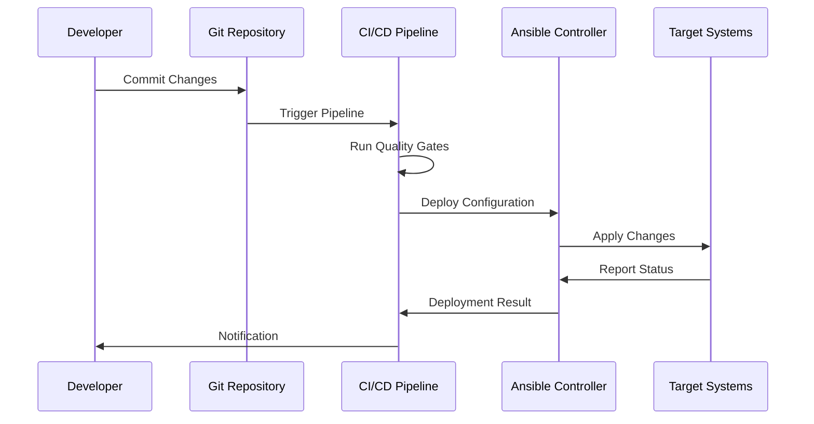

### Secrets Management Flow

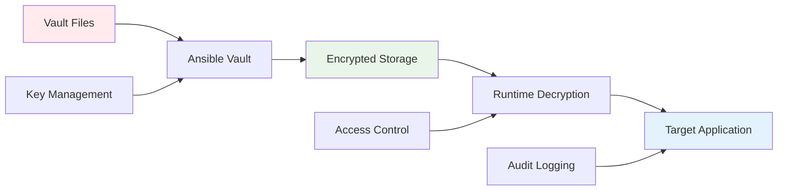

## Deployment Architecture

### Multi-Environment Strategy

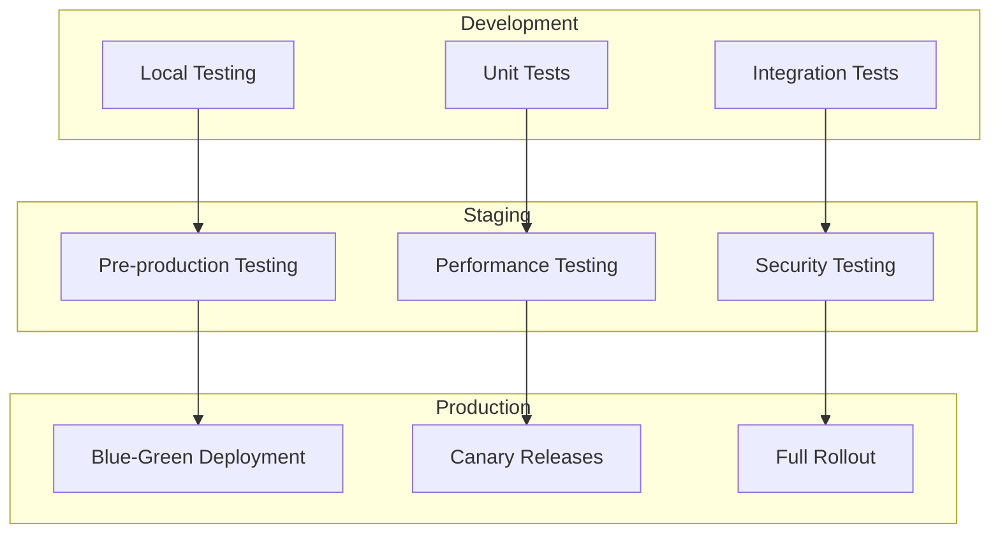

### High Availability Design

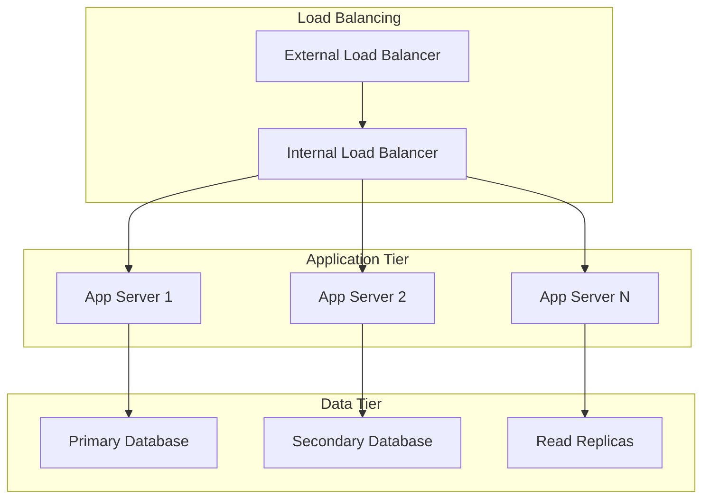

## Monitoring Architecture

### Observability Stack

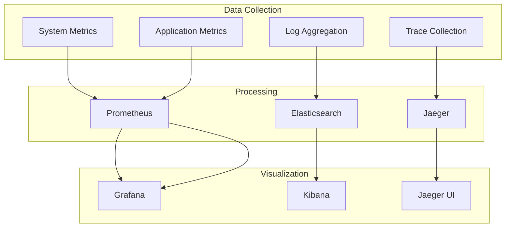

### Alerting Framework

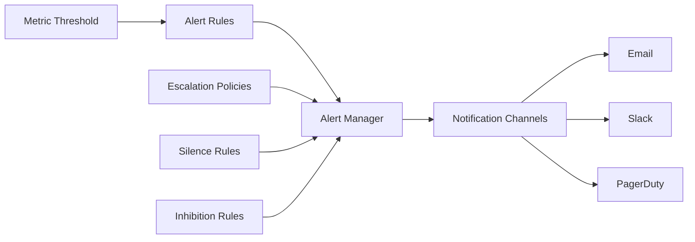

## Security Architecture

### Defense in Depth

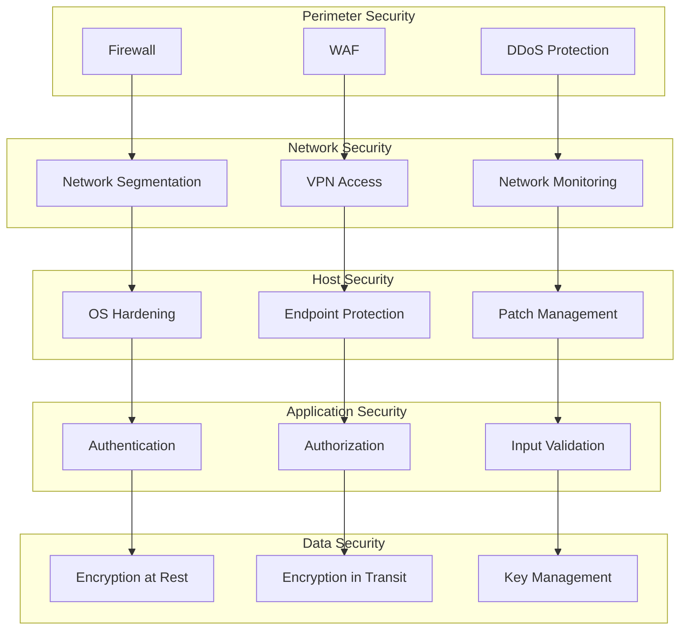

### Certificate Management

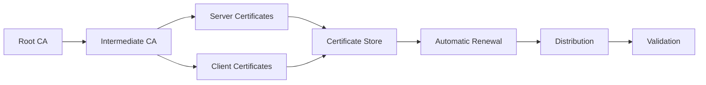

## Scalability Architecture

### Horizontal Scaling

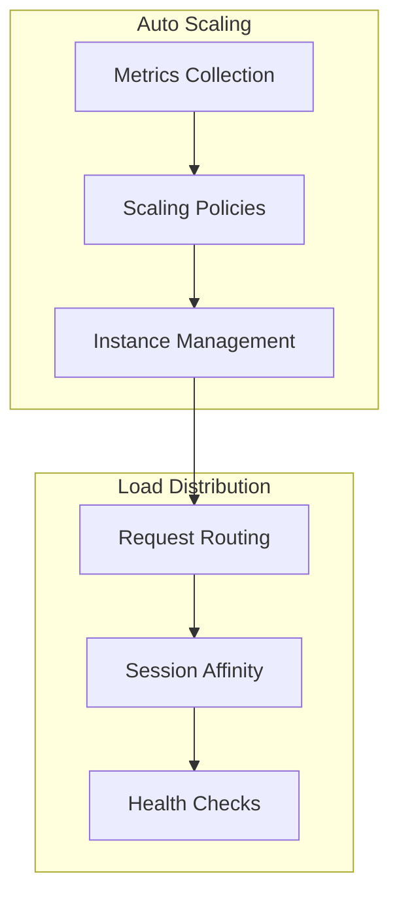

### Performance Optimization

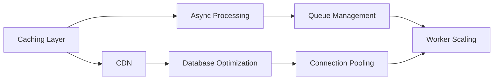

## Disaster Recovery Architecture

### Backup Strategy

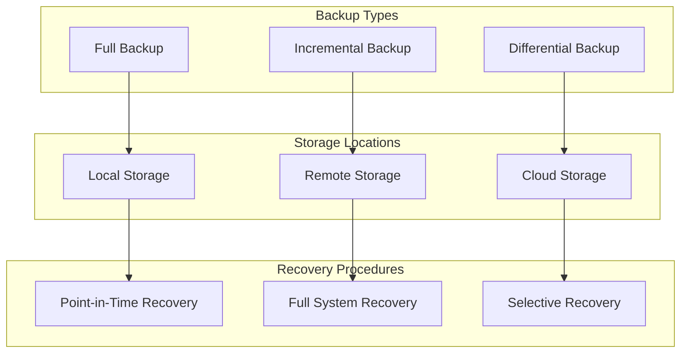

### Business Continuity

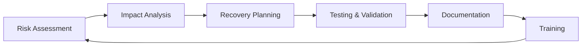

## Integration Architecture

### API Gateway Pattern

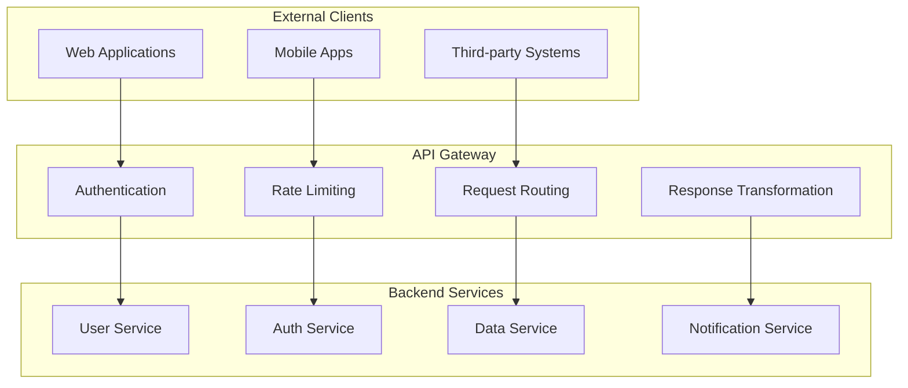

### Event-Driven Architecture

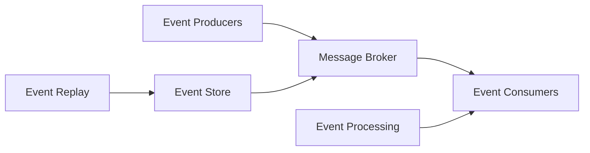

## Quality Assurance Architecture

### Testing Strategy

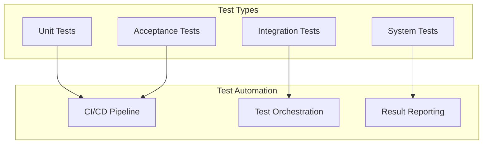

### Code Quality Gates

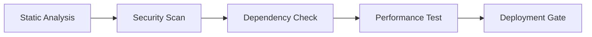

## Compliance Architecture

### Regulatory Framework

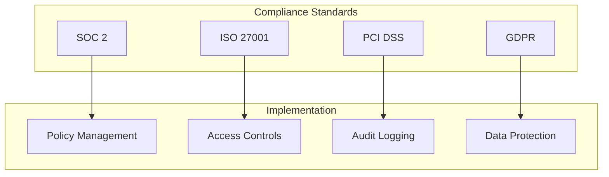

### Audit Trail

```mermaid
graph LR
    A[User Actions] --> B[System Events]
    B --> C[Audit Log]
    C --> D[Log Analysis]
    D --> E[Compliance Reports]
```

This architecture document provides a comprehensive overview of the HX Infrastructure system design, ensuring scalability, security, and operational excellence across all components.
