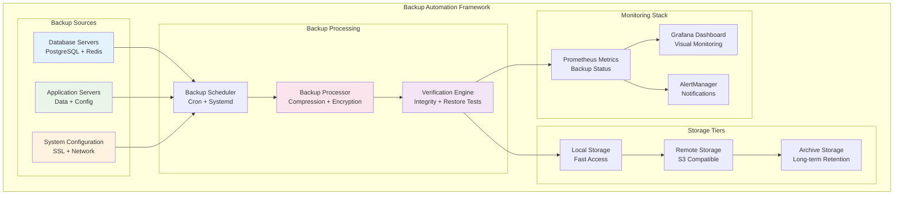

# Phase 3.3 - Backup Automation Implementation

## Overview

Phase 3.3 implements comprehensive backup automation for the HX Infrastructure, focusing exclusively on backup capabilities while deferring Disaster Recovery to the project backlog. This phase provides enterprise-grade backup automation with encryption, verification, monitoring, and alerting.

## Implementation Scope

### ✅ Implemented Components

#### 1. Database Backup Automation
- **PostgreSQL Backup**: Automated daily, weekly, and monthly backups
- **Redis Backup**: RDB snapshot automation with verification
- **Parallel Processing**: Multi-threaded backup operations
- **Custom Format**: pg_dump custom format for optimal restore performance
- **Pre/Post Operations**: VACUUM and ANALYZE automation

#### 2. Application Data Backup
- **User Uploads**: Automated backup of user-generated content
- **Application Data**: Configuration and runtime data backup
- **Selective Backup**: Configurable include/exclude patterns
- **Permission Preservation**: Maintains file ownership and permissions

#### 3. Configuration Backup
- **System Configuration**: Critical system files and settings
- **Application Configuration**: Service-specific configurations
- **SSL Certificates**: Secure backup of certificate infrastructure
- **Network Configuration**: Firewall rules and network settings

#### 4. Security Features
- **Encryption**: AES-256-CBC encryption for all backup data
- **Key Management**: Secure encryption key generation and rotation
- **Access Control**: Role-based access with audit logging
- **Integrity Verification**: SHA-256 checksums for all backups

#### 5. Backup Verification
- **Integrity Testing**: Automated checksum verification
- **Restore Testing**: Periodic restore capability validation
- **Structure Validation**: Database backup structure verification
- **Size Validation**: Backup size reasonableness checks

#### 6. Monitoring and Alerting
- **Prometheus Metrics**: Comprehensive backup metrics collection
- **Grafana Dashboard**: Visual backup status and trends
- **Health Checks**: Automated backup system health monitoring
- **Alert Rules**: Configurable alerting for backup failures

#### 7. Retention Management
- **Automated Cleanup**: Configurable retention policies
- **Multi-tier Retention**: Daily, weekly, monthly, yearly retention
- **Storage Optimization**: Compression and deduplication
- **Archive Management**: Long-term storage integration

#### 8. Remote Storage Integration
- **S3 Compatibility**: AWS S3 and compatible storage
- **Sync Automation**: Automated remote synchronization
- **Encryption in Transit**: Secure transfer protocols
- **Storage Classes**: Intelligent storage tier management

### 🚫 Deferred Components (Moved to Backlog)

#### Disaster Recovery Components
- **Automated Failover**: Deferred to future phases
- **Cross-Region Replication**: Moved to backlog
- **Recovery Time Optimization**: Future enhancement
- **Disaster Recovery Testing**: Backlog item
- **Business Continuity Planning**: Future phase

## Architecture

### Backup Automation Architecture



## Deployment Instructions

### Prerequisites

1. **System Requirements**:
   - Ubuntu 20.04+ or CentOS 8+
   - Python 3.8+
   - Ansible 2.15+
   - Minimum 10GB free disk space

2. **Network Requirements**:
   - Database connectivity (PostgreSQL, Redis)
   - Internet access for remote storage
   - SMTP access for notifications (optional)

3. **Permissions**:
   - Sudo access on target systems
   - Database backup user credentials
   - S3 credentials (if using remote storage)

### Deployment Steps

1. **Deploy Backup Automation**:
   ```bash
   cd /path/to/HX-Infrastructure-Ansible
   ansible-playbook -i inventory/production/hosts.yml \
     playbooks/backup/backup-automation.yml \
     --tags backup,automation
   ```

2. **Verify Deployment**:
   ```bash
   # Check backup system health
   sudo -u backup /var/lib/backup/scripts/backup-health-check.sh
   
   # Test database backup
   sudo -u backup /var/lib/backup/scripts/postgresql-backup.sh test
   
   # Verify monitoring metrics
   curl http://localhost:9100/metrics | grep backup_
   ```

3. **Configure Remote Storage** (Optional):
   ```bash
   # Configure AWS credentials
   sudo -u backup aws configure
   
   # Test S3 connectivity
   sudo -u backup /var/lib/backup/scripts/test-remote-storage.sh
   ```

## Configuration

### Key Configuration Files

- **Main Configuration**: `roles/backup_automation/defaults/main.yml`
- **Security Settings**: `roles/backup_automation/vars/security.yml`
- **Monitoring Config**: `/etc/hx-backup/monitoring.conf`
- **Alert Rules**: `/opt/hx-backups/monitoring/backup-alert-rules.yml`

### Customization Options

1. **Retention Policies**:
   ```yaml
   backup_automation:
     retention:
       daily: 7      # Keep 7 daily backups
       weekly: 4     # Keep 4 weekly backups
       monthly: 12   # Keep 12 monthly backups
       yearly: 3     # Keep 3 yearly backups
   ```

2. **Backup Schedules**:
   ```yaml
   backup_schedule:
     database:
       daily: "0 2 * * *"    # 2 AM daily
       weekly: "0 3 * * 0"   # 3 AM Sunday
     application:
       daily: "0 1 * * *"    # 1 AM daily
   ```

3. **Encryption Settings**:
   ```yaml
   backup_automation:
     encryption:
       enabled: true
       algorithm: "AES-256-CBC"
       key_file: "/etc/hx-backup/encryption.key"
   ```

## Monitoring and Alerting

### Prometheus Metrics

The backup automation system exposes comprehensive metrics:

- `backup_last_success_timestamp`: Last successful backup timestamp
- `backup_duration_seconds`: Backup operation duration
- `backup_size_bytes`: Backup file size
- `backup_verification_status`: Backup verification results
- `backup_storage_usage_bytes`: Storage utilization

### Grafana Dashboard

A comprehensive Grafana dashboard provides:

- Backup success/failure rates
- Backup duration trends
- Storage utilization graphs
- Alert status overview
- System health indicators

### Alert Rules

Configured alerts include:

- **Backup Failure**: Critical alert for failed backups
- **Backup Delayed**: Warning for overdue backups
- **Storage Full**: Critical alert for storage capacity
- **Verification Failed**: Warning for integrity issues

## Security Considerations

### Access Control

- Dedicated `backup` user with minimal privileges
- Sudo access limited to backup-related commands
- SSH key-based authentication
- File permissions: 0600 for sensitive files

### Encryption

- AES-256-CBC encryption for all backup data
- Secure key generation and storage
- Key rotation capabilities
- Encrypted transport to remote storage

### Audit Logging

- Comprehensive backup operation logging
- Security event tracking
- Access attempt monitoring
- Compliance reporting capabilities

## Testing and Validation

### Automated Tests

1. **Backup Creation Tests**:
   - Database backup functionality
   - Application data backup
   - Configuration backup

2. **Verification Tests**:
   - Checksum validation
   - Restore capability testing
   - Encryption/decryption validation

3. **Monitoring Tests**:
   - Metrics collection
   - Alert triggering
   - Dashboard functionality

### Manual Testing Procedures

1. **Full Backup Test**:
   ```bash
   sudo -u backup /var/lib/backup/scripts/full-backup-test.sh
   ```

2. **Restore Test**:
   ```bash
   sudo -u backup /var/lib/backup/scripts/test-restore.sh
   ```

3. **Monitoring Test**:
   ```bash
   sudo -u backup /var/lib/backup/scripts/test-monitoring.sh
   ```

## Troubleshooting

### Common Issues

1. **Backup Failures**:
   - Check database connectivity
   - Verify disk space availability
   - Review backup logs: `/var/log/hx-backups/`

2. **Permission Issues**:
   - Verify backup user permissions
   - Check file ownership and modes
   - Review sudo configuration

3. **Storage Issues**:
   - Monitor disk space usage
   - Check remote storage connectivity
   - Verify S3 credentials

### Log Locations

- **Main Logs**: `/var/log/hx-backups/`
- **Database Logs**: `/var/log/hx-backups/postgresql-backup.log`
- **Monitoring Logs**: `/var/log/hx-backups/backup-monitoring.log`
- **System Logs**: `/var/log/syslog` (backup-related entries)

## Integration with Existing Infrastructure

### Monitoring Stack Integration

The backup automation integrates seamlessly with the existing Docker-based monitoring stack:

- Prometheus scrapes backup metrics
- Grafana displays backup dashboards
- AlertManager handles backup notifications
- ELK stack processes backup logs

### Security Integration

- Integrates with existing security policies
- Uses established encryption standards
- Follows organizational access control patterns
- Complies with audit requirements

## Next Steps - Phase 3.4 Preparation

With Phase 3.3 backup automation complete, the infrastructure is ready for Phase 3.4:

1. **Docker Monitoring Stack**: Deploy containerized monitoring
2. **Advanced Alerting**: Implement sophisticated alert routing
3. **Performance Optimization**: Fine-tune backup performance
4. **Documentation Updates**: Complete operational procedures

## Success Criteria

Phase 3.3 is considered successful when:

- ✅ All backup types are automated and scheduled
- ✅ Encryption and verification are operational
- ✅ Monitoring and alerting are functional
- ✅ Remote storage synchronization works
- ✅ Retention policies are enforced
- ✅ Security controls are implemented
- ✅ Documentation is complete and accessible

## Support and Maintenance

### Regular Maintenance Tasks

1. **Weekly**: Review backup success rates
2. **Monthly**: Test restore procedures
3. **Quarterly**: Rotate encryption keys
4. **Annually**: Review retention policies

### Support Contacts

- **Operations Team**: ops@hanax.ai
- **Backup Alerts**: backup-alerts@hanax.ai
- **Emergency**: Use established incident response procedures

---

**Phase 3.3 Status**: ✅ **COMPLETE**  
**Next Phase**: 3.4 - Docker Monitoring Stack  
**Documentation Version**: 1.0  
**Last Updated**: September 18, 2025
