# HX Infrastructure Visual Documentation

## Comprehensive System Diagrams and Visual Architecture

This document provides detailed visual representations of the HX Infrastructure Ansible system architecture, workflows, and operational procedures using Mermaid diagrams.

## Table of Contents

1. [System Architecture Diagrams](#system-architecture-diagrams)
2. [Deployment Flow Diagrams](#deployment-flow-diagrams)
3. [Security Architecture](#security-architecture)
4. [Monitoring and Observability](#monitoring-and-observability)
5. [Data Flow Diagrams](#data-flow-diagrams)
6. [Network Architecture](#network-architecture)
7. [CI/CD Pipeline Visualization](#cicd-pipeline-visualization)
8. [Disaster Recovery Workflows](#disaster-recovery-workflows)

## System Architecture Diagrams

### 1. Overall System Architecture

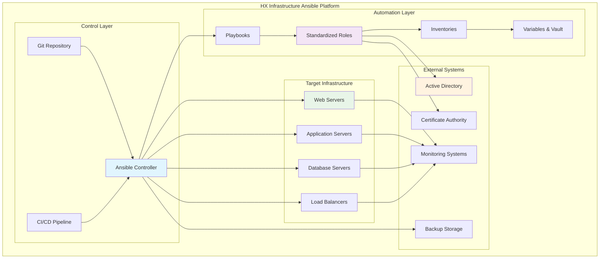

### 2. Role Architecture and Dependencies

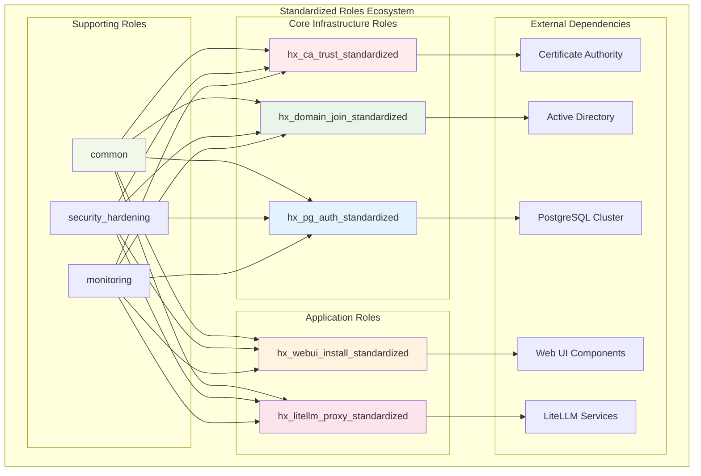

### 3. Multi-Environment Architecture

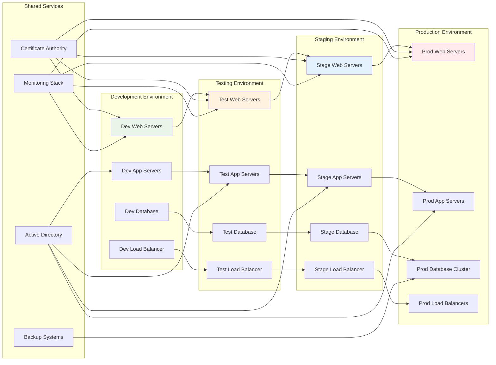

## Deployment Flow Diagrams

### 4. Standard Deployment Workflow

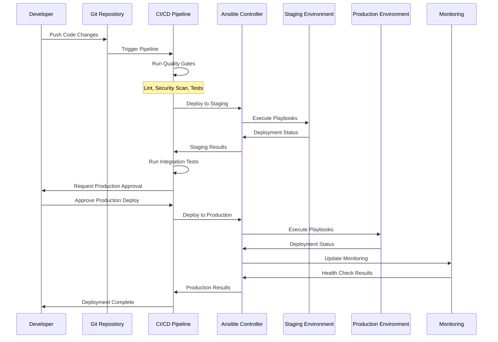

### 5. Blue-Green Deployment Process

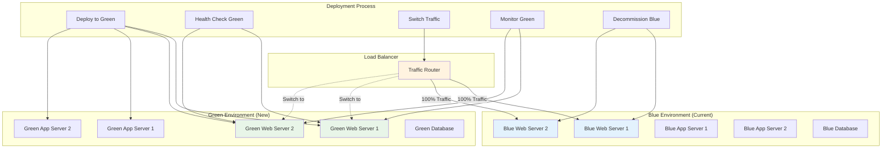

### 6. Rolling Deployment Strategy

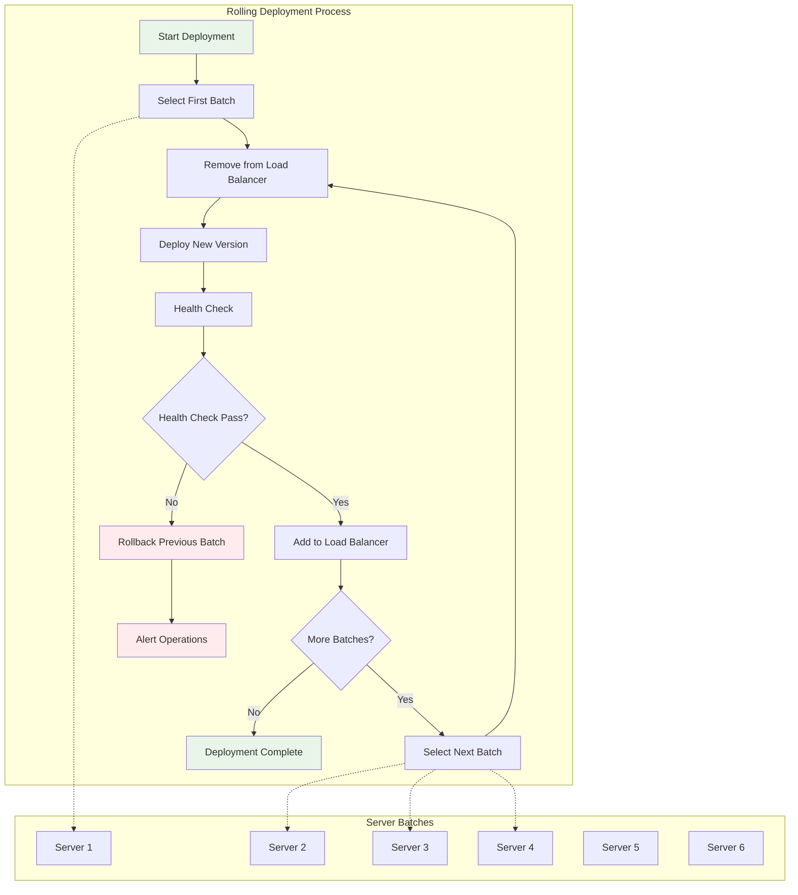

## Security Architecture

### 7. Defense in Depth Security Model

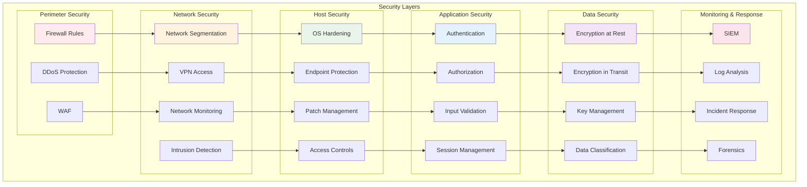

### 8. Certificate Management Workflow

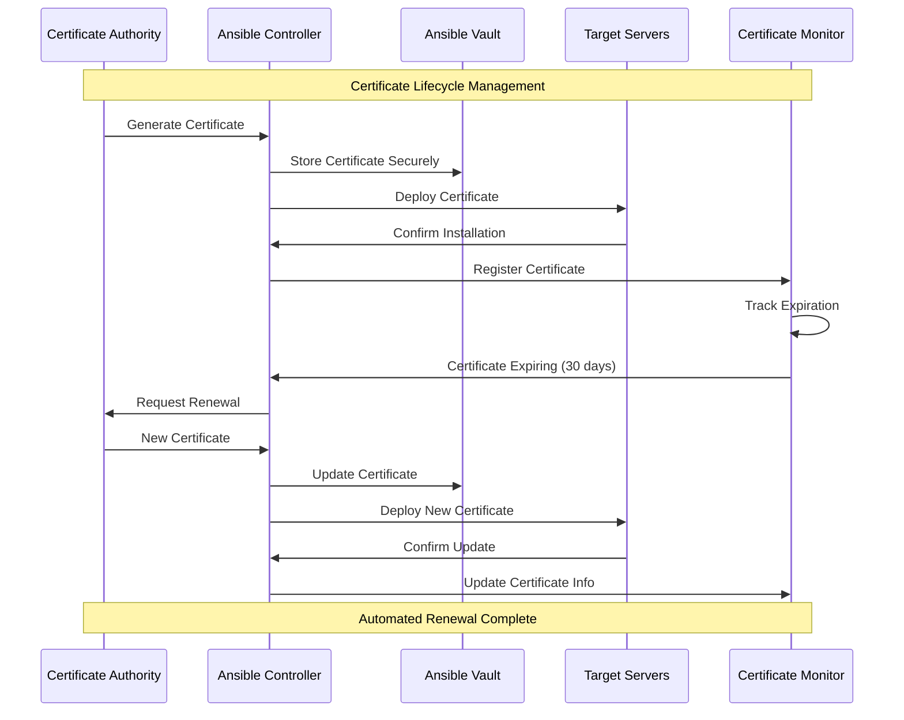

## Monitoring and Observability

### 9. Monitoring Architecture

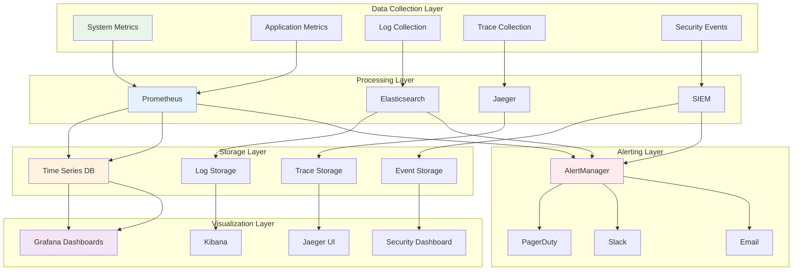

### 10. Alerting and Escalation Flow

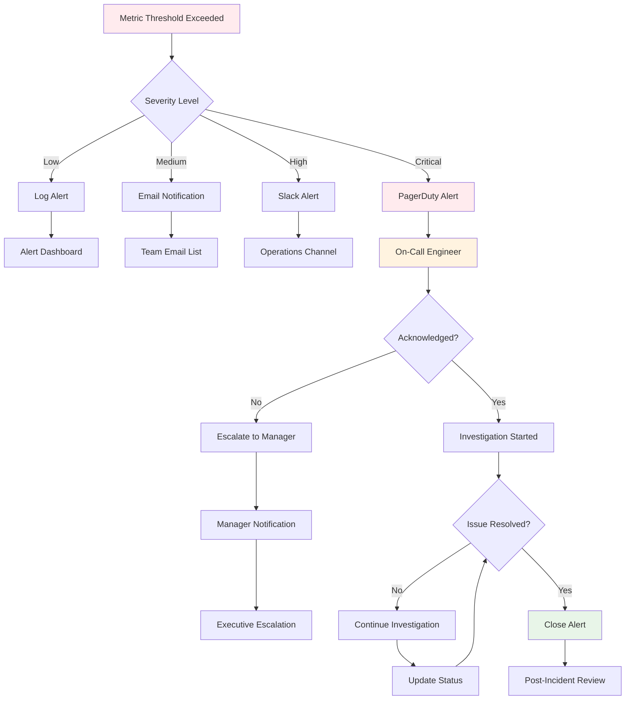

## Data Flow Diagrams

### 11. Configuration Data Flow

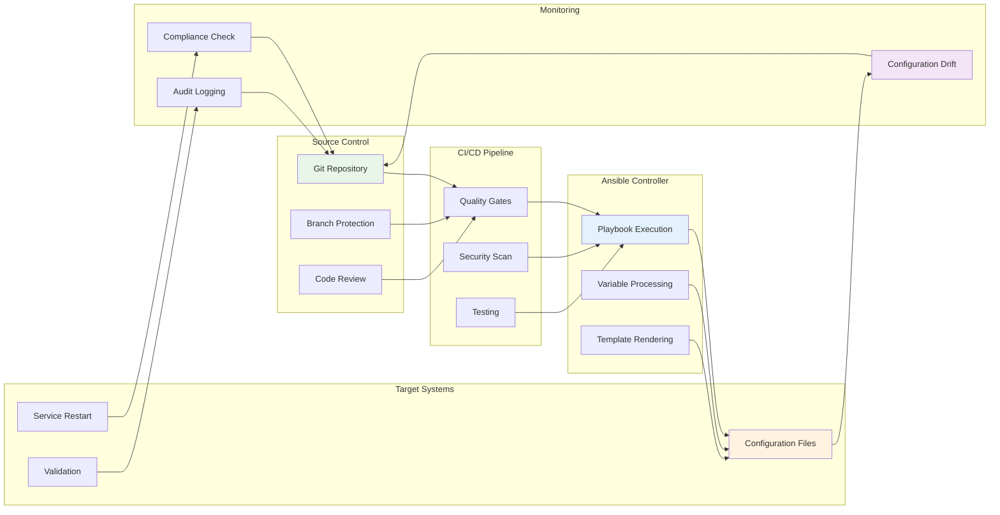

### 12. Secrets Management Flow

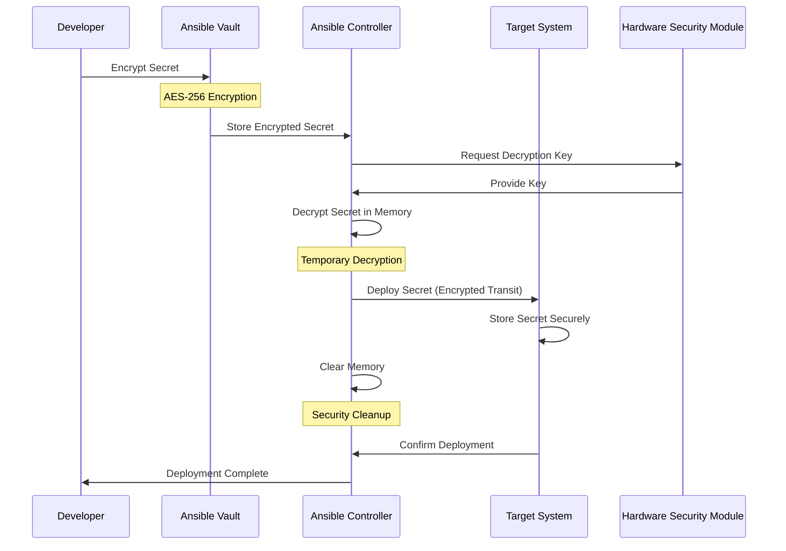

## Network Architecture

### 13. Network Topology

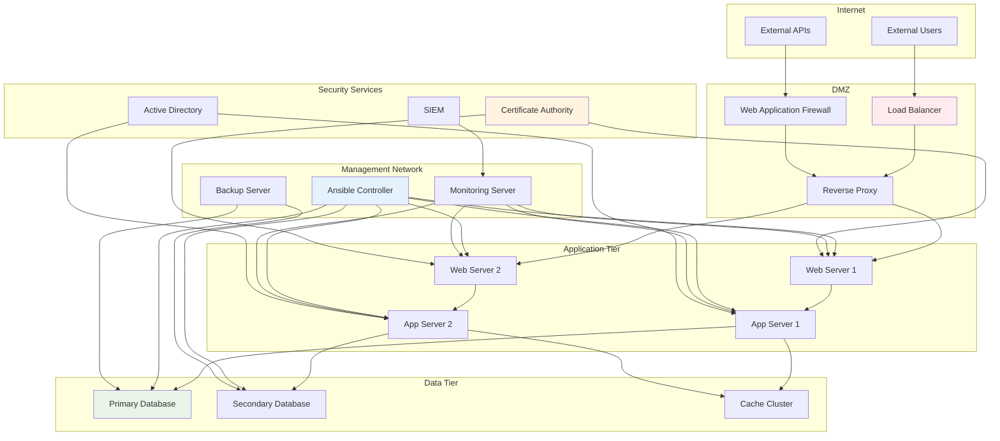

## CI/CD Pipeline Visualization

### 14. Complete CI/CD Pipeline

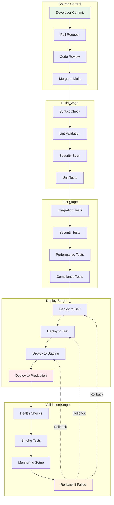

## Disaster Recovery Workflows

### 15. Disaster Recovery Process

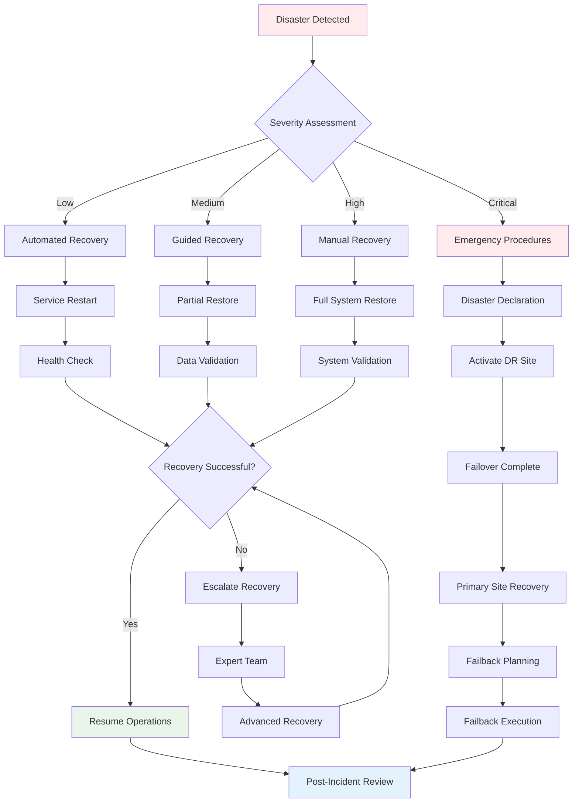

### 16. Backup and Restore Workflow

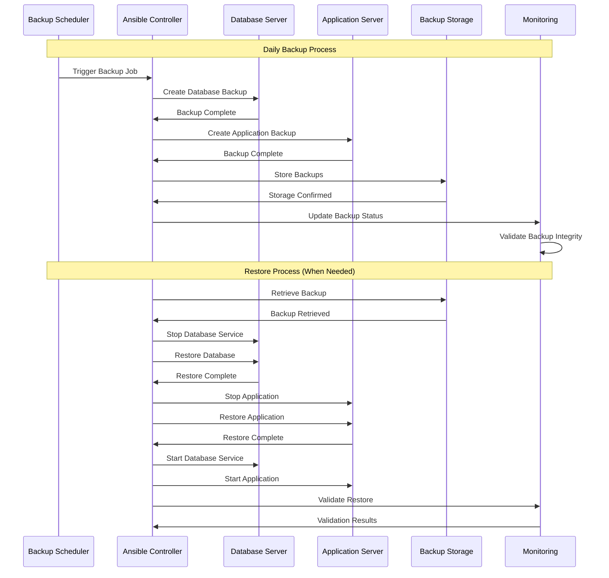

This comprehensive visual documentation provides detailed diagrams for understanding the HX Infrastructure Ansible system architecture, workflows, and operational procedures. Each diagram serves as a reference for system design, troubleshooting, and operational planning.
