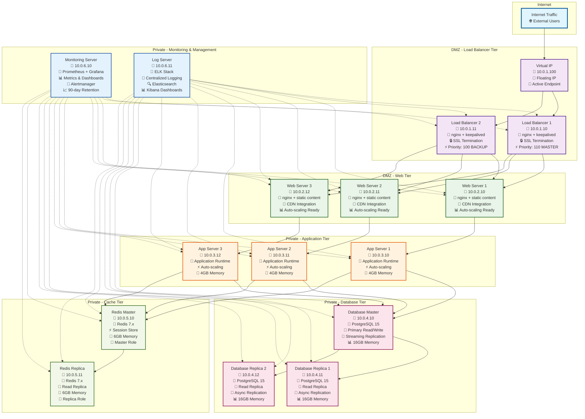
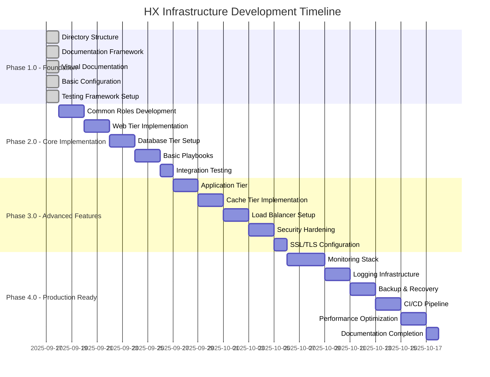
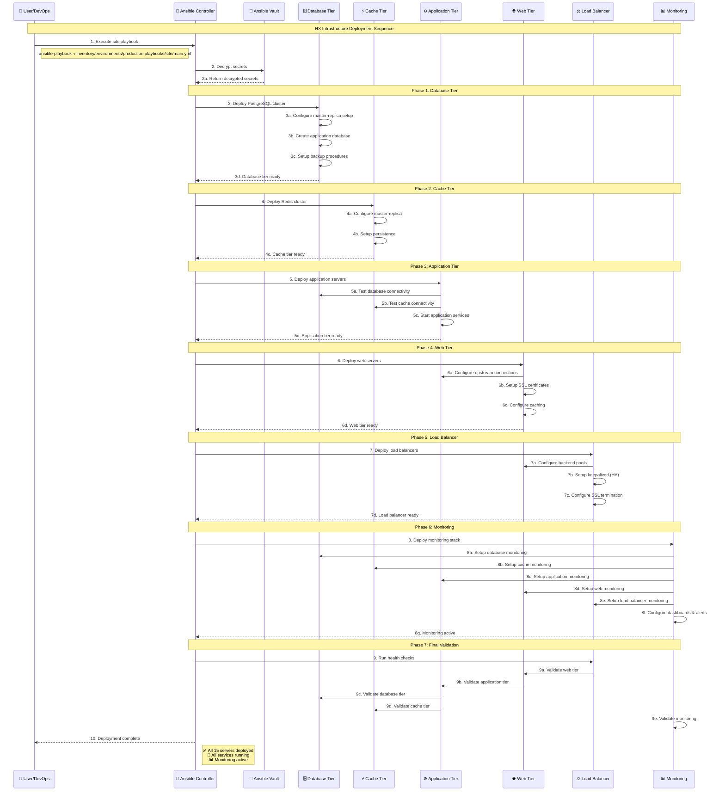
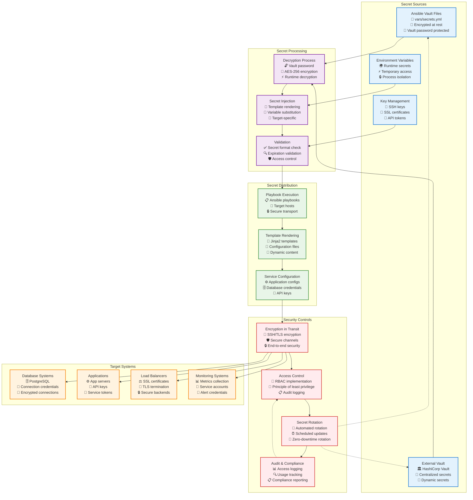
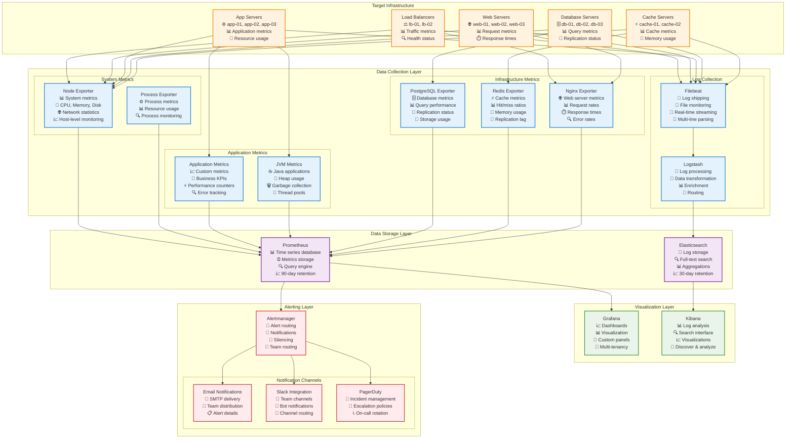
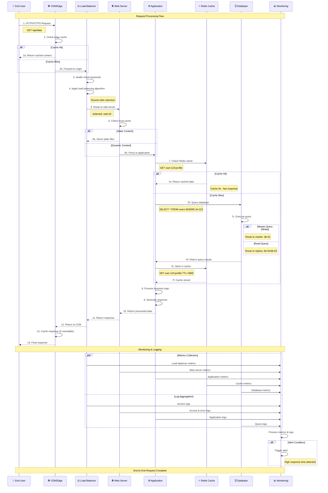

# HX Infrastructure Visual Documentation

## 📊 Comprehensive Visual Framework

This document contains all the visual diagrams for the HX Infrastructure project, providing comprehensive visual documentation for architecture, workflows, and processes.

## 🏗️ Infrastructure Topology Diagram



## 🔄 Phase Development Workflow



## 🌐 Variable Hierarchy Diagram

```mermaid
graph TB
    subgraph "Variable Hierarchy"
        GLOBAL[Global Variables<br/>📁 inventory/group_vars/all.yml<br/>🌍 Applies to all hosts<br/>🔧 Base configuration]
        
        subgraph "Environment Level"
            ENV_PROD[Production Variables<br/>📁 inventory/environments/production/<br/>🏭 Production-specific settings]
            ENV_STAGE[Staging Variables<br/>📁 inventory/environments/staging/<br/>🎭 Staging-specific settings]
            ENV_DEV[Development Variables<br/>📁 inventory/environments/development/<br/>🔧 Development-specific settings]
        end
        
        subgraph "Group Level"
            GROUP_LB[Load Balancer Group<br/>📁 inventory/group_vars/load_balancers.yml<br/>⚖️ LB-specific configuration]
            GROUP_WEB[Web Group<br/>📁 inventory/group_vars/web_servers.yml<br/>🌐 Web-specific configuration]
            GROUP_APP[Application Group<br/>📁 inventory/group_vars/app_servers.yml<br/>⚙️ App-specific configuration]
            GROUP_DB[Database Group<br/>📁 inventory/group_vars/database_servers.yml<br/>🗄️ DB-specific configuration]
            GROUP_CACHE[Cache Group<br/>📁 inventory/group_vars/cache_servers.yml<br/>⚡ Cache-specific configuration]
            GROUP_MON[Monitoring Group<br/>📁 inventory/group_vars/monitoring_servers.yml<br/>📊 Monitoring-specific configuration]
        end
        
        subgraph "Host Level"
            HOST_SPECIFIC[Host Variables<br/>📁 inventory/host_vars/<hostname>.yml<br/>🖥️ Host-specific overrides<br/>🔧 Individual customization]
        end
        
        subgraph "Role Level"
            ROLE_DEFAULTS[Role Defaults<br/>📁 roles/*/defaults/main.yml<br/>📋 Default role values<br/>🔧 Lowest priority]
            ROLE_VARS[Role Variables<br/>📁 roles/*/vars/main.yml<br/>📋 Role-specific values<br/>🔧 High priority]
        end
        
        subgraph "Runtime Level"
            EXTRA_VARS[Extra Variables<br/>🚀 Command line: -e "var=value"<br/>🔧 Highest priority<br/>⚡ Runtime overrides]
        end
        
        subgraph "Secrets Management"
            VAULT[Ansible Vault<br/>📁 vars/secrets.yml<br/>🔐 Encrypted secrets<br/>🔒 Sensitive data]
        end
    end
    
    %% Precedence Flow (Higher to Lower)
    EXTRA_VARS --> ROLE_VARS
    ROLE_VARS --> HOST_SPECIFIC
    HOST_SPECIFIC --> GROUP_LB
    HOST_SPECIFIC --> GROUP_WEB
    HOST_SPECIFIC --> GROUP_APP
    HOST_SPECIFIC --> GROUP_DB
    HOST_SPECIFIC --> GROUP_CACHE
    HOST_SPECIFIC --> GROUP_MON
    GROUP_LB --> ENV_PROD
    GROUP_WEB --> ENV_STAGE
    GROUP_APP --> ENV_DEV
    GROUP_DB --> GLOBAL
    GROUP_CACHE --> GLOBAL
    GROUP_MON --> GLOBAL
    ENV_PROD --> GLOBAL
    ENV_STAGE --> GLOBAL
    ENV_DEV --> GLOBAL
    GLOBAL --> ROLE_DEFAULTS
    
    %% Vault Integration
    VAULT -.-> HOST_SPECIFIC
    VAULT -.-> GROUP_LB
    VAULT -.-> GROUP_WEB
    VAULT -.-> GROUP_APP
    VAULT -.-> GROUP_DB
    VAULT -.-> GROUP_CACHE
    VAULT -.-> GROUP_MON
    
    %% Styling
    classDef highPriority fill:#ffcdd2,stroke:#d32f2f,stroke-width:3px
    classDef mediumPriority fill:#fff3e0,stroke:#f57c00,stroke-width:2px
    classDef lowPriority fill:#e8f5e8,stroke:#388e3c,stroke-width:2px
    classDef secretClass fill:#f3e5f5,stroke:#7b1fa2,stroke-width:2px
    
    class EXTRA_VARS highPriority
    class ROLE_VARS,HOST_SPECIFIC mediumPriority
    class GROUP_LB,GROUP_WEB,GROUP_APP,GROUP_DB,GROUP_CACHE,GROUP_MON mediumPriority
    class ENV_PROD,ENV_STAGE,ENV_DEV,GLOBAL lowPriority
    class ROLE_DEFAULTS lowPriority
    class VAULT secretClass
```

## 🚀 Deployment Workflow Diagram



## 🔀 Git Workflow Diagram

```mermaid
gitgraph
    commit id: "Initial Setup"
    branch develop
    checkout develop
    commit id: "Phase 1.0 Foundation"
    
    branch feature/phase-1-docs
    checkout feature/phase-1-docs
    commit id: "Add documentation"
    commit id: "Add visual diagrams"
    commit id: "Update README"
    
    checkout develop
    merge feature/phase-1-docs
    commit id: "Merge Phase 1 docs"
    
    branch feature/phase-2-core
    checkout feature/phase-2-core
    commit id: "Add common roles"
    commit id: "Add web tier"
    commit id: "Add database tier"
    commit id: "Add basic playbooks"
    
    checkout develop
    merge feature/phase-2-core
    commit id: "Merge Phase 2 core"
    
    branch feature/phase-3-advanced
    checkout feature/phase-3-advanced
    commit id: "Add app tier"
    commit id: "Add cache tier"
    commit id: "Add load balancer"
    commit id: "Add security hardening"
    
    checkout develop
    merge feature/phase-3-advanced
    commit id: "Merge Phase 3 advanced"
    
    branch feature/phase-4-production
    checkout feature/phase-4-production
    commit id: "Add monitoring stack"
    commit id: "Add logging infrastructure"
    commit id: "Add backup & recovery"
    commit id: "Add CI/CD pipeline"
    
    checkout develop
    merge feature/phase-4-production
    commit id: "Merge Phase 4 production"
    
    checkout main
    merge develop
    commit id: "Release v1.0.0"
    tag: "v1.0.0"
    
    checkout develop
    branch hotfix/security-patch
    checkout hotfix/security-patch
    commit id: "Security patch"
    
    checkout main
    merge hotfix/security-patch
    commit id: "Hotfix v1.0.1"
    tag: "v1.0.1"
    
    checkout develop
    merge hotfix/security-patch
    commit id: "Merge hotfix to develop"
```

## 🔄 CI/CD Pipeline Diagram

```mermaid
graph TB
    subgraph "Source Control"
        GIT[Git Repository<br/>📁 GitHub<br/>🔄 Branch Protection<br/>📋 Pull Requests]
    end
    
    subgraph "Continuous Integration"
        TRIGGER[Pipeline Trigger<br/>🔄 Push/PR Events<br/>⚡ Webhook Integration]
        
        subgraph "Code Quality Stage"
            LINT[Linting<br/>📝 ansible-lint<br/>📄 yamllint<br/>🐍 flake8]
            SYNTAX[Syntax Check<br/>✅ Playbook validation<br/>🔍 YAML validation]
            SECURITY[Security Scan<br/>🔒 Vulnerability check<br/>🛡️ Secret detection]
        end
        
        subgraph "Testing Stage"
            UNIT[Unit Tests<br/>🧪 Molecule tests<br/>🔬 Role validation]
            INTEGRATION[Integration Tests<br/>🔗 Multi-role testing<br/>🧪 Testinfra validation]
            SMOKE[Smoke Tests<br/>💨 Basic functionality<br/>⚡ Quick validation]
        end
        
        subgraph "Build Stage"
            BUILD[Build Artifacts<br/>📦 Package creation<br/>🏗️ Asset preparation]
            VALIDATE[Validation<br/>✅ Artifact integrity<br/>🔍 Dependency check]
        end
    end
    
    subgraph "Continuous Deployment"
        subgraph "Development Environment"
            DEV_DEPLOY[Deploy to Dev<br/>🔧 Development servers<br/>🧪 Feature testing]
            DEV_TEST[Dev Testing<br/>🔍 Functional tests<br/>📊 Performance baseline]
        end
        
        subgraph "Staging Environment"
            STAGE_DEPLOY[Deploy to Staging<br/>🎭 Pre-production<br/>🔄 Production mirror]
            STAGE_TEST[Staging Testing<br/>🧪 E2E tests<br/>📊 Load testing<br/>🔒 Security testing]
            UAT[User Acceptance<br/>👥 Stakeholder approval<br/>✅ Business validation]
        end
        
        subgraph "Production Environment"
            PROD_APPROVAL[Production Approval<br/>👤 Manual gate<br/>📋 Change management]
            PROD_DEPLOY[Deploy to Production<br/>🏭 Live environment<br/>🔄 Rolling deployment]
            PROD_VALIDATE[Production Validation<br/>📊 Health checks<br/>🚨 Monitoring alerts]
        end
    end
    
    subgraph "Monitoring & Feedback"
        MONITOR[Monitoring<br/>📊 Prometheus metrics<br/>📈 Grafana dashboards]
        ALERTS[Alerting<br/>🚨 Alert manager<br/>📧 Notifications]
        LOGS[Logging<br/>📝 ELK stack<br/>🔍 Log analysis]
        FEEDBACK[Feedback Loop<br/>🔄 Continuous improvement<br/>📊 Performance metrics]
    end
    
    %% Flow Connections
    GIT --> TRIGGER
    TRIGGER --> LINT
    TRIGGER --> SYNTAX
    TRIGGER --> SECURITY
    
    LINT --> UNIT
    SYNTAX --> UNIT
    SECURITY --> UNIT
    
    UNIT --> INTEGRATION
    INTEGRATION --> SMOKE
    
    SMOKE --> BUILD
    BUILD --> VALIDATE
    
    VALIDATE --> DEV_DEPLOY
    DEV_DEPLOY --> DEV_TEST
    
    DEV_TEST --> STAGE_DEPLOY
    STAGE_DEPLOY --> STAGE_TEST
    STAGE_TEST --> UAT
    
    UAT --> PROD_APPROVAL
    PROD_APPROVAL --> PROD_DEPLOY
    PROD_DEPLOY --> PROD_VALIDATE
    
    PROD_VALIDATE --> MONITOR
    MONITOR --> ALERTS
    MONITOR --> LOGS
    ALERTS --> FEEDBACK
    LOGS --> FEEDBACK
    FEEDBACK --> GIT
    
    %% Styling
    classDef sourceClass fill:#e3f2fd,stroke:#1976d2,stroke-width:2px
    classDef ciClass fill:#f3e5f5,stroke:#7b1fa2,stroke-width:2px
    classDef cdClass fill:#e8f5e8,stroke:#388e3c,stroke-width:2px
    classDef monitorClass fill:#fff3e0,stroke:#f57c00,stroke-width:2px
    
    class GIT sourceClass
    class TRIGGER,LINT,SYNTAX,SECURITY,UNIT,INTEGRATION,SMOKE,BUILD,VALIDATE ciClass
    class DEV_DEPLOY,DEV_TEST,STAGE_DEPLOY,STAGE_TEST,UAT,PROD_APPROVAL,PROD_DEPLOY,PROD_VALIDATE cdClass
    class MONITOR,ALERTS,LOGS,FEEDBACK monitorClass
```



## 🔐 Secrets Management Diagram



## 📊 Monitoring Architecture Diagram



## 🔄 Service Orchestration Diagram



---

This comprehensive visual documentation provides detailed diagrams for all aspects of the HX Infrastructure project, enabling clear understanding of architecture, workflows, and processes.
