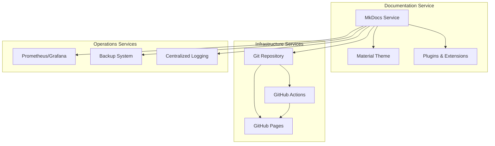

# MkDocs Documentation Service Configuration

This document provides comprehensive guidance for configuring and managing the MkDocs documentation service within the HX Infrastructure.

## Overview

MkDocs is integrated as part of the Operations services tier, providing automated documentation generation and deployment capabilities. The service uses the Material theme and supports GitHub Pages deployment with comprehensive validation and monitoring.

## Architecture

### Service Integration



### Component Architecture

- **MkDocs Core**: Static site generator with Python-based configuration
- **Material Theme**: Modern, responsive theme with advanced features
- **Plugin Ecosystem**: Search, minification, social cards, git integration
- **Deployment Pipeline**: GitHub Actions or direct gh-deploy integration
- **Monitoring Integration**: Health checks and performance metrics
- **Backup System**: Automated configuration and content backups

## Configuration Structure

### Role Defaults Location

```
role_defaults/operations/defaults/mkdocs.yml
```

### Environment Templates

```
env_templates/
├── development/mkdocs.yml    # Development-optimized settings
├── test/mkdocs.yml          # Testing and validation settings
└── production/mkdocs.yml    # Production-optimized settings
```

### Validation Rules

```
vars_validation/mkdocs_validation_rules.yml
```

## Core Configuration Variables

### Required Variables

| Variable | Type | Description | Example |
|----------|------|-------------|---------|
| `mkdocs_project_root` | string | Absolute path to MkDocs project | `/opt/docs/material-portal` |
| `mkdocs_git_repo` | string | Git repository URL | `git@github.com:hana-x/docs.git` |
| `mkdocs_site_name` | string | Documentation site name | `HX Infrastructure Documentation` |

### Essential Optional Variables

| Variable | Type | Default | Description |
|----------|------|---------|-------------|
| `mkdocs_version` | string | `latest` | MkDocs version to install |
| `mkdocs_material_version` | string | `latest` | Material theme version |
| `mkdocs_site_url` | string | `""` | Public site URL |
| `mkdocs_deploy_method` | string | `actions` | Deployment method |
| `mkdocs_build_strict` | boolean | `true` | Enable strict build mode |

## Environment-Specific Configuration

### Development Environment

Optimized for rapid development and testing:

```yaml
# Development-specific overrides
mkdocs_build_strict: false          # Allow warnings
mkdocs_dev_server_enabled: true     # Enable live preview
mkdocs_social_enabled: false        # Disable social cards for speed
mkdocs_analytics_provider: ""       # No analytics in development
mkdocs_backup_enabled: false        # No backups needed
```

### Test Environment

Balanced configuration for validation:

```yaml
# Test-specific overrides
mkdocs_build_strict: true           # Strict validation
mkdocs_social_enabled: false        # Disable for speed
mkdocs_backup_retention_days: 7     # Shorter retention
mkdocs_monitoring_enabled: true     # Enable monitoring
```

### Production Environment

Full-featured, performance-optimized:

```yaml
# Production-specific overrides
mkdocs_build_strict: true           # Strict validation required
mkdocs_social_enabled: true         # Enable social cards
mkdocs_analytics_provider: "google" # Enable analytics
mkdocs_monitoring_enabled: true     # Full monitoring
mkdocs_backup_enabled: true         # Automated backups
mkdocs_performance_build_parallel: true  # Parallel builds
```

## Theme Configuration

### Material Theme Features

The Material theme provides extensive customization options:

```yaml
mkdocs_theme_features:
  # Content features
  - content.code.copy           # Copy code blocks
  - content.tabs.link          # Link content tabs
  - content.tooltips           # Enhanced tooltips
  
  # Navigation features
  - navigation.footer          # Footer navigation
  - navigation.indexes         # Section index pages
  - navigation.sections        # Collapsible sections
  - navigation.tabs           # Top-level tabs
  - navigation.top            # Back to top button
  
  # Search features
  - search.suggest            # Search suggestions
  - search.highlight          # Highlight search terms
  - search.share             # Share search results
```

### Color Schemes

Supports both light and dark modes:

```yaml
mkdocs_theme_palette:
  # Light mode
  - media: "(prefers-color-scheme: light)"
    scheme: default
    primary: indigo
    accent: indigo
    toggle:
      icon: material/brightness-7
      name: Switch to dark mode
      
  # Dark mode
  - media: "(prefers-color-scheme: dark)"
    scheme: slate
    primary: indigo
    accent: indigo
    toggle:
      icon: material/brightness-4
      name: Switch to light mode
```

## Plugin Configuration

### Core Plugins

#### Search Plugin
```yaml
- search:
    lang: ["en"]
    separator: '[\\s\\-]+'
```

#### Minification Plugin
```yaml
- minify:
    minify_html: true
    minify_js: true
    minify_css: true
    htmlmin_opts:
      remove_comments: true
```

#### Social Cards Plugin
```yaml
- social:
    enabled: true
    cards: true
    cards_layout_options:
      background_color: "#1976d2"
```

#### Git Integration Plugin
```yaml
- git-revision-date-localized:
    enabled: true
    type: "timeago"
    timezone: "UTC"
    locale: "en"
```

### Markdown Extensions

Comprehensive set of extensions for rich content:

```yaml
mkdocs_markdown_extensions:
  # Core extensions
  - admonition              # Call-out boxes
  - attr_list              # HTML attributes
  - def_list               # Definition lists
  - footnotes              # Footnote support
  - md_in_html            # Markdown in HTML
  - toc:                  # Table of contents
      permalink: true
      
  # PyMdown extensions
  - pymdownx.details       # Collapsible details
  - pymdownx.emoji:        # Emoji support
      emoji_index: !!python/name:material.extensions.emoji.twemoji
      emoji_generator: !!python/name:material.extensions.emoji.to_svg
  - pymdownx.highlight:    # Code highlighting
      anchor_linenums: true
  - pymdownx.superfences:  # Advanced code blocks
      custom_fences:
        - name: mermaid
          class: mermaid
          format: !!python/name:pymdownx.superfences.fence_code_format
  - pymdownx.tabbed:       # Content tabs
      alternate_style: true
```

## Deployment Configuration

### GitHub Actions Deployment

Recommended for production environments:

```yaml
mkdocs_deploy_method: "actions"
vault_mkdocs_github_token: "{{ vault_mkdocs_prod_github_token }}"
```

#### GitHub Actions Workflow

The system automatically generates a workflow file:

```yaml
# .github/workflows/gh-pages.yml
name: Deploy MkDocs site
on:
  push:
    branches: [ "main" ]
permissions:
  contents: write
jobs:
  build-deploy:
    runs-on: ubuntu-latest
    steps:
    - uses: actions/checkout@v4
    - uses: actions/setup-python@v5
      with:
        python-version: "3.x"
    - name: Install dependencies
      run: |
        pip install mkdocs mkdocs-material mkdocs-material-extensions
    - name: Build and deploy
      run: mkdocs gh-deploy --force
```

### Direct gh-deploy

For simpler setups:

```yaml
mkdocs_deploy_method: "gh-deploy"
```

## Validation and Quality Assurance

### Validation Rules

The system includes comprehensive validation:

#### Repository URL Validation
```python
def validate_mkdocs_git_repo(repo_url):
    github_ssh_pattern = r'^git@github\.com:[a-zA-Z0-9_-]+/[a-zA-Z0-9_.-]+\.git$'
    github_https_pattern = r'^https://github\.com/[a-zA-Z0-9_-]+/[a-zA-Z0-9_.-]+(?:\.git)?$'
    
    if re.match(github_ssh_pattern, repo_url) or re.match(github_https_pattern, repo_url):
        return True, "Valid GitHub repository URL"
    else:
        return False, "Invalid repository URL format"
```

#### Theme Configuration Validation
```python
def validate_mkdocs_theme_configuration(theme_config):
    if theme_config.get('name') == 'material':
        features = theme_config.get('features', [])
        if 'navigation.tabs' in features and 'navigation.sections' in features:
            return True, "Valid Material theme configuration"
    return True, "Theme configuration is valid"
```

### Build Validation

Strict mode validation ensures content quality:

```yaml
mkdocs_build_strict: true  # Fail on warnings
```

This catches:
- Broken internal links
- Missing referenced files
- Invalid configuration syntax
- Plugin configuration errors

## Monitoring and Health Checks

### Health Check Script

The system includes a comprehensive health check script:

```bash
./scripts/health_check_mkdocs.sh
```

This validates:
- Configuration file syntax
- Project structure integrity
- Dependency availability
- Git repository accessibility
- Build process functionality
- Deployment configuration

### Monitoring Integration

MkDocs integrates with the monitoring stack:

```yaml
mkdocs_monitoring:
  enabled: true
  health_checks:
    build_status: true
    site_availability: true
    deployment_status: true
  metrics:
    build_time: true
    site_size: true
    page_count: true
```

## Backup and Recovery

### Automated Backups

```yaml
mkdocs_backup:
  enabled: true
  schedule: "0 2 * * *"  # Daily at 2 AM
  retention_days: 30
  include:
    - "docs/"
    - "mkdocs.yml"
    - ".github/"
    - "overrides/"
```

### Manual Backup

```bash
# Create configuration backup
make backup-config

# Create MkDocs-specific backup
./scripts/backup_config.sh --type config --env prod
```

## Performance Optimization

### Build Performance

```yaml
mkdocs_performance:
  build:
    parallel: true          # Enable parallel processing
    cache_enabled: true     # Enable build caching
  assets:
    compression: true       # Compress assets
    minification: true      # Minify HTML/CSS/JS
```

### Content Delivery

- **Static Site Generation**: Pre-built HTML for fast delivery
- **Asset Optimization**: Minified CSS, JS, and optimized images
- **Social Card Generation**: Automated Open Graph images
- **Search Index**: Client-side search with optimized index

## Security Configuration

### Content Security Policy

```yaml
mkdocs_security:
  csp:
    enabled: true
    directives:
      default_src: ["'self'"]
      script_src: ["'self'", "'unsafe-inline'"]
      style_src: ["'self'", "'unsafe-inline'"]
      img_src: ["'self'", "data:", "https:"]
```

### File Permissions

```yaml
mkdocs_security:
  file_permissions:
    directories: "0755"
    files: "0644"
    executables: "0755"
```

## Troubleshooting

### Common Issues

#### Build Failures

**Symptom**: MkDocs build fails with validation errors

**Solution**:
1. Check configuration syntax: `make check-syntax`
2. Validate variables: `make validate-mkdocs`
3. Review build logs for specific errors
4. Test locally: `mkdocs build --strict`

#### Deployment Issues

**Symptom**: GitHub Pages deployment fails

**Solution**:
1. Verify GitHub token permissions
2. Check repository settings (Pages source)
3. Review GitHub Actions logs
4. Validate workflow file syntax

#### Theme Issues

**Symptom**: Material theme features not working

**Solution**:
1. Verify Material theme version compatibility
2. Check feature configuration syntax
3. Review plugin dependencies
4. Test with minimal configuration

### Diagnostic Commands

```bash
# Validate MkDocs configuration
make validate-mkdocs

# Run comprehensive health check
./scripts/health_check_mkdocs.sh

# Test build locally
cd /opt/docs/material-portal
mkdocs build --strict

# Check deployment configuration
make validate-prod
```

## Best Practices

### Content Organization

1. **Logical Structure**: Organize content in clear hierarchies
2. **Consistent Naming**: Use consistent file and directory naming
3. **Cross-References**: Use relative links for internal references
4. **Asset Management**: Store images and assets in organized directories

### Configuration Management

1. **Environment Separation**: Use environment-specific configurations
2. **Version Pinning**: Pin specific versions in production
3. **Validation**: Always validate before deployment
4. **Backup**: Maintain regular configuration backups

### Performance Optimization

1. **Image Optimization**: Optimize images before adding to documentation
2. **Content Caching**: Leverage build caching for faster builds
3. **Minimal Plugins**: Only enable necessary plugins
4. **Asset Minification**: Enable minification in production

### Security Considerations

1. **Token Management**: Store GitHub tokens securely in Ansible Vault
2. **Access Control**: Limit repository access appropriately
3. **Content Review**: Review content before publication
4. **Regular Updates**: Keep MkDocs and plugins updated

## Integration Examples

### Basic Setup

```yaml
# inventories/group_vars/operations.yml
mkdocs_project_root: "/opt/docs/hx-portal"
mkdocs_git_repo: "git@github.com:hana-x/infrastructure-docs.git"
mkdocs_site_name: "HX Infrastructure Documentation"
mkdocs_site_url: "https://docs.hana-x.ai"
mkdocs_deploy_method: "actions"
```

### Advanced Configuration

```yaml
# Production environment with full features
mkdocs_theme_features:
  - content.code.copy
  - content.tabs.link
  - navigation.footer
  - navigation.indexes
  - navigation.sections
  - navigation.tabs
  - navigation.top
  - search.suggest
  - search.highlight

mkdocs_plugins:
  - search
  - minify
  - social
  - git-revision-date-localized

mkdocs_extra:
  analytics:
    provider: "google"
    property: "G-XXXXXXXXXX"
  social:
    - icon: fontawesome/brands/github
      link: "https://github.com/hana-x/infrastructure"
```

## Migration Guide

### From Legacy Documentation

1. **Content Migration**: Convert existing documentation to Markdown
2. **Structure Mapping**: Map old structure to MkDocs navigation
3. **Asset Migration**: Move images and assets to docs directory
4. **Link Updates**: Update internal links to new structure
5. **Validation**: Validate migrated content with strict builds

### Version Upgrades

1. **Backup**: Create full backup before upgrade
2. **Test Environment**: Test upgrade in non-production environment
3. **Dependency Check**: Verify plugin compatibility
4. **Configuration Review**: Review configuration for deprecated options
5. **Validation**: Run full validation suite after upgrade

---

This documentation provides comprehensive guidance for implementing and managing MkDocs within the HX Infrastructure. For additional support, refer to the troubleshooting section or consult the official MkDocs and Material theme documentation.

