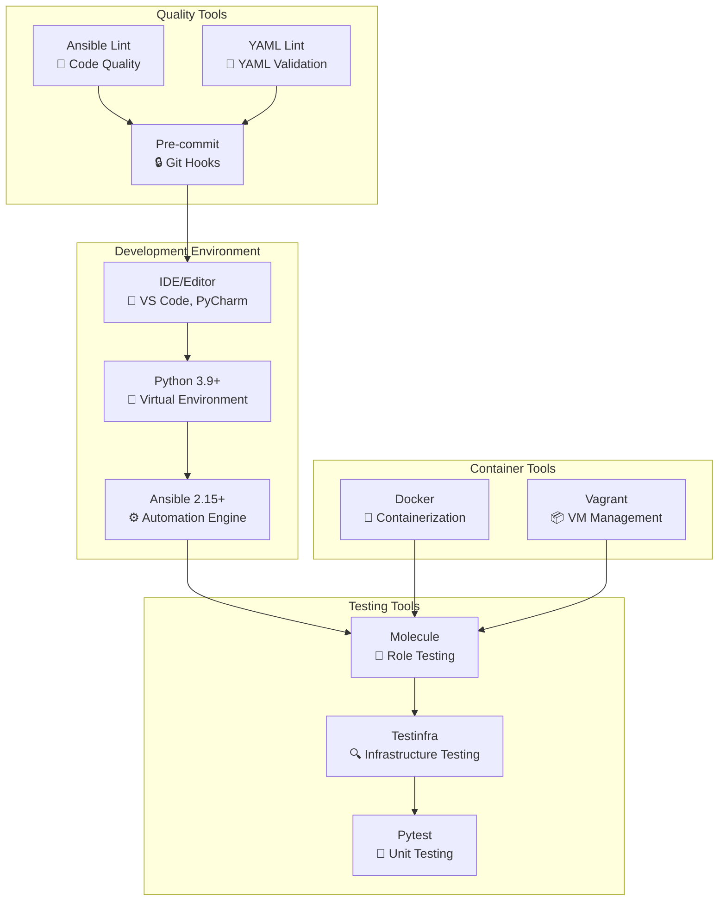
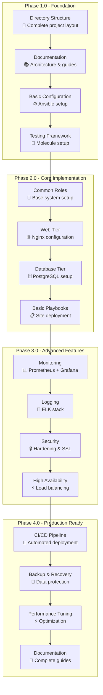
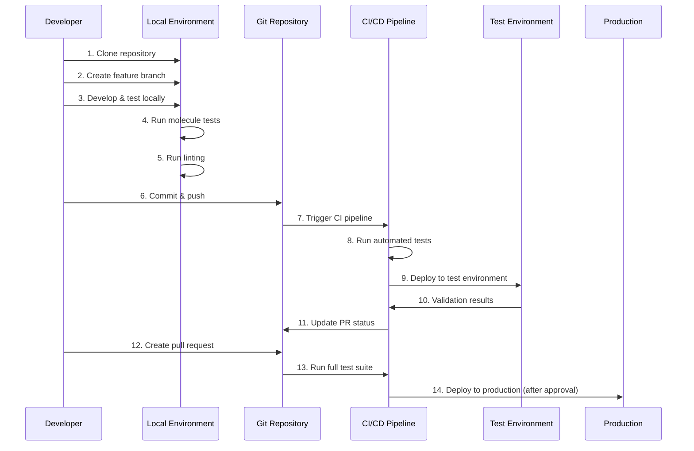
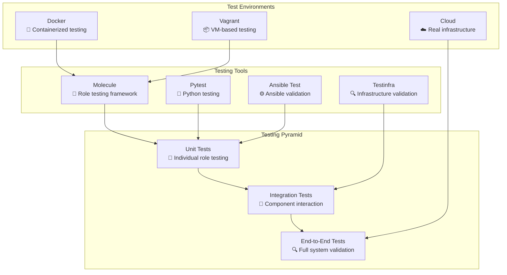
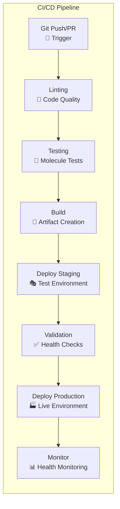
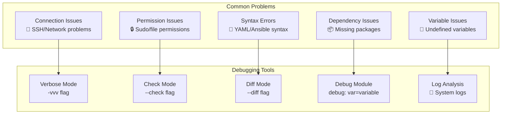

# HX Infrastructure Development Guide

## 🚀 Development Workflow

This guide provides comprehensive instructions for developing, testing, and contributing to the HX Infrastructure Ansible project.

## 📋 Table of Contents

- [Development Environment Setup](#development-environment-setup)
- [Project Structure](#project-structure)
- [Development Workflow](#development-workflow)
- [Testing Framework](#testing-framework)
- [Code Standards](#code-standards)
- [Git Workflow](#git-workflow)
- [CI/CD Pipeline](#cicd-pipeline)
- [Troubleshooting](#troubleshooting)

## 🛠️ Development Environment Setup

### Prerequisites

```bash
# System Requirements
- Python 3.9+
- Ansible 2.15+
- Docker 20.10+
- Git 2.30+
- Make 4.3+
```

### Local Development Setup

```bash
# Clone the repository
git clone https://github.com/hanax-ai/HX-Infrastructure-Ansible.git
cd HX-Infrastructure-Ansible

# Create virtual environment
python3 -m venv venv
source venv/bin/activate

# Install dependencies
pip install -r requirements.txt
ansible-galaxy install -r requirements.yml

# Install development dependencies
pip install -r requirements-dev.txt

# Setup pre-commit hooks
pre-commit install
```

### Development Tools



## 📁 Project Structure

### Directory Layout

```
HX-Infrastructure-Ansible/
├── 📁 playbooks/                    # Main Ansible playbooks
│   ├── 📁 site/                     # Site-wide deployment playbooks
│   │   ├── main.yml                 # Master site playbook
│   │   ├── web-tier.yml             # Web tier deployment
│   │   ├── app-tier.yml             # Application tier deployment
│   │   └── db-tier.yml              # Database tier deployment
│   ├── 📁 services/                 # Service-specific playbooks
│   │   ├── nginx.yml                # Nginx configuration
│   │   ├── postgresql.yml           # PostgreSQL setup
│   │   └── redis.yml                # Redis configuration
│   ├── 📁 maintenance/              # Maintenance operations
│   │   ├── backup.yml               # Backup procedures
│   │   ├── update.yml               # System updates
│   │   └── security.yml             # Security hardening
│   └── 📁 deployment/               # Deployment workflows
│       ├── rolling-update.yml       # Rolling deployment
│       ├── blue-green.yml           # Blue-green deployment
│       └── canary.yml               # Canary deployment
├── 📁 roles/                        # Ansible roles
│   ├── 📁 common/                   # Common system configurations
│   │   ├── tasks/main.yml           # Main tasks
│   │   ├── handlers/main.yml        # Event handlers
│   │   ├── vars/main.yml            # Role variables
│   │   ├── defaults/main.yml        # Default variables
│   │   ├── templates/               # Jinja2 templates
│   │   ├── files/                   # Static files
│   │   └── molecule/                # Testing scenarios
│   ├── 📁 web/                      # Web server roles
│   │   ├── nginx/                   # Nginx role
│   │   └── apache/                  # Apache role (alternative)
│   ├── 📁 database/                 # Database roles
│   │   ├── postgresql/              # PostgreSQL role
│   │   ├── mysql/                   # MySQL role (alternative)
│   │   └── mongodb/                 # MongoDB role (NoSQL option)
│   ├── 📁 monitoring/               # Monitoring and logging
│   │   ├── prometheus/              # Prometheus monitoring
│   │   ├── grafana/                 # Grafana dashboards
│   │   └── elk/                     # ELK stack logging
│   └── 📁 security/                 # Security hardening
│       ├── firewall/                # Firewall configuration
│       ├── ssl/                     # SSL/TLS setup
│       └── hardening/               # OS hardening
├── 📁 inventory/                    # Inventory management
│   ├── 📁 environments/             # Environment-specific configs
│   │   ├── development/             # Development environment
│   │   ├── staging/                 # Staging environment
│   │   └── production/              # Production environment
│   ├── 📁 group_vars/               # Group variables
│   │   ├── all.yml                  # Global variables
│   │   ├── web.yml                  # Web tier variables
│   │   ├── app.yml                  # App tier variables
│   │   └── db.yml                   # Database tier variables
│   └── 📁 host_vars/                # Host-specific variables
├── 📁 vars/                         # Variable definitions
│   ├── main.yml                     # Main variables
│   ├── secrets.yml                  # Encrypted secrets (Ansible Vault)
│   └── environment-specific/        # Environment variables
├── 📁 templates/                    # Global Jinja2 templates
├── 📁 files/                        # Global static files
├── 📁 scripts/                      # Utility scripts
│   ├── setup.sh                     # Environment setup
│   ├── deploy.sh                    # Deployment script
│   └── backup.sh                    # Backup script
├── 📁 tests/                        # Testing framework
│   ├── 📁 unit/                     # Unit tests
│   ├── 📁 integration/              # Integration tests
│   └── 📁 e2e/                      # End-to-end tests
├── 📁 docs/                         # Documentation
│   ├── README.md                    # Project overview
│   ├── ARCHITECTURE.md              # Architecture documentation
│   ├── DEVELOPMENT_GUIDE.md         # This file
│   ├── USER_GUIDE.md                # User documentation
│   └── API_REFERENCE.md             # API documentation
├── 📁 .github/                      # GitHub workflows
│   ├── workflows/                   # CI/CD workflows
│   └── ISSUE_TEMPLATE/              # Issue templates
├── ansible.cfg                      # Ansible configuration
├── requirements.txt                 # Python dependencies
├── requirements.yml                 # Ansible Galaxy dependencies
├── requirements-dev.txt             # Development dependencies
├── .gitignore                       # Git ignore rules
├── .pre-commit-config.yaml          # Pre-commit configuration
├── Makefile                         # Build automation
└── LICENSE                          # Project license
```

## 🔄 Development Workflow

### Phase-Based Development



### Development Process



## 🧪 Testing Framework

### Testing Strategy



### Running Tests

```bash
# Run all tests
make test

# Run specific test types
make test-unit          # Unit tests only
make test-integration   # Integration tests only
make test-e2e          # End-to-end tests only

# Run tests for specific role
cd roles/nginx
molecule test

# Run tests with specific scenario
molecule test -s docker
molecule test -s vagrant

# Run linting
make lint
ansible-lint playbooks/
yamllint .

# Run security checks
make security-check
ansible-playbook --check --diff playbooks/site/main.yml
```

### Test Configuration

```yaml
# molecule/default/molecule.yml
---
dependency:
  name: galaxy
driver:
  name: docker
platforms:
  - name: instance
    image: quay.io/ansible/molecule-ubuntu:20.04
    pre_build_image: true
provisioner:
  name: ansible
  config_options:
    defaults:
      interpreter_python: auto_silent
      callback_whitelist: profile_tasks, timer, yaml
verifier:
  name: testinfra
  directory: ../tests
  options:
    sudo: true
```

## 📝 Code Standards

### Ansible Best Practices

```yaml
# Example role structure
---
# roles/nginx/tasks/main.yml
- name: Install nginx package
  package:
    name: nginx
    state: present
  become: true
  tags:
    - nginx
    - packages

- name: Configure nginx
  template:
    src: nginx.conf.j2
    dest: /etc/nginx/nginx.conf
    backup: true
    validate: nginx -t -c %s
  become: true
  notify: restart nginx
  tags:
    - nginx
    - configuration

- name: Ensure nginx is running
  service:
    name: nginx
    state: started
    enabled: true
  become: true
  tags:
    - nginx
    - services
```

### Variable Naming Conventions

```yaml
# Group variables example
---
# group_vars/web.yml
web_server_port: 80
web_server_ssl_port: 443
web_server_document_root: /var/www/html
web_server_max_connections: 1024

# Role-specific variables
nginx_worker_processes: auto
nginx_worker_connections: 1024
nginx_keepalive_timeout: 65
nginx_client_max_body_size: 64m

# Environment-specific variables
app_environment: production
app_debug_mode: false
app_log_level: info
```

### Documentation Standards

```yaml
# Role documentation example
---
# roles/nginx/README.md
# Nginx Role

## Description
This role installs and configures nginx web server.

## Requirements
- Ubuntu 20.04+
- Python 3.8+

## Role Variables
| Variable | Default | Description |
|----------|---------|-------------|
| `nginx_worker_processes` | `auto` | Number of worker processes |
| `nginx_worker_connections` | `1024` | Max connections per worker |

## Dependencies
- common (base system configuration)

## Example Playbook
```yaml
- hosts: web
  roles:
    - role: nginx
      nginx_worker_processes: 4
```

## License
MIT
```

## 🔀 Git Workflow

### Branch Strategy

```mermaid
gitgraph
    commit id: "Initial"
    branch develop
    checkout develop
    commit id: "Setup"
    
    branch feature/nginx-role
    checkout feature/nginx-role
    commit id: "Add nginx role"
    commit id: "Add tests"
    
    checkout develop
    merge feature/nginx-role
    commit id: "Merge nginx"
    
    branch feature/database-role
    checkout feature/database-role
    commit id: "Add PostgreSQL"
    commit id: "Add backup"
    
    checkout develop
    merge feature/database-role
    commit id: "Merge database"
    
    checkout main
    merge develop
    commit id: "Release v1.0"
    tag: "v1.0.0"
```

### Commit Message Format

```
type(scope): subject

body

footer
```

**Types:**
- `feat`: New feature
- `fix`: Bug fix
- `docs`: Documentation changes
- `style`: Code style changes
- `refactor`: Code refactoring
- `test`: Test changes
- `chore`: Build/tooling changes

**Examples:**
```
feat(nginx): add SSL configuration support

- Add SSL certificate management
- Configure secure headers
- Update documentation

Closes #123
```

### Pull Request Process

```mermaid
graph TB
    subgraph "PR Workflow"
        CREATE[Create Feature Branch<br/>🌿 git checkout -b feature/name]
        DEVELOP[Develop & Test<br/>🔧 Local development]
        COMMIT[Commit Changes<br/>💾 git commit -m "message"]
        PUSH[Push Branch<br/>📤 git push origin feature/name]
        PR[Create Pull Request<br/>📋 GitHub PR]
        REVIEW[Code Review<br/>👥 Peer review]
        CI[CI/CD Checks<br/>🤖 Automated testing]
        MERGE[Merge to Main<br/>🔀 Squash and merge]
        CLEANUP[Cleanup<br/>🧹 Delete feature branch]
    end
    
    CREATE --> DEVELOP
    DEVELOP --> COMMIT
    COMMIT --> PUSH
    PUSH --> PR
    PR --> REVIEW
    PR --> CI
    REVIEW --> MERGE
    CI --> MERGE
    MERGE --> CLEANUP
```

## 🚀 CI/CD Pipeline

### GitHub Actions Workflow

```yaml
# .github/workflows/ci.yml
name: CI/CD Pipeline

on:
  push:
    branches: [ main, develop ]
  pull_request:
    branches: [ main ]

jobs:
  lint:
    runs-on: ubuntu-latest
    steps:
      - uses: actions/checkout@v3
      - name: Set up Python
        uses: actions/setup-python@v4
        with:
          python-version: '3.9'
      - name: Install dependencies
        run: |
          pip install ansible ansible-lint yamllint
      - name: Run linting
        run: |
          ansible-lint playbooks/
          yamllint .

  test:
    runs-on: ubuntu-latest
    strategy:
      matrix:
        role: [common, nginx, postgresql, redis]
    steps:
      - uses: actions/checkout@v3
      - name: Set up Python
        uses: actions/setup-python@v4
        with:
          python-version: '3.9'
      - name: Install dependencies
        run: |
          pip install molecule[docker] testinfra
      - name: Run molecule tests
        run: |
          cd roles/${{ matrix.role }}
          molecule test

  deploy:
    needs: [lint, test]
    runs-on: ubuntu-latest
    if: github.ref == 'refs/heads/main'
    steps:
      - uses: actions/checkout@v3
      - name: Deploy to staging
        run: |
          ansible-playbook -i inventory/staging playbooks/site/main.yml
```

### Pipeline Stages



## 🔧 Development Tools

### Makefile Commands

```makefile
# Makefile
.PHONY: help install test lint clean deploy

help:           ## Show this help
	@grep -E '^[a-zA-Z_-]+:.*?## .*$$' $(MAKEFILE_LIST) | sort | awk 'BEGIN {FS = ":.*?## "}; {printf "\033[36m%-30s\033[0m %s\n", $$1, $$2}'

install:        ## Install dependencies
	pip install -r requirements.txt
	ansible-galaxy install -r requirements.yml

test:           ## Run all tests
	@echo "Running molecule tests..."
	@for role in roles/*/; do \
		if [ -d "$$role/molecule" ]; then \
			echo "Testing $$role"; \
			cd "$$role" && molecule test && cd ../..; \
		fi \
	done

lint:           ## Run linting
	ansible-lint playbooks/
	yamllint .
	flake8 tests/

clean:          ## Clean up temporary files
	find . -name "*.pyc" -delete
	find . -name "__pycache__" -delete
	docker system prune -f

deploy-dev:     ## Deploy to development
	ansible-playbook -i inventory/development playbooks/site/main.yml

deploy-staging: ## Deploy to staging
	ansible-playbook -i inventory/staging playbooks/site/main.yml

deploy-prod:    ## Deploy to production
	ansible-playbook -i inventory/production playbooks/site/main.yml --ask-vault-pass
```

### VS Code Configuration

```json
// .vscode/settings.json
{
    "python.defaultInterpreterPath": "./venv/bin/python",
    "ansible.python.interpreterPath": "./venv/bin/python",
    "files.associations": {
        "*.yml": "ansible",
        "*.yaml": "ansible"
    },
    "yaml.schemas": {
        "https://raw.githubusercontent.com/ansible/ansible-lint/main/src/ansiblelint/schemas/ansible.json": [
            "playbooks/*.yml",
            "playbooks/*.yaml",
            "roles/*/tasks/*.yml",
            "roles/*/tasks/*.yaml"
        ]
    },
    "editor.rulers": [80, 120],
    "editor.tabSize": 2,
    "editor.insertSpaces": true
}
```

## 🐛 Troubleshooting

### Common Issues



### Debug Commands

```bash
# Run playbook in check mode (dry run)
ansible-playbook --check --diff playbooks/site/main.yml

# Run with maximum verbosity
ansible-playbook -vvv playbooks/site/main.yml

# Test connectivity
ansible all -m ping -i inventory/production

# Check syntax
ansible-playbook --syntax-check playbooks/site/main.yml

# List tasks
ansible-playbook --list-tasks playbooks/site/main.yml

# List hosts
ansible-playbook --list-hosts playbooks/site/main.yml

# Debug variables
ansible-playbook playbooks/debug.yml -e "debug_var=nginx_config"
```

### Performance Optimization

```yaml
# ansible.cfg optimizations
[defaults]
host_key_checking = False
pipelining = True
forks = 20
gathering = smart
fact_caching = jsonfile
fact_caching_connection = /tmp/ansible_facts_cache
fact_caching_timeout = 86400

[ssh_connection]
ssh_args = -o ControlMaster=auto -o ControlPersist=60s -o UserKnownHostsFile=/dev/null
control_path_dir = /tmp/.ansible-cp
control_path = %(directory)s/%%h-%%p-%%r
```

## 📚 Additional Resources

### Documentation Links
- [Ansible Documentation](https://docs.ansible.com/)
- [Molecule Documentation](https://molecule.readthedocs.io/)
- [Testinfra Documentation](https://testinfra.readthedocs.io/)
- [Ansible Best Practices](https://docs.ansible.com/ansible/latest/user_guide/playbooks_best_practices.html)

### Community Resources
- [Ansible Galaxy](https://galaxy.ansible.com/)
- [Ansible Community](https://github.com/ansible-community)
- [Reddit r/ansible](https://www.reddit.com/r/ansible/)
- [Ansible Slack](https://ansiblenetwork.slack.com/)

---

This development guide provides a comprehensive framework for contributing to the HX Infrastructure project. Follow these guidelines to ensure consistent, high-quality code and smooth collaboration.
