# HX Infrastructure Inventory Documentation

## 📊 Comprehensive Inventory Structure and Visual Diagrams

This document provides detailed visual documentation for the HX Infrastructure inventory structure, showing environment organization, host groupings, service relationships, and variable inheritance patterns.

## 🏗️ Environment Overview Diagram

```mermaid
graph TB
    subgraph "HX Infrastructure Environments"
        subgraph "Development Environment"
            DEV_DOMAIN[Domain: dev-test.hana-x.ai<br/>Network: 192.168.10.0/24<br/>15 Servers]
            
            subgraph "Dev Services"
                DEV_INFRA[Infrastructure<br/>🏢 DC + CA<br/>2 servers]
                DEV_AI[AI/ML Services<br/>🤖 LiteLLM + Ollama<br/>4 servers]
                DEV_UI[UI Services<br/>🌐 WebUI + LB<br/>3 servers]
                DEV_OPS[Operations<br/>🔧 DB + Cache + Monitor<br/>6 servers]
            end
        end
        
        subgraph "Test Environment"
            TEST_DOMAIN[Domain: test.hana-x.ai<br/>Network: 192.168.20.0/24<br/>8 Servers]
            
            subgraph "Test Services"
                TEST_INFRA[Infrastructure<br/>🏢 DC Only<br/>1 server]
                TEST_AI[AI/ML Services<br/>🤖 CPU-only Testing<br/>2 servers]
                TEST_UI[UI Services<br/>🌐 Basic WebUI<br/>2 servers]
                TEST_OPS[Operations<br/>🔧 Essential Services<br/>3 servers]
            end
        end
        
        subgraph "Production Environment"
            PROD_DOMAIN[Domain: hana-x.ai<br/>Network: 10.0.0.0/16<br/>22 Servers]
            
            subgraph "Prod Services"
                PROD_INFRA[Infrastructure<br/>🏢 HA DC + CA<br/>4 servers]
                PROD_AI[AI/ML Services<br/>🤖 GPU Cluster<br/>6 servers]
                PROD_UI[UI Services<br/>🌐 HA WebUI + LB<br/>5 servers]
                PROD_OPS[Operations<br/>🔧 Enterprise Grade<br/>7 servers]
            end
        end
    end
    
    DEV_INFRA --> DEV_AI
    DEV_AI --> DEV_UI
    DEV_UI --> DEV_OPS
    
    TEST_INFRA --> TEST_AI
    TEST_AI --> TEST_UI
    TEST_UI --> TEST_OPS
    
    PROD_INFRA --> PROD_AI
    PROD_AI --> PROD_UI
    PROD_UI --> PROD_OPS
    
    %% Styling
    classDef devClass fill:#e3f2fd,stroke:#1976d2,stroke-width:2px
    classDef testClass fill:#f3e5f5,stroke:#7b1fa2,stroke-width:2px
    classDef prodClass fill:#e8f5e8,stroke:#388e3c,stroke-width:2px
    
    class DEV_DOMAIN,DEV_INFRA,DEV_AI,DEV_UI,DEV_OPS devClass
    class TEST_DOMAIN,TEST_INFRA,TEST_AI,TEST_UI,TEST_OPS testClass
    class PROD_DOMAIN,PROD_INFRA,PROD_AI,PROD_UI,PROD_OPS prodClass
```



## 🔗 Service Grouping Structure

```mermaid
graph TB
    subgraph "HX Infrastructure Service Groups"
        subgraph "Infrastructure Services"
            DC[Domain Controllers<br/>🏢 Active Directory<br/>DNS, DHCP, GPO<br/>Windows Server]
            CA[Certificate Authorities<br/>🔐 PKI Infrastructure<br/>SSL Certificates<br/>Code Signing]
        end
        
        subgraph "AI/ML Services"
            LITELLM[LiteLLM Gateway<br/>🚪 API Gateway<br/>Model Routing<br/>Rate Limiting]
            OLLAMA[Ollama Inference<br/>🧠 Local LLMs<br/>GPU Acceleration<br/>Model Management]
            MODELS[Model Storage<br/>📦 Model Repository<br/>Version Control<br/>Registry Service]
        end
        
        subgraph "UI Services"
            WEBUI[Web Interface<br/>💬 Chat Interface<br/>User Management<br/>Admin Panel]
            LB[Load Balancers<br/>⚖️ Traffic Distribution<br/>SSL Termination<br/>High Availability]
        end
        
        subgraph "Operations Services"
            DB[PostgreSQL Cluster<br/>🗄️ Primary Database<br/>Replication<br/>Backup & Recovery]
            CACHE[Redis Cluster<br/>⚡ Caching Layer<br/>Session Storage<br/>Pub/Sub Messaging]
            MONITOR[Monitoring Stack<br/>📊 Prometheus + Grafana<br/>Metrics Collection<br/>Alerting]
            LOGS[Logging Stack<br/>📝 ELK Stack<br/>Log Aggregation<br/>Search & Analysis]
        end
    end
    
    %% Service Dependencies
    DC --> CA
    CA --> LB
    LB --> WEBUI
    WEBUI --> LITELLM
    LITELLM --> OLLAMA
    OLLAMA --> MODELS
    WEBUI --> DB
    WEBUI --> CACHE
    
    %% Monitoring Connections
    MONITOR -.-> DC
    MONITOR -.-> CA
    MONITOR -.-> LITELLM
    MONITOR -.-> OLLAMA
    MONITOR -.-> WEBUI
    MONITOR -.-> LB
    MONITOR -.-> DB
    MONITOR -.-> CACHE
    
    %% Logging Connections
    LOGS -.-> DC
    LOGS -.-> CA
    LOGS -.-> LITELLM
    LOGS -.-> OLLAMA
    LOGS -.-> WEBUI
    LOGS -.-> LB
    LOGS -.-> DB
    LOGS -.-> CACHE
    LOGS -.-> MONITOR
    
    %% Styling
    classDef infraClass fill:#ffebee,stroke:#d32f2f,stroke-width:2px
    classDef aiClass fill:#e8f5e8,stroke:#388e3c,stroke-width:2px
    classDef uiClass fill:#e3f2fd,stroke:#1976d2,stroke-width:2px
    classDef opsClass fill:#fff3e0,stroke:#f57c00,stroke-width:2px
    
    class DC,CA infraClass
    class LITELLM,OLLAMA,MODELS aiClass
    class WEBUI,LB uiClass
    class DB,CACHE,MONITOR,LOGS opsClass
```



## 🌐 Network Topology by Environment

### Development Environment Network


### Production Environment Network


## 📊 Variable Inheritance Hierarchy

```mermaid
graph TB
    subgraph "Ansible Variable Precedence (High to Low)"
        EXTRA[Extra Variables<br/>🚀 ansible-playbook -e<br/>Highest Priority<br/>Runtime Overrides]
        
        HOST_VARS[Host Variables<br/>📁 host_vars/<hostname>.yml<br/>Host-specific Settings<br/>Individual Customization]
        
        subgraph "Group Variables"
            GROUP_SPECIFIC[Specific Groups<br/>📁 group_vars/infrastructure.yml<br/>📁 group_vars/ai_ml.yml<br/>📁 group_vars/ui.yml<br/>📁 group_vars/operations.yml]
            
            GROUP_ALL[All Group<br/>📁 group_vars/all.yml<br/>Global Defaults<br/>Common Configuration]
        end
        
        subgraph "Role Variables"
            ROLE_VARS[Role Variables<br/>📁 roles/*/vars/main.yml<br/>Role-specific Values<br/>High Priority within Role]
            
            ROLE_DEFAULTS[Role Defaults<br/>📁 roles/*/defaults/main.yml<br/>Default Values<br/>Lowest Priority]
        end
        
        subgraph "Inventory Variables"
            INV_HOST[Inventory Host Vars<br/>📁 inventory/host_vars/<hostname>.yml<br/>Environment-specific Host Settings]
            
            INV_GROUP[Inventory Group Vars<br/>📁 inventory/group_vars/<group>.yml<br/>Environment-specific Group Settings]
        end
        
        subgraph "Secrets Management"
            VAULT[Ansible Vault<br/>🔐 Encrypted Variables<br/>Sensitive Data<br/>Cross-referenced in other vars]
        end
    end
    
    %% Precedence Flow (Higher to Lower)
    EXTRA --> HOST_VARS
    HOST_VARS --> GROUP_SPECIFIC
    GROUP_SPECIFIC --> GROUP_ALL
    GROUP_ALL --> INV_HOST
    INV_HOST --> INV_GROUP
    INV_GROUP --> ROLE_VARS
    ROLE_VARS --> ROLE_DEFAULTS
    
    %% Vault Integration (dotted lines show cross-references)
    VAULT -.-> EXTRA
    VAULT -.-> HOST_VARS
    VAULT -.-> GROUP_SPECIFIC
    VAULT -.-> GROUP_ALL
    VAULT -.-> INV_HOST
    VAULT -.-> INV_GROUP
    
    %% Styling
    classDef highPriority fill:#ffcdd2,stroke:#d32f2f,stroke-width:3px
    classDef mediumPriority fill:#fff3e0,stroke:#f57c00,stroke-width:2px
    classDef lowPriority fill:#e8f5e8,stroke:#388e3c,stroke-width:2px
    classDef secretClass fill:#f3e5f5,stroke:#7b1fa2,stroke-width:2px
    
    class EXTRA highPriority
    class HOST_VARS,GROUP_SPECIFIC mediumPriority
    class GROUP_ALL,INV_HOST,INV_GROUP,ROLE_VARS mediumPriority
    class ROLE_DEFAULTS lowPriority
    class VAULT secretClass
```



## 🔄 Environment-Specific Configuration Patterns

```mermaid
graph TB
    subgraph "Configuration Management Pattern"
        subgraph "Base Configuration"
            BASE_ALL[group_vars/all.yml<br/>🌍 Global Defaults<br/>Common to all environments<br/>Security, monitoring, backup settings]
            
            BASE_GROUPS[Group Variables<br/>📁 group_vars/<service>.yml<br/>Service-specific defaults<br/>PostgreSQL, Redis, Nginx configs]
        end
        
        subgraph "Environment Overrides"
            ENV_DEV[Development<br/>🔧 inventories/dev/<br/>Debug enabled<br/>Relaxed security<br/>Test data enabled]
            
            ENV_TEST[Test<br/>🧪 inventories/test/<br/>Validation enabled<br/>Performance testing<br/>Minimal resources]
            
            ENV_PROD[Production<br/>🏭 inventories/prod/<br/>Security hardened<br/>High availability<br/>Performance optimized]
        end
        
        subgraph "Host-Specific Customization"
            HOST_CUSTOM[Host Variables<br/>📁 host_vars/<hostname>.yml<br/>Individual server settings<br/>Resource allocation<br/>Special configurations]
        end
        
        subgraph "Runtime Flexibility"
            RUNTIME[Runtime Variables<br/>🚀 Extra vars (-e)<br/>Deployment-specific<br/>Feature flags<br/>Emergency overrides]
        end
    end
    
    %% Configuration Flow
    BASE_ALL --> ENV_DEV
    BASE_ALL --> ENV_TEST
    BASE_ALL --> ENV_PROD
    
    BASE_GROUPS --> ENV_DEV
    BASE_GROUPS --> ENV_TEST
    BASE_GROUPS --> ENV_PROD
    
    ENV_DEV --> HOST_CUSTOM
    ENV_TEST --> HOST_CUSTOM
    ENV_PROD --> HOST_CUSTOM
    
    HOST_CUSTOM --> RUNTIME
    
    %% Example Overrides
    ENV_DEV -.-> |"debug_mode: true<br/>ssl_verification: false<br/>log_level: DEBUG"| HOST_CUSTOM
    ENV_TEST -.-> |"test_mode: true<br/>performance_testing: true<br/>cleanup_enabled: true"| HOST_CUSTOM
    ENV_PROD -.-> |"security_hardening: true<br/>high_availability: true<br/>monitoring_enhanced: true"| HOST_CUSTOM
    
    %% Styling
    classDef baseClass fill:#e3f2fd,stroke:#1976d2,stroke-width:2px
    classDef envClass fill:#f3e5f5,stroke:#7b1fa2,stroke-width:2px
    classDef customClass fill:#e8f5e8,stroke:#388e3c,stroke-width:2px
    classDef runtimeClass fill:#ffebee,stroke:#d32f2f,stroke-width:2px
    
    class BASE_ALL,BASE_GROUPS baseClass
    class ENV_DEV,ENV_TEST,ENV_PROD envClass
    class HOST_CUSTOM customClass
    class RUNTIME runtimeClass
```

## 🎯 Deployment Target Groups

```mermaid
graph TB
    subgraph "Deployment Target Groupings"
        subgraph "Functional Groups"
            INFRA_GROUP[Infrastructure Services<br/>🏢 Domain Controllers<br/>🔐 Certificate Authorities<br/>Windows-based services]
            
            AI_GROUP[AI/ML Services<br/>🤖 LiteLLM Gateway<br/>🧠 Ollama Inference<br/>📦 Model Storage<br/>GPU-enabled hosts]
            
            UI_GROUP[UI Services<br/>💬 Web Interface<br/>⚖️ Load Balancers<br/>🌐 Frontend services]
            
            OPS_GROUP[Operations Services<br/>🗄️ PostgreSQL Cluster<br/>⚡ Redis Cache<br/>📊 Monitoring Stack<br/>📝 Logging Stack]
        end
        
        subgraph "Platform Groups"
            LINUX_HOSTS[Linux Hosts<br/>🐧 Ubuntu/RHEL<br/>Container-ready<br/>Most AI/ML and web services]
            
            WINDOWS_HOSTS[Windows Hosts<br/>🪟 Windows Server<br/>Active Directory<br/>Certificate Services]
        end
        
        subgraph "Role-Based Groups"
            PRIMARY[Primary Services<br/>🎯 Master nodes<br/>Main service instances<br/>High priority]
            
            SECONDARY[Secondary Services<br/>🔄 Replica nodes<br/>Backup instances<br/>Failover targets]
            
            GPU_HOSTS[GPU-Enabled Hosts<br/>🎮 NVIDIA GPUs<br/>CUDA support<br/>AI/ML inference]
        end
        
        subgraph "Availability Groups"
            AZ1[Availability Zone 1<br/>🏢 Primary datacenter<br/>Main service instances<br/>Active workloads]
            
            AZ2[Availability Zone 2<br/>🏢 Secondary datacenter<br/>Replica instances<br/>Disaster recovery]
        end
        
        subgraph "Maintenance Groups"
            CRITICAL[Critical Services<br/>🚨 Zero-downtime required<br/>Database masters<br/>Load balancers]
            
            STANDARD[Standard Services<br/>⚙️ Planned maintenance windows<br/>Application servers<br/>Monitoring services]
        end
    end
    
    %% Group Relationships
    INFRA_GROUP --> WINDOWS_HOSTS
    AI_GROUP --> LINUX_HOSTS
    AI_GROUP --> GPU_HOSTS
    UI_GROUP --> LINUX_HOSTS
    OPS_GROUP --> LINUX_HOSTS
    
    PRIMARY --> CRITICAL
    SECONDARY --> STANDARD
    
    AZ1 --> PRIMARY
    AZ2 --> SECONDARY
    
    %% Styling
    classDef functionalClass fill:#e3f2fd,stroke:#1976d2,stroke-width:2px
    classDef platformClass fill:#f3e5f5,stroke:#7b1fa2,stroke-width:2px
    classDef roleClass fill:#e8f5e8,stroke:#388e3c,stroke-width:2px
    classDef availabilityClass fill:#fff3e0,stroke:#f57c00,stroke-width:2px
    classDef maintenanceClass fill:#ffebee,stroke:#d32f2f,stroke-width:2px
    
    class INFRA_GROUP,AI_GROUP,UI_GROUP,OPS_GROUP functionalClass
    class LINUX_HOSTS,WINDOWS_HOSTS platformClass
    class PRIMARY,SECONDARY,GPU_HOSTS roleClass
    class AZ1,AZ2 availabilityClass
    class CRITICAL,STANDARD maintenanceClass
```



## 📋 Inventory Usage Examples

### Basic Deployment Commands

```bash
# Deploy entire development environment
ansible-playbook -i inventories/dev/hosts.yml playbooks/site/main.yml

# Deploy only AI/ML services in production
ansible-playbook -i inventories/prod/hosts.yml playbooks/services/ai-ml.yml --limit ai_ml

# Deploy to specific host group
ansible-playbook -i inventories/prod/hosts.yml playbooks/services/database.yml --limit databases

# Deploy with environment-specific overrides
ansible-playbook -i inventories/prod/hosts.yml playbooks/site/main.yml -e "environment=production" -e "debug_mode=false"

# Deploy to primary services only
ansible-playbook -i inventories/prod/hosts.yml playbooks/maintenance/update.yml --limit primary_services

# Deploy to specific availability zone
ansible-playbook -i inventories/prod/hosts.yml playbooks/services/monitoring.yml --limit availability_zone_1
```

### Maintenance Operations

```bash
# Update only GPU-enabled hosts
ansible-playbook -i inventories/prod/hosts.yml playbooks/maintenance/gpu-update.yml --limit gpu_enabled_hosts

# Backup all databases
ansible-playbook -i inventories/prod/hosts.yml playbooks/maintenance/backup.yml --limit databases

# Restart secondary services (safe maintenance)
ansible-playbook -i inventories/prod/hosts.yml playbooks/maintenance/restart.yml --limit secondary_services

# Check health of critical services
ansible-playbook -i inventories/prod/hosts.yml playbooks/monitoring/health-check.yml --limit critical_services
```

### Environment-Specific Operations

```bash
# Development environment with debug enabled
ansible-playbook -i inventories/dev/hosts.yml playbooks/site/main.yml -e "debug_mode=true" -e "log_level=DEBUG"

# Test environment with performance testing
ansible-playbook -i inventories/test/hosts.yml playbooks/testing/performance.yml -e "load_testing=true"

# Production deployment with security hardening
ansible-playbook -i inventories/prod/hosts.yml playbooks/site/main.yml -e "security_hardening=true" -e "high_availability=true"
```

---

This comprehensive inventory documentation provides clear visual representations of the HX Infrastructure organization, making it easy to understand the relationships between environments, services, and configuration management patterns.

