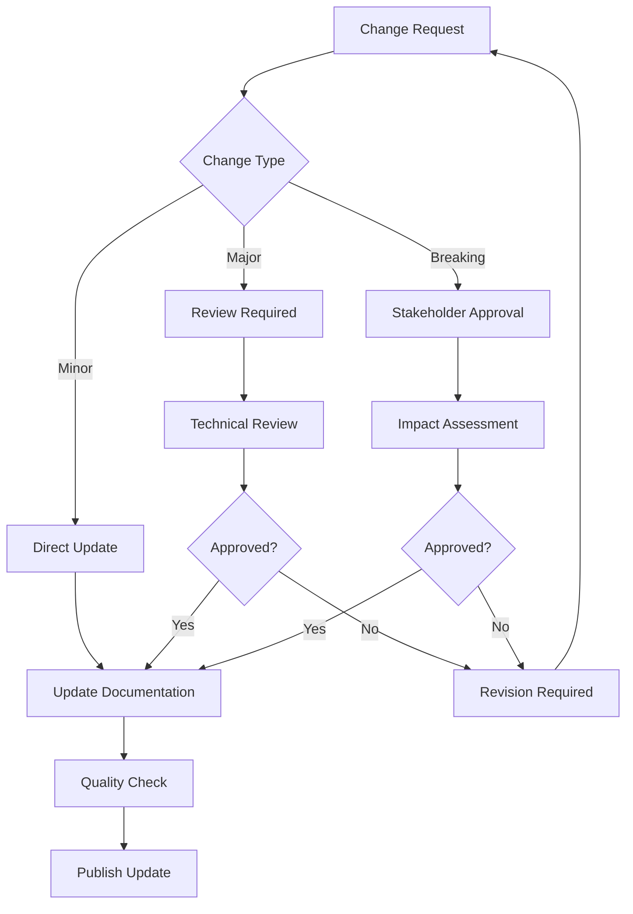
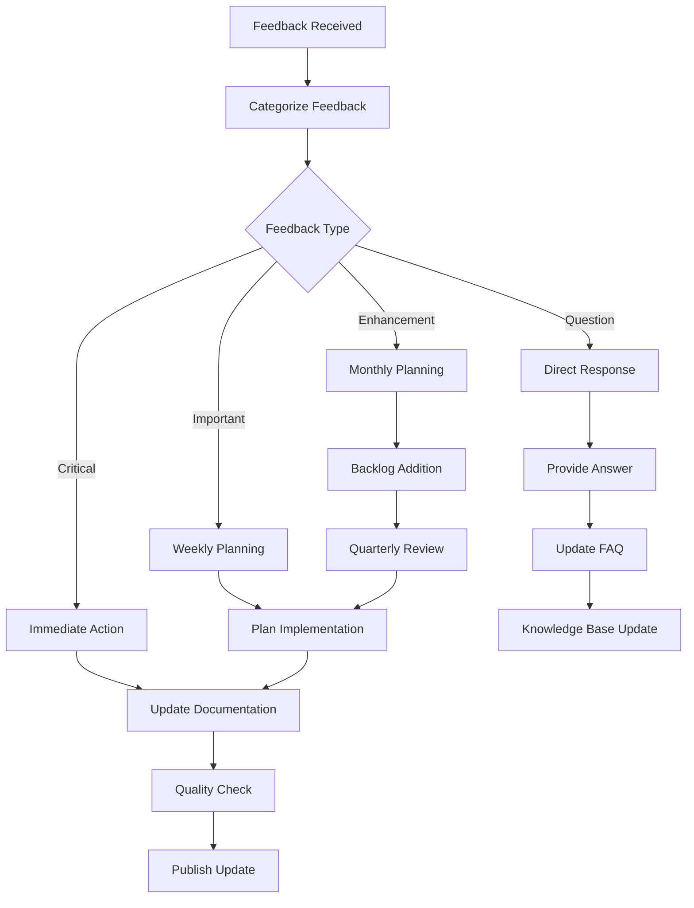

# Documentation Standards and Quality Assurance

## Overview

This document establishes comprehensive standards for HX Infrastructure documentation, including rationale for configuration choices, maintenance procedures, quality assurance processes, and feedback incorporation workflows.

## Configuration Standards and Rationale

### Ansible Configuration Standards

#### Primary Configuration (`ansible.cfg`)
**Rationale**: Optimized for production control node operations
- **Inventory Path**: `inventory/environments/production`
  - *Rationale*: Clear environment separation, supports multiple environments
  - *Alternative Considered*: Single inventory file - rejected due to complexity
- **Performance Settings**: Smart gathering, fact caching, pipelining
  - *Rationale*: Optimizes execution time for large infrastructure deployments
  - *Trade-off*: Increased memory usage for better performance
- **Security Settings**: Vault integration, secure SSH configuration
  - *Rationale*: Ensures secrets management and secure communications
  - *Compliance*: Meets enterprise security requirements

#### Development Configuration
**Rationale**: Optimized for developer productivity and debugging
- **Inventory Path**: `inventories/dev` (transitional)
  - *Rationale*: Maintains backward compatibility during standardization
  - *Migration Plan*: Move to `inventory/environments/development`
- **Performance Settings**: Explicit gathering, memory caching
  - *Rationale*: Faster feedback loops for development and testing
  - *Trade-off*: Less optimization for better debugging visibility

### Inventory Format Standards

#### YAML Format Selection
**Rationale**: Chosen over INI format for the following reasons:

**Technical Advantages**:
- **Hierarchical Structure**: Natural representation of complex service relationships
- **Rich Data Types**: Support for lists, dictionaries, and nested configurations
- **Extensibility**: Easy addition of metadata and complex variables
- **Ansible Integration**: Native support for advanced Ansible features

**Operational Advantages**:
- **Readability**: Self-documenting structure with clear relationships
- **Maintainability**: Easier to update and modify complex configurations
- **Scalability**: Better support for large, complex infrastructures
- **Version Control**: Better diff and merge capabilities

**Decision Matrix**:
| Criteria | YAML | INI | Weight | YAML Score | INI Score |
|----------|------|-----|--------|------------|-----------|
| Readability | ✅ | ❌ | 25% | 9 | 6 |
| Flexibility | ✅ | ❌ | 30% | 10 | 4 |
| Ansible Integration | ✅ | ⚠️ | 20% | 10 | 7 |
| Learning Curve | ⚠️ | ✅ | 15% | 7 | 9 |
| Tool Support | ✅ | ✅ | 10% | 9 | 8 |
| **Total** | | | | **9.05** | **6.25** |

### Directory Structure Standards

#### Standardized Layout
```
inventory/
├── environments/
│   ├── production/
│   ├── staging/
│   └── development/
└── group_vars/
```

**Rationale**:
- **Environment Separation**: Clear isolation between deployment targets
- **Scalability**: Easy addition of new environments
- **Security**: Environment-specific access controls
- **Consistency**: Aligns with Ansible best practices

## Documentation Maintenance Procedures

### Regular Maintenance Schedule

#### Weekly Tasks
- **Documentation Review**: Check for outdated information
- **Link Validation**: Verify all internal and external links
- **Consistency Check**: Ensure formatting and style consistency
- **Update Tracking**: Review and incorporate pending updates

#### Monthly Tasks
- **Comprehensive Audit**: Full documentation review
- **Stakeholder Feedback**: Collect and analyze user feedback
- **Process Improvement**: Identify and implement improvements
- **Training Updates**: Update training materials based on changes

#### Quarterly Tasks
- **Standards Review**: Evaluate and update documentation standards
- **Tool Evaluation**: Assess documentation tools and processes
- **Metrics Analysis**: Review documentation effectiveness metrics
- **Strategic Planning**: Plan documentation roadmap updates

### Change Management Process

#### Documentation Change Types
1. **Minor Updates**: Typos, formatting, small clarifications
2. **Major Updates**: Structural changes, new sections, process modifications
3. **Breaking Changes**: Changes that affect existing procedures or configurations

#### Change Approval Workflow


### Version Control and Tracking

#### Documentation Versioning
- **Semantic Versioning**: Major.Minor.Patch format
- **Change Logs**: Detailed change tracking for each version
- **Rollback Procedures**: Ability to revert to previous versions
- **Branch Strategy**: Feature branches for major documentation updates

#### Metadata Tracking
```yaml
document_metadata:
  version: "2.1.0"
  last_updated: "2025-09-17"
  author: "Infrastructure Team"
  reviewers: ["team_lead", "senior_engineer"]
  next_review_date: "2025-12-17"
  change_frequency: "monthly"
  stakeholders: ["operations", "development", "security"]
```

## Quality Assurance Framework

### Documentation Quality Checklist

#### Content Quality
- [ ] **Accuracy**: All technical information is correct and current
- [ ] **Completeness**: All required sections and information are included
- [ ] **Clarity**: Information is clear and understandable
- [ ] **Relevance**: Content is relevant to the intended audience
- [ ] **Currency**: Information is up-to-date and reflects current state

#### Structure and Format
- [ ] **Consistency**: Follows established formatting standards
- [ ] **Navigation**: Clear table of contents and cross-references
- [ ] **Hierarchy**: Logical information hierarchy and flow
- [ ] **Accessibility**: Readable and accessible to all users
- [ ] **Standards Compliance**: Adheres to documentation standards

#### Technical Validation
- [ ] **Code Examples**: All code examples are tested and functional
- [ ] **Configurations**: All configuration examples are validated
- [ ] **Links**: All links are functional and point to correct resources
- [ ] **References**: All references are accurate and accessible
- [ ] **Dependencies**: All dependencies and prerequisites are documented

### Automated Quality Checks

#### Continuous Integration Checks
```yaml
documentation_ci:
  checks:
    - markdown_lint
    - link_validation
    - spell_check
    - format_consistency
    - code_example_validation
  
  triggers:
    - pull_request
    - scheduled_daily
    - manual_trigger
  
  reporting:
    - quality_score
    - issue_summary
    - improvement_recommendations
```

#### Quality Metrics
- **Completeness Score**: Percentage of required sections completed
- **Accuracy Score**: Percentage of validated technical information
- **Consistency Score**: Adherence to formatting and style standards
- **Usability Score**: User feedback and usage analytics
- **Maintenance Score**: Frequency and quality of updates

### Review Process

#### Peer Review Requirements
- **Technical Accuracy**: Subject matter expert review
- **Editorial Review**: Language and clarity review
- **User Experience**: End-user perspective review
- **Compliance Review**: Standards and policy compliance

#### Review Criteria
```markdown
## Review Checklist

### Technical Review
- [ ] Technical accuracy verified
- [ ] Code examples tested
- [ ] Configurations validated
- [ ] Dependencies documented

### Editorial Review
- [ ] Grammar and spelling checked
- [ ] Clarity and readability verified
- [ ] Tone and style consistent
- [ ] Audience appropriateness confirmed

### Standards Review
- [ ] Formatting standards followed
- [ ] Structure standards met
- [ ] Metadata requirements satisfied
- [ ] Cross-reference accuracy verified
```

## Feedback Incorporation Process

### Feedback Collection Methods

#### Formal Feedback Channels
1. **Documentation Reviews**: Scheduled review meetings
2. **Issue Tracking**: GitHub issues for documentation problems
3. **Survey Feedback**: Regular user satisfaction surveys
4. **Stakeholder Interviews**: Quarterly stakeholder feedback sessions

#### Informal Feedback Channels
1. **Team Discussions**: Daily standup and team meeting feedback
2. **Slack Channels**: Real-time feedback and questions
3. **Email Feedback**: Direct feedback to documentation team
4. **Usage Analytics**: Documentation usage patterns and metrics

### Feedback Processing Workflow

#### Feedback Categorization
- **Critical**: Incorrect information that could cause issues
- **Important**: Missing information or significant improvements
- **Enhancement**: Nice-to-have improvements and suggestions
- **Question**: Clarification requests and usage questions

#### Processing Timeline
- **Critical**: Within 24 hours
- **Important**: Within 1 week
- **Enhancement**: Within 1 month
- **Question**: Within 3 business days

#### Feedback Integration Process


### Feedback Analysis and Improvement

#### Feedback Metrics
- **Response Time**: Average time to address feedback
- **Resolution Rate**: Percentage of feedback successfully addressed
- **User Satisfaction**: Feedback quality and usefulness ratings
- **Recurring Issues**: Patterns in feedback indicating systemic issues

#### Continuous Improvement Process
1. **Monthly Analysis**: Review feedback patterns and trends
2. **Quarterly Assessment**: Evaluate process effectiveness
3. **Annual Review**: Comprehensive process and standards review
4. **Process Updates**: Implement improvements based on analysis

## Tool and Technology Standards

### Documentation Tools
- **Primary Format**: Markdown for source documentation
- **Version Control**: Git with GitHub for collaboration
- **Static Site Generation**: MkDocs for published documentation
- **Diagramming**: Mermaid for process flows, PlantUML for architecture
- **Review Tools**: GitHub pull requests for collaborative review

### Automation Standards
- **CI/CD Integration**: Automated quality checks and publishing
- **Link Validation**: Automated link checking and reporting
- **Format Validation**: Automated markdown and style checking
- **Content Generation**: AI-assisted content generation with human review

## Compliance and Governance

### Documentation Governance
- **Ownership**: Clear ownership assignment for each document
- **Approval Authority**: Defined approval levels for different change types
- **Access Control**: Role-based access to documentation systems
- **Audit Trail**: Complete change history and approval tracking

### Compliance Requirements
- **Security**: Sensitive information handling and access controls
- **Regulatory**: Industry-specific compliance requirements
- **Internal Policy**: Company policy and procedure compliance
- **Standards**: Industry best practice and standard compliance

## Related Documentation

- [Ansible Configuration](../ansible/README.md)
- [Inventory Management](../inventory/README.md)
- [Process for New Discoveries](../process/new_discoveries.md)
- [Generative Prompt Guide](../generative_prompt_guide.md)
