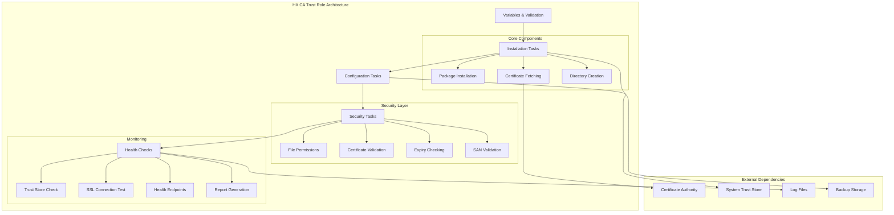

# HX CA Trust Standardized Role

Professional-grade Certificate Authority trust management for HX Infrastructure, implementing SOLID principles and comprehensive security practices.

## Features

- **Automated CA Certificate Deployment**: Secure fetching and installation of root CA certificates
- **System Trust Store Integration**: Automatic integration with system certificate trust store
- **Security Validation**: SHA256 fingerprint verification and certificate chain validation
- **Health Monitoring**: Comprehensive health checks and certificate expiry monitoring
- **Audit Logging**: Complete audit trail of certificate operations
- **Backup Management**: Automated backup of certificate changes
- **Multi-Platform Support**: Ubuntu 20.04+, Debian 11+ compatibility
- **SOLID Architecture**: Modular, extensible, and maintainable design

## Requirements

- **Ansible**: >= 2.9
- **Target Systems**: Ubuntu 20.04+, Debian 11+
- **Dependencies**: None (standalone role)
- **Privileges**: Root access required for certificate installation

## Role Variables

### Core Configuration

| Variable | Type | Default | Description |
|----------|------|---------|-------------|
| `hx_ca_trust_enabled` | boolean | `true` | Enable/disable CA trust management |
| `hx_ca_host` | string | `hx-ca-server.dev-test.hana-x.ai` | Certificate Authority server hostname |
| `hx_ca_root_ca_path_on_ca` | string | `/home/agent0/easy-rsa/pki/ca.crt` | Path to root CA on CA server |
| `hx_ca_root_ca_filename` | string | `hx-rootCA.crt` | Local certificate filename |
| `hx_ca_local_cert_path` | string | `/usr/local/share/ca-certificates/hx-root-ca.crt` | Local certificate path |

### Security Settings

| Variable | Type | Default | Description |
|----------|------|---------|-------------|
| `hx_ca_security_enabled` | boolean | `true` | Enable security features |
| `hx_ca_expected_sha256` | string | `""` | Expected SHA256 fingerprint (optional) |
| `hx_ca_verify_chain` | boolean | `true` | Enable certificate chain verification |
| `hx_ca_strict_permissions` | boolean | `true` | Enforce strict file permissions |

### Validation and Monitoring

| Variable | Type | Default | Description |
|----------|------|---------|-------------|
| `hx_ca_validation_enabled` | boolean | `true` | Enable certificate validation |
| `hx_ca_health_checks_enabled` | boolean | `true` | Enable health checks |
| `hx_ca_monitoring_enabled` | boolean | `false` | Enable certificate monitoring |
| `hx_ca_san_check_targets` | list | `[]` | SAN validation targets |

### Feature Flags

| Variable | Type | Default | Description |
|----------|------|---------|-------------|
| `hx_ca_backup_enabled` | boolean | `true` | Enable certificate backups |
| `hx_ca_audit_logging_enabled` | boolean | `true` | Enable audit logging |

### Advanced Configuration

| Variable | Type | Default | Description |
|----------|------|---------|-------------|
| `hx_ca_update_timeout` | integer | `30` | CA update timeout (seconds) |
| `hx_ca_validation_retries` | integer | `3` | Validation retry attempts |
| `hx_ca_validation_delay` | integer | `5` | Delay between retries (seconds) |

## Dependencies

This role has no external dependencies and can be used standalone.

## Example Playbook

### Basic Usage

```yaml
---
- hosts: servers
  become: true
  roles:
    - role: hx_ca_trust_standardized
      vars:
        hx_ca_host: "ca.example.com"
        hx_ca_root_ca_path_on_ca: "/etc/ssl/certs/root-ca.crt"
        hx_ca_root_ca_filename: "example-root-ca.crt"
```

### Production Configuration with Security

```yaml
---
- hosts: production
  become: true
  roles:
    - role: hx_ca_trust_standardized
      vars:
        # Core settings
        hx_ca_host: "ca.production.example.com"
        hx_ca_root_ca_path_on_ca: "/opt/ca/certs/root-ca.crt"
        hx_ca_root_ca_filename: "production-root-ca.crt"
        
        # Security settings
        hx_ca_security_enabled: true
        hx_ca_expected_sha256: "SHA256:AA:BB:CC:DD:EE:FF:00:11:22:33:44:55:66:77:88:99:AA:BB:CC:DD:EE:FF:00:11:22:33:44:55:66:77:88:99"
        hx_ca_verify_chain: true
        hx_ca_strict_permissions: true
        
        # Monitoring and validation
        hx_ca_monitoring_enabled: true
        hx_ca_health_checks_enabled: true
        hx_ca_san_check_targets:
          - name: "Web Server"
            address: "web.example.com"
            port: 443
            servername: "web.example.com"
            health_url: "https://web.example.com/health"
          - name: "API Server"
            address: "api.example.com"
            port: 8443
            servername: "api.example.com"
        
        # Operational settings
        hx_ca_backup_enabled: true
        hx_ca_audit_logging_enabled: true
```

### Integration with Vault

```yaml
---
- hosts: secure_servers
  become: true
  roles:
    - role: hx_ca_trust_standardized
      vars:
        hx_ca_host: "{{ vault_ca_host }}"
        hx_ca_expected_sha256: "{{ vault_ca_fingerprint }}"
        hx_ca_security_enabled: true
        hx_ca_audit_logging_enabled: true
```

## Architecture



## Testing

### Running Tests with Molecule

```bash
# Install molecule and dependencies
pip install molecule[docker] ansible-lint yamllint

# Run all tests
molecule test

# Run specific test scenarios
molecule test -s default

# Test on specific platforms
molecule test -s ubuntu-focal
molecule test -s ubuntu-jammy
```

### Test Scenarios

The role includes comprehensive testing covering:

- **Unit Tests**: Variable validation, task logic verification
- **Integration Tests**: Certificate deployment, trust store integration
- **Security Tests**: Permission validation, fingerprint verification
- **Health Tests**: Service functionality, endpoint validation
- **Multi-Platform Tests**: Ubuntu 20.04, Ubuntu 22.04, Debian 11+

### Manual Testing

```bash
# Verify certificate installation
sudo openssl x509 -in /usr/local/share/ca-certificates/hx-root-ca.crt -text -noout

# Check trust store integration
cert_hash=$(openssl x509 -in /usr/local/share/ca-certificates/hx-root-ca.crt -hash -noout)
ls -la /etc/ssl/certs/${cert_hash}.0

# Test SSL connection
openssl s_client -connect example.com:443 -CAfile /usr/local/share/ca-certificates/hx-root-ca.crt
```

## Troubleshooting

### Common Issues

#### Certificate Not Found in Trust Store

**Symptoms**: SSL connections fail with certificate verification errors

**Diagnosis**:
```bash
# Check if certificate file exists
ls -la /usr/local/share/ca-certificates/hx-root-ca.crt

# Verify trust store update
sudo update-ca-certificates --verbose

# Check trust store links
cert_hash=$(openssl x509 -in /usr/local/share/ca-certificates/hx-root-ca.crt -hash -noout)
ls -la /etc/ssl/certs/${cert_hash}.0
```

**Solutions**:
- Ensure certificate file has correct permissions (644)
- Run `update-ca-certificates` manually
- Check certificate format with `openssl x509 -text -noout`

#### SHA256 Fingerprint Mismatch

**Symptoms**: Role fails with fingerprint validation error

**Diagnosis**:
```bash
# Get actual certificate fingerprint
openssl x509 -in /usr/local/share/ca-certificates/hx-root-ca.crt -fingerprint -sha256 -noout
```

**Solutions**:
- Update `hx_ca_expected_sha256` variable with correct fingerprint
- Verify certificate source integrity
- Disable fingerprint checking temporarily for debugging

#### Certificate Fetch Failures

**Symptoms**: Cannot fetch certificate from CA server

**Diagnosis**:
```bash
# Test connectivity to CA server
ping ca-server.example.com
telnet ca-server.example.com 22

# Check file permissions on CA server
ssh ca-server.example.com "ls -la /path/to/ca.crt"
```

**Solutions**:
- Verify network connectivity to CA server
- Check SSH key authentication
- Ensure certificate file exists and is readable on CA server

### Log Analysis

#### Deployment Logs
```bash
# View deployment log
sudo tail -f /var/log/hx/ca-trust/deployment.log

# Check security audit
sudo cat /var/log/hx/ca-trust/security_audit_*.txt

# Monitor health checks
sudo tail -f /var/log/hx/ca-trust/monitor.log
```

#### System Logs
```bash
# Check system certificate updates
sudo journalctl -u update-ca-certificates

# View Ansible execution logs
sudo journalctl -u ansible*
```

### Performance Optimization

#### Large Certificate Files
- Increase `hx_ca_update_timeout` for slow networks
- Use local certificate caching
- Implement certificate compression

#### Multiple Target Validation
- Adjust `hx_ca_validation_retries` and `hx_ca_validation_delay`
- Parallelize SAN checks where possible
- Use health endpoint checks for faster validation

## Security Considerations

### Certificate Security
- **Fingerprint Validation**: Always configure `hx_ca_expected_sha256` in production
- **Chain Verification**: Enable `hx_ca_verify_chain` for complete validation
- **File Permissions**: Use `hx_ca_strict_permissions` for enhanced security

### Network Security
- **Secure Transport**: Ensure CA server uses secure protocols (SSH, HTTPS)
- **Network Isolation**: Restrict CA server access to authorized systems
- **Certificate Rotation**: Implement regular certificate rotation procedures

### Audit and Compliance
- **Audit Logging**: Enable `hx_ca_audit_logging_enabled` for compliance
- **Backup Management**: Regular backup verification and testing
- **Access Control**: Restrict access to certificate files and logs

## Performance Tuning

### Resource Optimization
- **Memory Usage**: Minimal memory footprint (~10MB during execution)
- **CPU Usage**: Low CPU usage, primarily I/O bound operations
- **Network Usage**: Efficient certificate transfer with retry logic

### Scaling Considerations
- **Concurrent Deployments**: Role supports parallel execution across multiple hosts
- **Large Environments**: Batch processing for hundreds of servers
- **Certificate Updates**: Efficient update mechanisms with change detection

## Best Practices

### Development
- Use variable validation for all inputs
- Implement comprehensive error handling
- Follow SOLID principles for maintainability
- Include extensive testing coverage

### Operations
- Monitor certificate expiry dates
- Implement automated certificate rotation
- Maintain backup and recovery procedures
- Use centralized logging for audit trails

### Security
- Regular security audits and reviews
- Principle of least privilege
- Secure certificate storage and transport
- Incident response procedures

## License

MIT

## Author Information

**HX Infrastructure Team**  
Hanax AI  
infrastructure@hana-x.ai

## Contributing

1. Fork the repository
2. Create a feature branch
3. Make changes following the established patterns
4. Add comprehensive tests
5. Update documentation
6. Submit a pull request

## Changelog

### v1.0.0 (2024-01-XX)
- Initial standardized implementation
- SOLID principles architecture
- Comprehensive testing framework
- Security hardening features
- Professional documentation

---

*This role is part of the HX Infrastructure Ansible collection, providing enterprise-grade automation for modern infrastructure management.*
