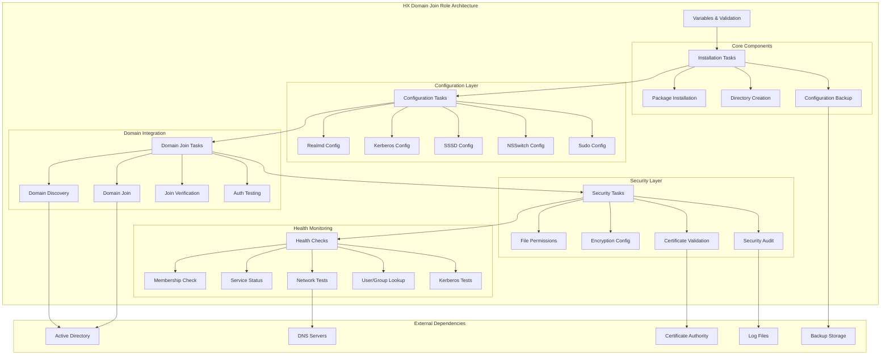

# HX Domain Join Standardized Role

Professional-grade Active Directory domain integration for HX Infrastructure, implementing SOLID principles and comprehensive security practices.

## Features

- **Automated Domain Join**: Secure integration with Active Directory domains
- **SSSD Integration**: Complete System Security Services Daemon configuration
- **Kerberos Authentication**: Full Kerberos client setup and configuration
- **Security Hardening**: Encryption enforcement and certificate validation
- **User Management**: Automated home directory creation and sudo configuration
- **Health Monitoring**: Comprehensive health checks and domain connectivity tests
- **Audit Logging**: Complete audit trail of domain operations
- **Backup Management**: Automated backup of configuration changes
- **Multi-Platform Support**: Ubuntu, Debian, CentOS, RHEL compatibility
- **SOLID Architecture**: Modular, extensible, and maintainable design

## Requirements

- **Ansible**: >= 2.9
- **Target Systems**: Ubuntu 20.04+, Debian 11+, CentOS 7+, RHEL 7+
- **Dependencies**: hx_ca_trust_standardized (when certificate validation enabled)
- **Privileges**: Root access required for domain join operations
- **Network**: Connectivity to Active Directory domain controllers

## Role Variables

### Core Configuration

| Variable | Type | Default | Description |
|----------|------|---------|-------------|
| `hx_domain_join_enabled` | boolean | `true` | Enable/disable domain join functionality |
| `hx_ad_domain` | string | `dev-test.hana-x.ai` | Active Directory domain FQDN |
| `hx_ad_admin_user` | string | `agent0` | Domain administrator username |
| `hx_ad_admin_password` | string | `""` | Domain administrator password (use vault) |
| `hx_ad_realm` | string | `DEV-TEST.HANA-X.AI` | Kerberos realm (uppercase domain) |
| `hx_ad_computer_name` | string | `{{ ansible_hostname \| upper }}` | Computer name for domain join |

### Security Settings

| Variable | Type | Default | Description |
|----------|------|---------|-------------|
| `hx_domain_security_enabled` | boolean | `true` | Enable security features |
| `hx_domain_strict_validation` | boolean | `true` | Enable strict validation checks |
| `hx_domain_require_encryption` | boolean | `true` | Require encrypted connections |
| `hx_domain_verify_certificates` | boolean | `true` | Verify SSL/TLS certificates |

### SSSD Configuration

| Variable | Type | Default | Description |
|----------|------|---------|-------------|
| `hx_sssd_enabled` | boolean | `true` | Enable SSSD service |
| `hx_sssd_cache_credentials` | boolean | `true` | Cache user credentials offline |
| `hx_sssd_enumerate_users` | boolean | `false` | Enumerate domain users |
| `hx_sssd_enumerate_groups` | boolean | `false` | Enumerate domain groups |
| `hx_sssd_case_sensitive` | boolean | `false` | Case sensitive usernames |
| `hx_sssd_use_fully_qualified_names` | boolean | `false` | Use fully qualified names |

### Kerberos Configuration

| Variable | Type | Default | Description |
|----------|------|---------|-------------|
| `hx_krb5_enabled` | boolean | `true` | Enable Kerberos authentication |
| `hx_krb5_ticket_lifetime` | string | `24h` | Kerberos ticket lifetime |
| `hx_krb5_renew_lifetime` | string | `7d` | Ticket renewal lifetime |
| `hx_krb5_forwardable` | boolean | `true` | Allow ticket forwarding |

### Home Directory Configuration

| Variable | Type | Default | Description |
|----------|------|---------|-------------|
| `hx_home_dir_enabled` | boolean | `false` | Enable home directory creation |
| `hx_home_dir_base` | string | `/home` | Base directory for home folders |
| `hx_home_dir_create` | boolean | `true` | Automatically create home directories |
| `hx_home_dir_umask` | string | `0077` | Default umask for home directories |

### Sudo Configuration

| Variable | Type | Default | Description |
|----------|------|---------|-------------|
| `hx_sudo_enabled` | boolean | `false` | Enable sudo access for domain users |
| `hx_sudo_groups` | list | `[]` | Domain groups with sudo access |
| `hx_sudo_users` | list | `[]` | Individual domain users with sudo access |

### Performance Settings

| Variable | Type | Default | Description |
|----------|------|---------|-------------|
| `hx_domain_join_timeout` | integer | `300` | Domain join timeout (seconds) |
| `hx_domain_validation_retries` | integer | `3` | Validation retry attempts |
| `hx_domain_validation_delay` | integer | `10` | Delay between retries (seconds) |
| `hx_domain_discovery_timeout` | integer | `60` | Domain discovery timeout (seconds) |

### Feature Flags

| Variable | Type | Default | Description |
|----------|------|---------|-------------|
| `hx_domain_backup_enabled` | boolean | `true` | Enable configuration backups |
| `hx_domain_monitoring_enabled` | boolean | `false` | Enable domain monitoring |
| `hx_domain_audit_logging_enabled` | boolean | `true` | Enable audit logging |
| `hx_domain_health_checks_enabled` | boolean | `true` | Enable health checks |

## Dependencies

- **hx_ca_trust_standardized**: Required when `hx_domain_verify_certificates` is enabled

## Example Playbook

### Basic Usage

```yaml
---
- hosts: servers
  become: true
  roles:
    - role: hx_domain_join_standardized
      vars:
        hx_ad_domain: "company.local"
        hx_ad_realm: "COMPANY.LOCAL"
        hx_ad_admin_user: "domainadmin"
        hx_ad_admin_password: "{{ vault_domain_admin_password }}"
```

### Production Configuration with Security

```yaml
---
- hosts: production
  become: true
  roles:
    - role: hx_domain_join_standardized
      vars:
        # Core domain settings
        hx_ad_domain: "prod.company.com"
        hx_ad_realm: "PROD.COMPANY.COM"
        hx_ad_admin_user: "svc-ansible"
        hx_ad_admin_password: "{{ vault_domain_password }}"
        hx_ad_computer_name: "{{ inventory_hostname | upper }}"
        hx_ad_ou_path: "OU=Servers,OU=Production,DC=prod,DC=company,DC=com"
        
        # Security settings
        hx_domain_security_enabled: true
        hx_domain_strict_validation: true
        hx_domain_require_encryption: true
        hx_domain_verify_certificates: true
        
        # SSSD configuration
        hx_sssd_enabled: true
        hx_sssd_cache_credentials: false  # High security
        hx_sssd_enumerate_users: false
        hx_sssd_use_fully_qualified_names: true
        
        # Home directory management
        hx_home_dir_enabled: true
        hx_home_dir_base: "/home"
        hx_home_dir_create: true
        hx_home_dir_umask: "0077"
        
        # Sudo access
        hx_sudo_enabled: true
        hx_sudo_groups:
          - "Linux Admins"
          - "Server Operators"
        hx_sudo_users:
          - "emergency.admin"
        
        # Operational settings
        hx_domain_backup_enabled: true
        hx_domain_audit_logging_enabled: true
        hx_domain_monitoring_enabled: true
```

### Development Environment

```yaml
---
- hosts: development
  become: true
  roles:
    - role: hx_domain_join_standardized
      vars:
        hx_ad_domain: "dev.company.local"
        hx_ad_realm: "DEV.COMPANY.LOCAL"
        hx_ad_admin_user: "devadmin"
        hx_ad_admin_password: "{{ vault_dev_password }}"
        
        # Relaxed security for development
        hx_domain_strict_validation: false
        hx_domain_require_encryption: false
        hx_sssd_cache_credentials: true
        hx_sssd_enumerate_users: true
        
        # Enable home directories
        hx_home_dir_enabled: true
        hx_sudo_enabled: true
        hx_sudo_groups:
          - "Developers"
```

## Architecture



## Testing

### Running Tests with Molecule

```bash
# Install molecule and dependencies
pip install molecule[docker] ansible-lint yamllint

# Run all tests
molecule test

# Run specific test scenarios
molecule test -s default

# Test configuration without domain join
molecule converge
molecule verify
```

### Test Scenarios

The role includes comprehensive testing covering:

- **Unit Tests**: Variable validation, configuration templating
- **Integration Tests**: Package installation, service configuration
- **Security Tests**: File permissions, encryption settings
- **Configuration Tests**: Template rendering, service setup
- **Multi-Platform Tests**: Ubuntu 20.04, Ubuntu 22.04, CentOS 7/8

### Manual Testing

```bash
# Verify domain membership
sudo realm list

# Test user lookup
getent passwd username@domain.com

# Test group lookup
getent group "Domain Users"

# Test Kerberos authentication
kinit username@DOMAIN.COM

# Check SSSD status
sudo systemctl status sssd
sudo sss_cache -E  # Clear cache for testing
```

## Troubleshooting

### Common Issues

#### Domain Join Failures

**Symptoms**: Domain join command fails with authentication errors

**Diagnosis**:
```bash
# Test domain discovery
sudo realm discover domain.com

# Check DNS resolution
nslookup domain.com
nslookup _ldap._tcp.domain.com

# Test connectivity
telnet domain.com 389
telnet domain.com 636
```

**Solutions**:
- Verify DNS configuration points to domain controllers
- Check firewall rules for required ports (53, 88, 389, 636, 3268)
- Ensure correct admin credentials
- Verify time synchronization with domain controllers

#### SSSD Service Issues

**Symptoms**: SSSD fails to start or user lookups fail

**Diagnosis**:
```bash
# Check SSSD configuration
sudo sssd -i -d 6

# Review SSSD logs
sudo journalctl -u sssd -f
sudo tail -f /var/log/sssd/sssd_domain.log

# Test configuration syntax
sudo sssctl config-check
```

**Solutions**:
- Verify SSSD configuration syntax
- Check domain controller connectivity
- Clear SSSD cache: `sudo sss_cache -E`
- Restart SSSD service: `sudo systemctl restart sssd`

#### Kerberos Authentication Issues

**Symptoms**: kinit fails or ticket acquisition problems

**Diagnosis**:
```bash
# Test Kerberos configuration
sudo kinit -V username@DOMAIN.COM

# Check Kerberos logs
sudo tail -f /var/log/krb5lib.log

# Verify time synchronization
timedatectl status
```

**Solutions**:
- Synchronize time with domain controllers
- Check Kerberos configuration syntax
- Verify DNS resolution for domain controllers
- Test with different encryption types

#### User/Group Lookup Failures

**Symptoms**: getent commands return no results

**Diagnosis**:
```bash
# Test NSSwitch configuration
getent passwd
getent group

# Check SSSD domain status
sudo sssctl domain-status domain.com

# Test LDAP connectivity
ldapsearch -H ldap://domain.com -x -b "DC=domain,DC=com"
```

**Solutions**:
- Verify NSSwitch configuration includes 'sss'
- Check SSSD domain configuration
- Test LDAP connectivity and authentication
- Clear and rebuild SSSD cache

### Log Analysis

#### SSSD Logs
```bash
# Main SSSD log
sudo tail -f /var/log/sssd/sssd.log

# Domain-specific logs
sudo tail -f /var/log/sssd/sssd_domain.log

# NSS responder logs
sudo tail -f /var/log/sssd/sssd_nss.log

# PAM responder logs
sudo tail -f /var/log/sssd/sssd_pam.log
```

#### System Logs
```bash
# Domain join logs
sudo tail -f /var/log/hx/domain-join/domain_join.log

# Security audit logs
sudo cat /var/log/hx/domain-join/security_audit_*.txt

# System authentication logs
sudo journalctl -u sssd -u realmd -f
```

### Performance Optimization

#### Large Environments
- Increase `hx_domain_join_timeout` for slow networks
- Adjust `hx_domain_validation_retries` and delays
- Use specific domain controllers instead of auto-discovery
- Implement SSSD cache tuning

#### High Security Environments
- Disable credential caching: `hx_sssd_cache_credentials: false`
- Enable strict validation: `hx_domain_strict_validation: true`
- Use certificate validation: `hx_domain_verify_certificates: true`
- Implement regular password rotation

## Security Considerations

### Authentication Security
- **Strong Encryption**: AES256 and AES128 encryption enforced
- **Certificate Validation**: LDAPS certificate verification enabled
- **Credential Protection**: Secure handling of domain credentials
- **Access Control**: Granular sudo access configuration

### Network Security
- **Encrypted Connections**: LDAPS and Kerberos encryption required
- **Certificate Validation**: SSL/TLS certificate verification
- **Port Security**: Minimal required port access
- **DNS Security**: Secure DNS resolution configuration

### Audit and Compliance
- **Comprehensive Logging**: All domain operations logged
- **Security Auditing**: Regular security audit reports
- **Configuration Backup**: Automated backup of all changes
- **Access Tracking**: Complete audit trail of access changes

## Performance Tuning

### Resource Optimization
- **Memory Usage**: Optimized SSSD cache settings
- **CPU Usage**: Efficient authentication algorithms
- **Network Usage**: Optimized LDAP queries and caching
- **Disk Usage**: Controlled log rotation and cache management

### Scaling Considerations
- **Concurrent Joins**: Support for parallel domain joins
- **Large Domains**: Optimized for enterprise-scale domains
- **High Availability**: Multiple domain controller support
- **Load Balancing**: Automatic failover between domain controllers

## Best Practices

### Development
- Use comprehensive variable validation
- Implement extensive error handling and recovery
- Follow SOLID principles for maintainability
- Include thorough testing coverage

### Operations
- Monitor domain controller connectivity
- Implement automated health checks
- Maintain configuration backups
- Use centralized logging and monitoring

### Security
- Regular security audits and reviews
- Implement principle of least privilege
- Use secure credential management (Ansible Vault)
- Maintain incident response procedures

## License

MIT

## Author Information

**HX Infrastructure Team**  
Hanax AI  
infrastructure@hana-x.ai

## Contributing

1. Fork the repository
2. Create a feature branch
3. Make changes following the established patterns
4. Add comprehensive tests
5. Update documentation
6. Submit a pull request

## Changelog

### v1.0.0 (2024-01-XX)
- Initial standardized implementation
- SOLID principles architecture
- Comprehensive security hardening
- Full testing framework
- Professional documentation
- Multi-platform support

---

*This role is part of the HX Infrastructure Ansible collection, providing enterprise-grade automation for modern infrastructure management.*
